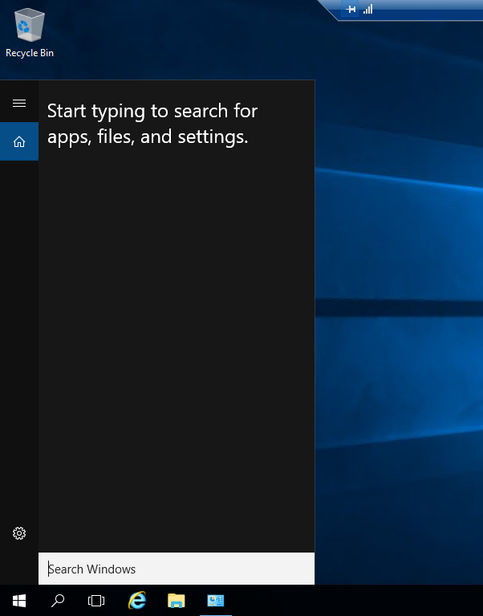
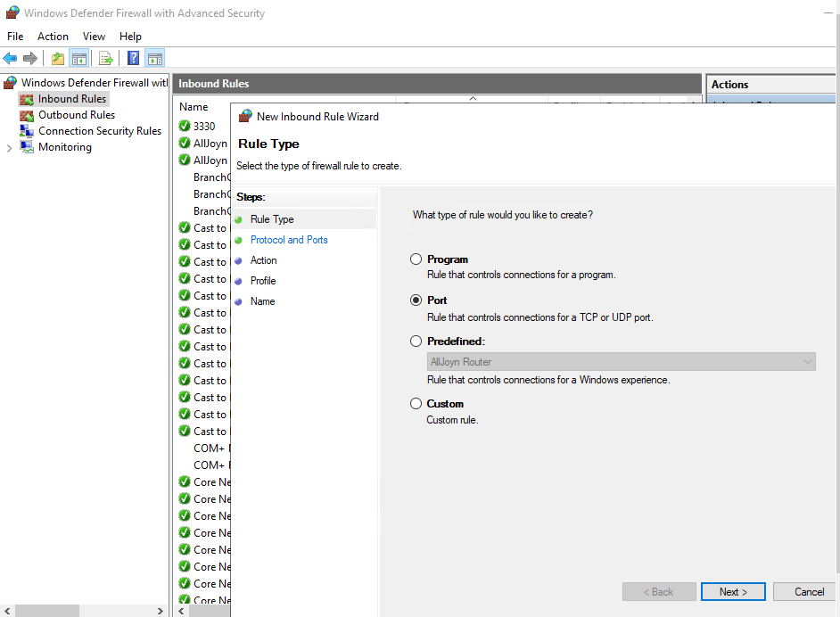

## Introduction

 This article will show you how to Install OpenSSH on [Windows Server](https://utho.com/docs/tutorial/category/windows-tutorial/), [OpenSSH](https://en.wikipedia.org/wiki/OpenSSH) is an encrypted remote access tool that protects data sent between a client and server. Therefore, it prevents common forms of network assaults like as connection hijacking, sniffing, and eavesdropping. Follow along with this tutorial to set up OpenSSH on a Windows server.

## Install OpenSSH

Through Windows Settings

Step 1. To access the Start Menu in Windows, click the Start button.

Step 2. Find the Settings menu and click it to open it. In the newly opened window, go to the Apps menu, and then select Optional Features from the Apps & Features drop-down menu.

Step 3. After clicking the "Add Feature" button, type "OpenSSH" into the search box to locate the feature. After that, from the list of results, choose OpenSSH Server, and then click the Install button.

Following the completion of the installation, the OpenSSH Client and Server will be added to the list of features that are installed on the system.

## Configure Firewall

Step 4. Open the Windows start menu, search for "Server Manager," and then click on it. In the window for the Server Manager, go to the Tools menu and then choose the Windows Defender Firewall with Advanced Security option from the drop-down list.

Step 5. Now, within the Firewall window that has been opened, right click at the Inbound Rules button. After that, pick New Rule from the menu located in the right pane.

Step 6.Choose Port from the list of available options within the New Inbound Rule Wizard.

Step 7. Then click the Next button. Choose 'TCP' from the drop-down menu, and then type 22 into the box under 'Specific local ports:'

Step 8. The next step is to enable the connection, assign the rule to server profiles, and set a custom name for the rule so that it can be easily identified among the list of Firewall rules.

To save the new firewall rule, click the Finish button.

## Conclusion

I hope now you understand how to install OpenSSH on Windows Server  

Thank You 🙂
