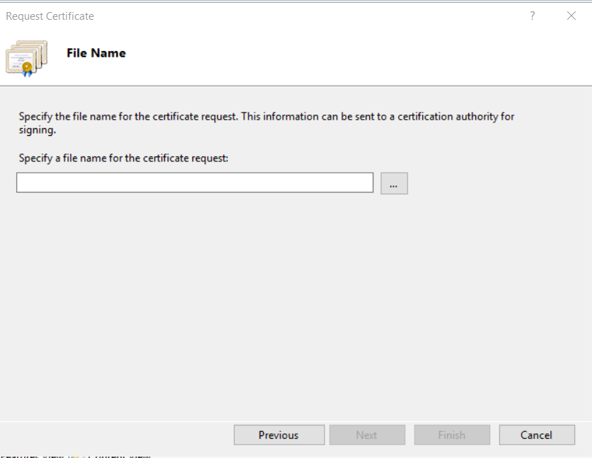

**Step 1: Login into your server using RDP using Administrator login details.**

**Step 2: Open Information Services (IIS) Manager**

**Step 3: Select the required server and open the "Server Certificates" option.**

**Step 4: On the right hand side options, click on the "Create Certificate Request" button.**

**Step 5: Enter all the required information for the CSR and then click on Next.**

**Step 6: Choose a bit length of 2048 and go to Step 7.**

**Step 7: Choose the location where you want to save your CSR and click "Finish."**

A **CSR TXT** file has been generated. 

**Step 8: Download the certificate from the SSL panel.**

**Step 9: After receiving the certificate, submit the SSL certificate.**

completion of the certificate.

**9.1:** Open the IIS and Server Manager and click on the Complete Certificate Request.

**9.2:** Add the certificate and fill in all the details, then click on "OK" to complete the request.

**9.3:** The Certificate has been completely submitted.

**Step 12: Bind the certificate and add domains.**

**10.1:** Open bindings options in default web sites as shown in the below screenshot.

**1**0**.2:** After opening the bindings , click on "add" to add the domains for the SSL.

**10.3:** Choose Type, IP, port and SSL certificate and then click on OK.

SSL has been successfully installed on the domain, please verify through the URL.

Thank you.
