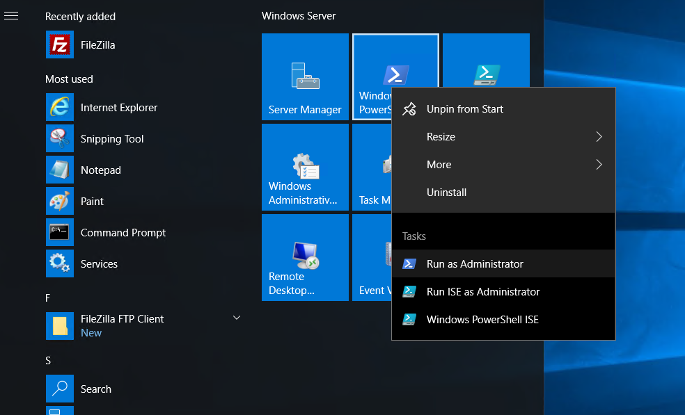
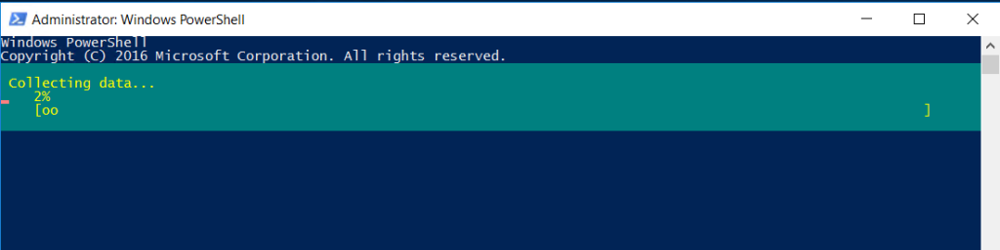

## INTRODUCTION

The [Telnet client](https://learn.microsoft.com/en-us/windows-server/administration/windows-commands/telnet?ranMID=43674&ranEAID=rl2xnKiLcHs&ranSiteID=rl2xnKiLcHs-PPfKRjba7d_vjMlCOESJzw&epi=rl2xnKiLcHs-PPfKRjba7d_vjMlCOESJzw&irgwc=1&OCID=AID2200057_aff_7795_1243925&tduid=(ir__cxccsrg9gwkfbxxxzokk9eet332xcttpytrqfyqi00)(7795)(1243925)(rl2xnKiLcHs-PPfKRjba7d_vjMlCOESJzw)()&irclickid=_cxccsrg9gwkfbxxxzokk9eet332xcttpytrqfyqi00) **enables a TCP/IP user to sign on and use applications on a remote system by using a Telnet server application**. Telnet allows you to log on to the remote computer and use it as if you were connected directly to it. You can run programs, change configurations, or do just almost anything else you can do. In this tutorial, we will learn how to and use install Telnet Client on Windows Server 2012R2, 2016, 2019, 2022.

### Step 1. Open [Windows](https://utho.com/docs/tutorial/how-to-configure-ftp-server-on-windows-server-2019/) PowerShell as Administrator

Step 2. Run the installation command install Telnet Client on windows

Installation Complete.

Thank You.
