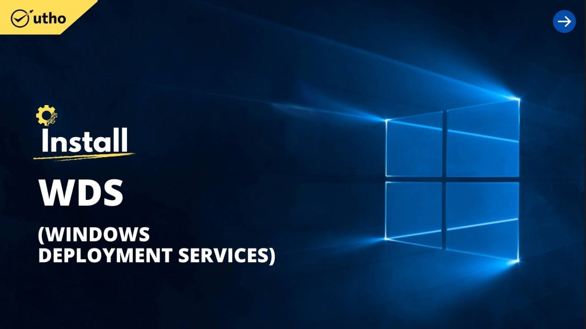
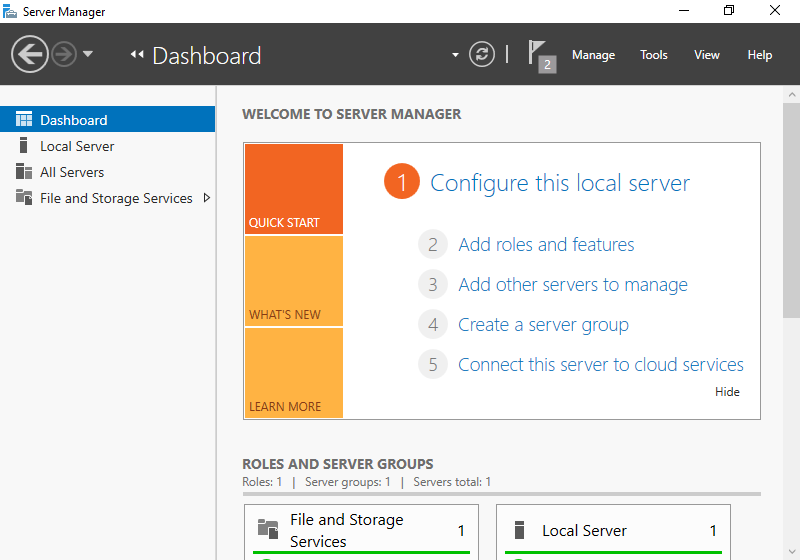
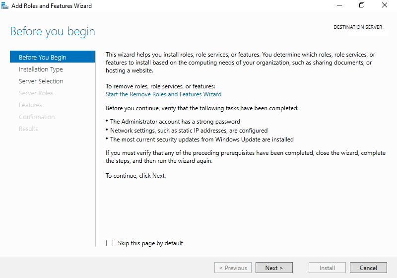
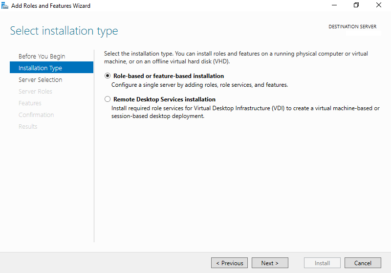
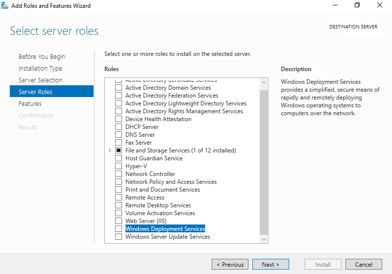
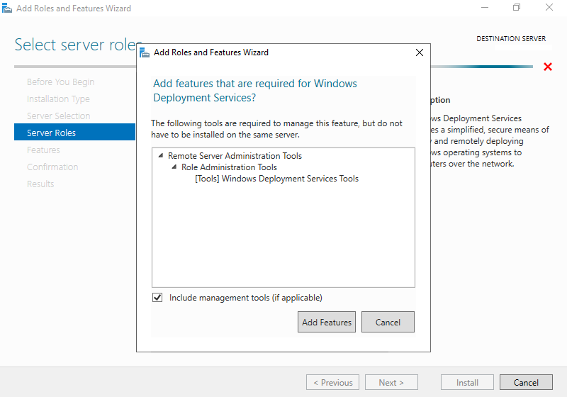
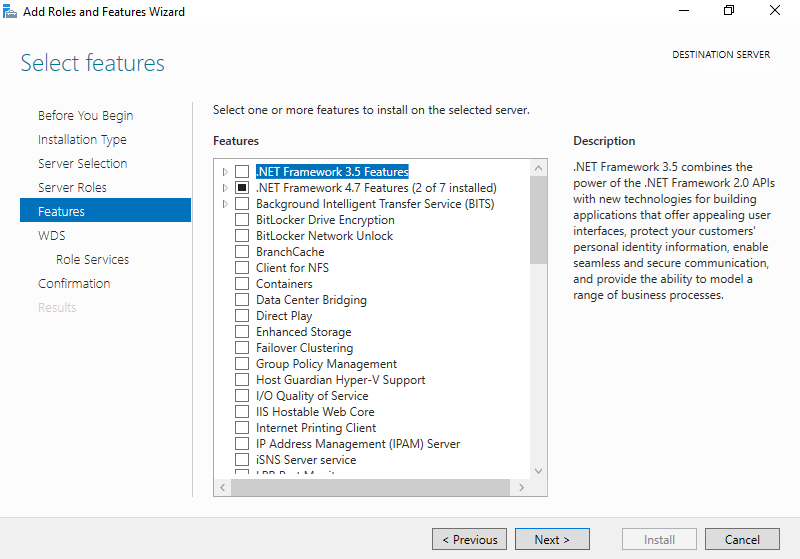
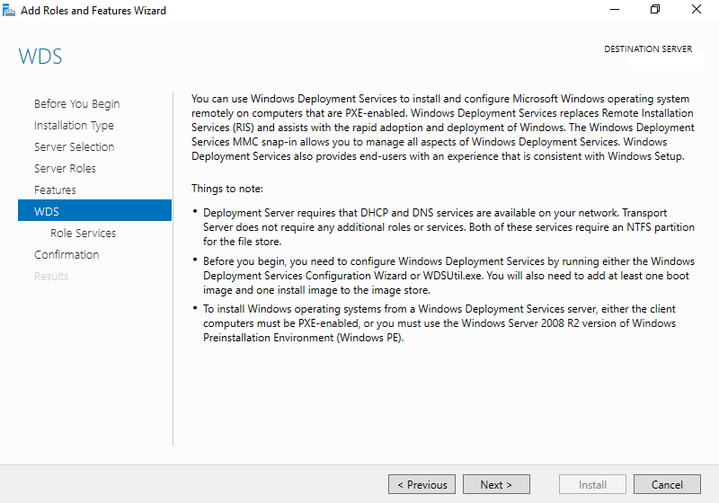
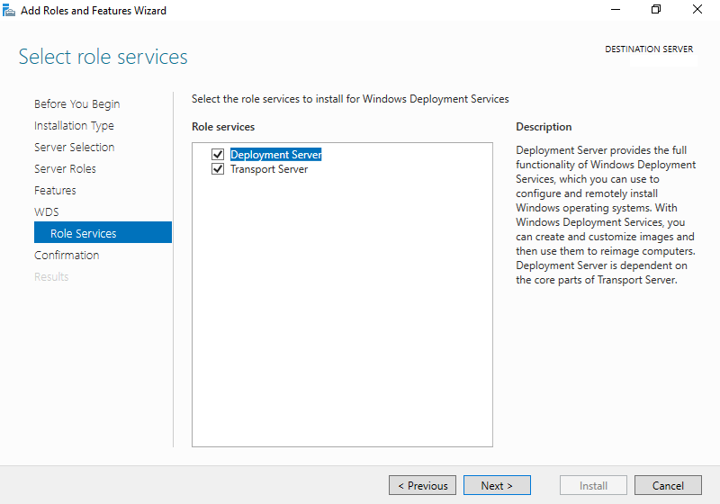
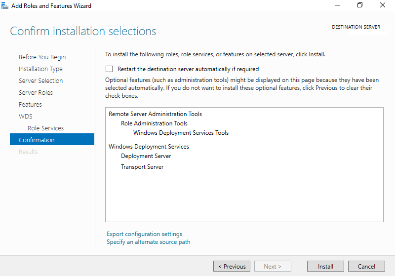

### INTRODUCTION

**Windows Deployment Services** (**WDS**) is a deprecated component of the [Windows](https://en.wikipedia.org/wiki/Windows_Server) operating system that enables centralized, network-based deploy of operating systems to bare-metal computers. It is the successor to Remote Installation Services (RIS). WDS officially supports remote deployment of Windows Vista and later, as well as Windows Server 2008 and later. However, because WDS uses disk imaging, in particular the Windows Imaging Format (WIM), it could deploy virtually any operating system. This is in contrast with its predecessor, RIS, which was a method of automating the installation process.

#### Prerequisites Windows Deployment Services on Windows

- Windows Server

- Internet connectivity

Run [Server Manager](https://utho.com/docs/tutorial/how-to-share-a-folder-over-network-using-server-manager-in-windows-servers/) and Click **Add roles and features**.

Click **Next** button.

Select **Role-based or feature-based installation**.

Select a Host which you'd like to add services.

Check a box \[Windows Deployment Services\].

Additional features are required to add WDS. Click \[Add Features\] button and then Click \[Next\] button.

Click **Next** button.

Click **Next** button.

Check boxes you'd like to install role services.

Click **Install** button.

After finishing Installation, click \[Close\] button.

Thank You!
