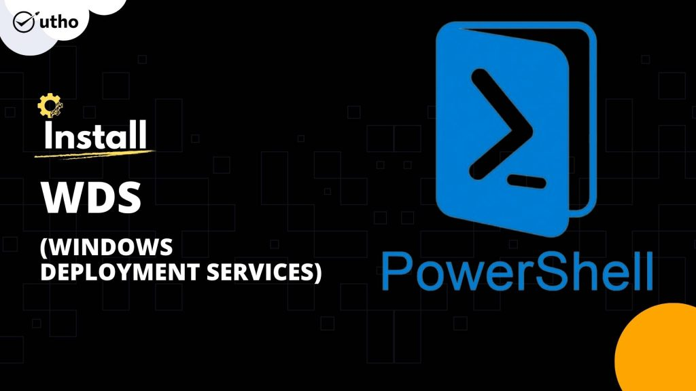
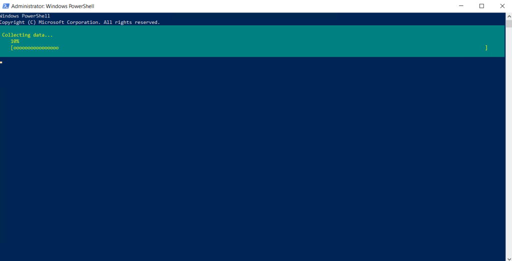
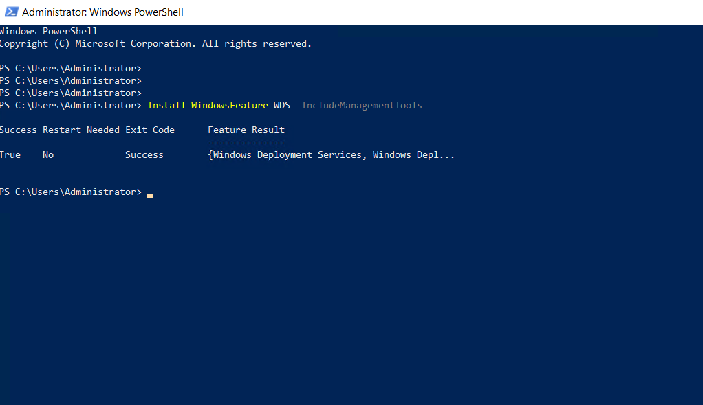

### INTRODUCTION

**Windows Deployment Services** (**WDS**) is a deprecated component of the [Windows](https://en.wikipedia.org/wiki/Windows_Server) operating system that enables centralized, network-based deploy of operating systems to bare-metal computers. It is the successor to Remote Installation Services (RIS). WDS officially supports remote deployment of Windows Vista and later, as well as Windows Server 2008 and later. However, because WDS uses disk imaging, in particular the Windows Imaging Format (WIM), it could deploy virtually any operating system. This is in contrast with its predecessor, RIS, which was a method of automating the installation process. We can also install WDS via Server Manager. But in this tutorial, we will learn how to install WDS (Windows Deployment Services) on Windows Server 2012, 2016 and 2019.

#### Prerequisites Windows Deployment Services on Windows

- Windows Server

- PowerShell with Administrator rights

- Internet connectivity

Step 1. Login to your Windows Server

Step 2. Open PowerShell as an Administrator

Step 3. Run the following command to install WDS

Step 4. Installation begins

Step 5. Installation completed. As the command suggests a system restart s not needed.

Thank You!
