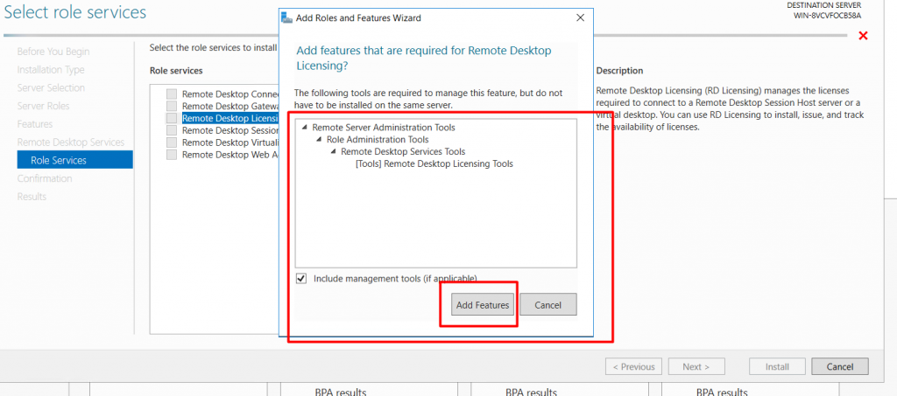
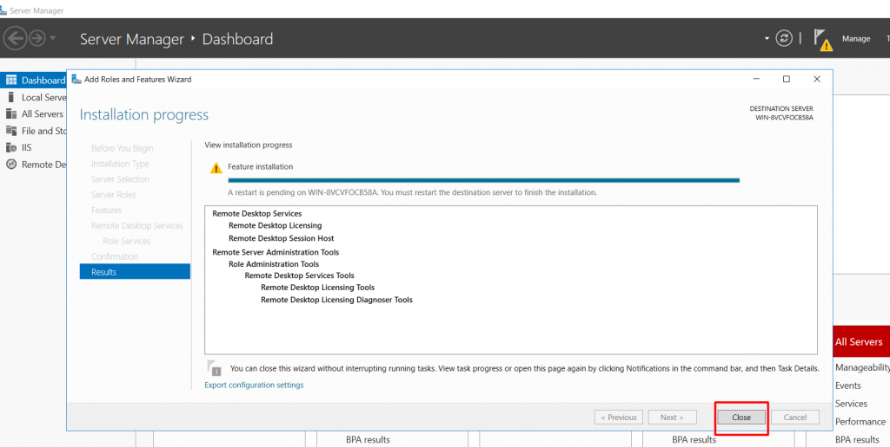
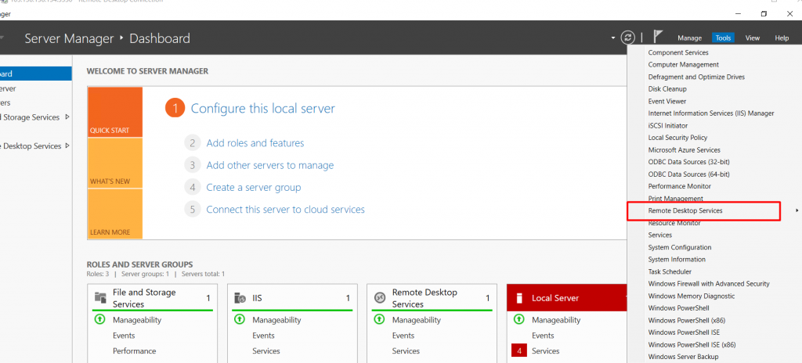
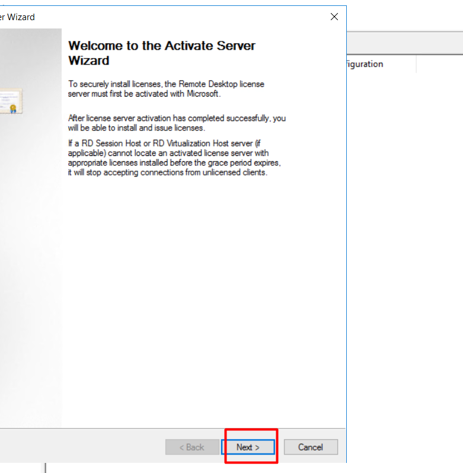
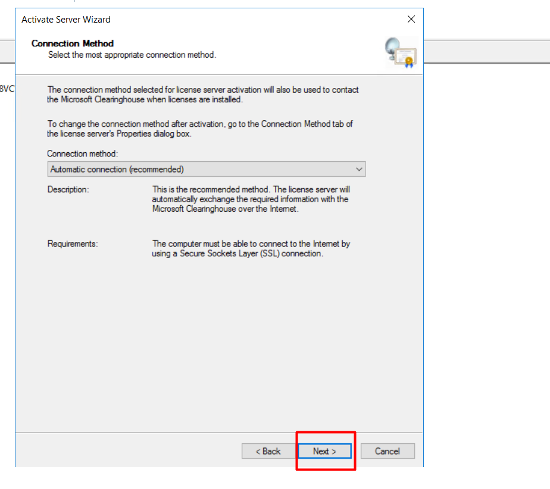
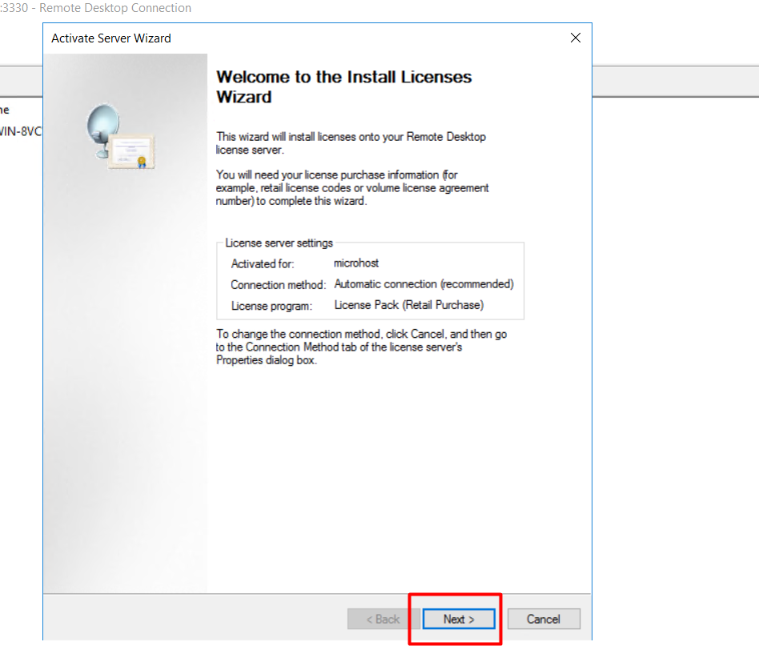
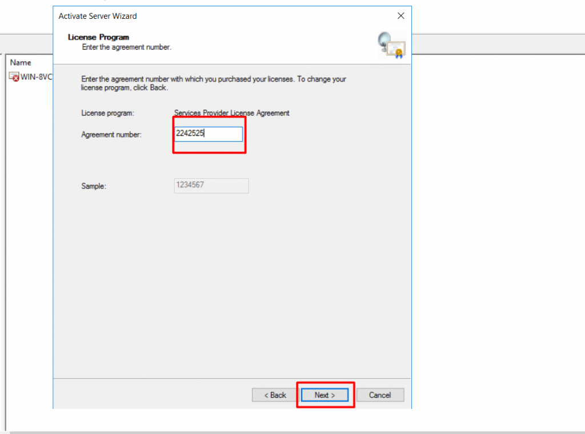
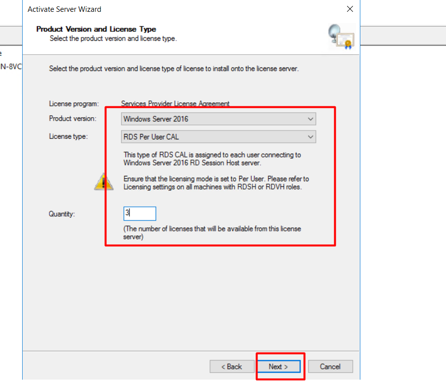

**An RDS CAL license is also known as a Remote Deskto Service Client Access License. It allows multiple users to access the server concurrently. A user can perform their own task in their RDP session.**

_We will have a brief explanation of the license installation process._

**Step 1:** We need to install the role for Remote Desktop Services. We can install the role from the server manager option. Please have a look at the below screenshot.

**STEP 2:** As per the above screenshot, we have to select the Remote Desktop Services option and then click on "NEXT." It will take you to the next option, where you have to select the additional features present in the Remote Desktop Services.

**STEP 3:** As per the above screenshot, we have added two features to this. Now we will click on "NEXT". Afterward, a new window will appear for the installation of this role. Please have a look at the below screenshot for reference.

**Step 4:** Once you click on "install," the installation process will start. It will take 5 to 10 minutes to install the role. Once the installation is completed, we have to close the window. Afterward, "reboot" the server to reflect the applied changes.

**Step 5:** Once the server has rebooted successfully, we can see the remote desktop services option in the toolbar of the server manager. Please have a look at the screenshot.

**Step 6:** Now we have to click on Remote Desktop Services and then select the “Remote Desktop Licensing Manager”. While clicking it, you can see the below prompt as per the screenshot.

**Step 7:** We can see that the licensing server is not activated yet. Hence, we have to activate the server first.

**Step 8:** Further, we have filled in the required details to activate the server.

**Step** **9:** As per the above screenshot, we have activated the licensing server successfully. Now we will initiate the license installation process by clicking on 'Next'.

**Step 10:** While clicking on next, as per the above screenshot, the next thing is to select the license program. Please have a look at the below screenshot for reference.

**Step 11:** Now we have to enter the agreement number.

**Step 12:** Now we have to select the operating system and then the license type, as well as the license quantity. Afterward, click on "Next" and then click on "FINISH".

We have successfully installed the CAL license now.

Thank you 😊
