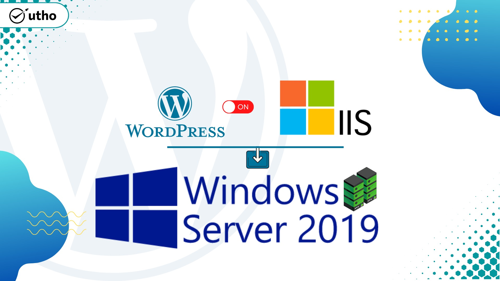

## Introduction

WordPress is a free and open-source content management system written in hypertext preprocessor language and paired with a MySQL or MariaDB database with supported HTTPS. In this article we will learn to install wordpress on IIS in a Windows Server 2019.

## **Prerequisites**

- Windows Server® 2019

- IIS 

- PHP (latest version)

- MySQL (latest version)

## **Step 1. Login to your win server via RDP.**

## **Step 2. Install IIS (Internet Information Services) if you don’t have it on your server.**

IIS is very important to install Wordpress on IIS in WIndows Server 2019.

Please see the link below for the IIS installation.

[Install IIS through Powershell](https://utho.com/docs/tutorial/how-to-install-iis-via-powershell-in-windows-server/) ----- [Install IIS through GUI](https://utho.com/docs/tutorial/installation-and-configuration-of-iis-web-server-on-windows-server/)

## **Step 3. Open IIS**

Click on your server.

## **Step 4. On the right side, click on Get New Web Platform Components**

## **Step 5. Install Web Platform Installer**

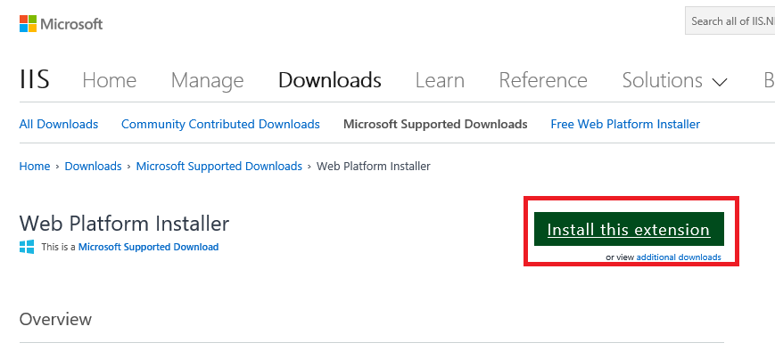

## **step 6. Open Web Platform Isntaller**

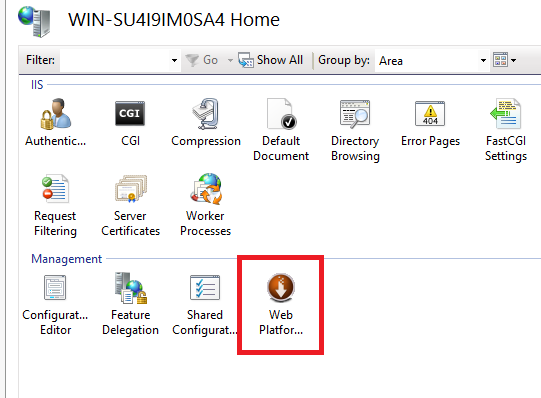

## **Step 7. Search for PHP, and install PHP 7.4.13 (x86).**

## **Step 8. Now open your browser and download PHP Manager for IIS.** 

Use the link below to download

LINK: [Download PHP Manager for IIS](https://www.iis.net/downloads/community/2018/05/php-manager-150-for-iis-10)

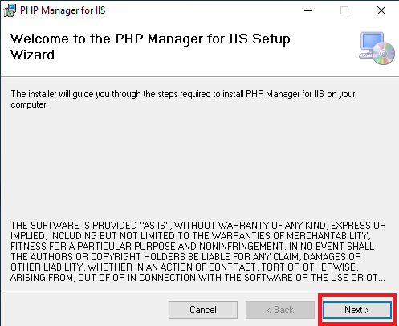

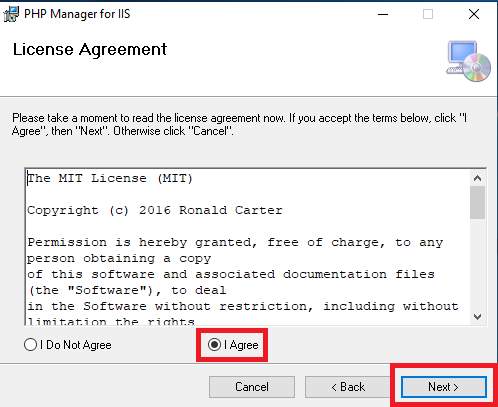

## **Step 9. Download MariaDB.**

Use one of the links below to download

LINK 1: [Download MariaDB 10.6.5](https://mariadb.org/download/?t=mariadb&p=mariadb&r=10.6.5&os=windows&cpu=x86_64&pkg=msi&m=inet)

LINK 2:  [MariaDB downloads page](https://mariadb.com/downloads/)

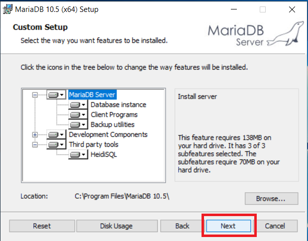

Enter the password for the root user.

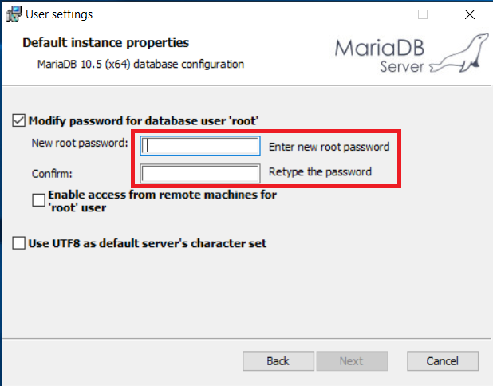

## **Step 10. After the installation, go to Start Menu and open HeidiSQL**

## **Step 11. Add a new session and change its name from "Unamed" to "localhost"**

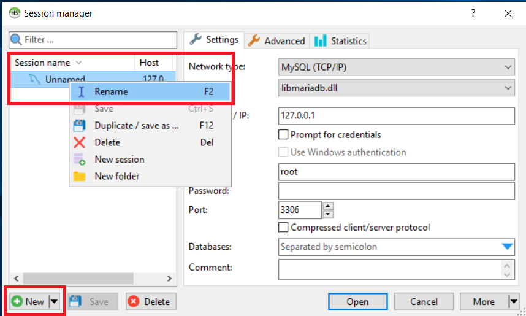

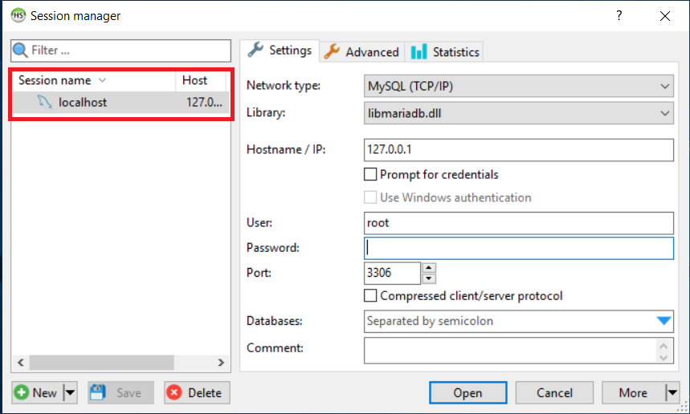

## **Step 12. Set a password for the root user.** Click save, open

## **Step13. Create a new database under localhost**

Name it "**wordp1**".

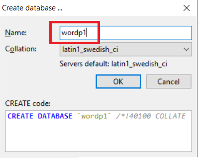

## **Step 14. Go to the User Manager**

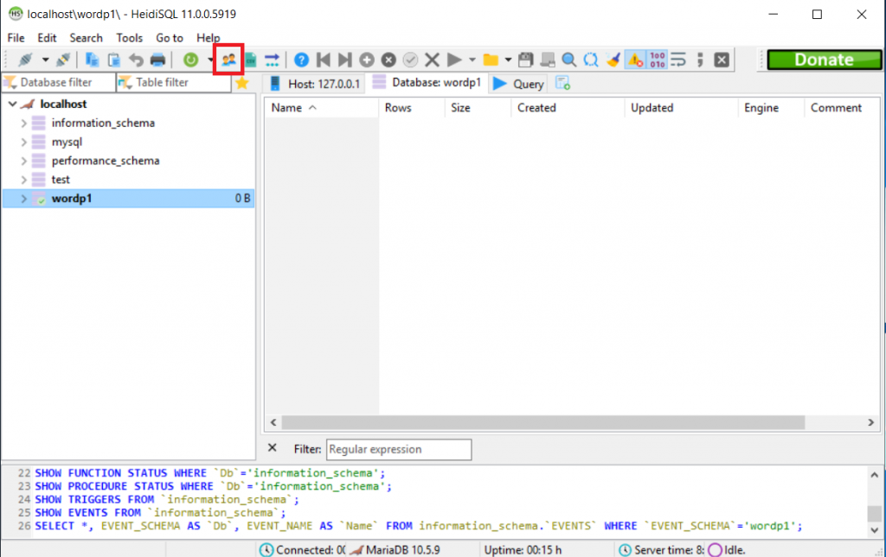

## **Step 15. Click on "Add new user."**

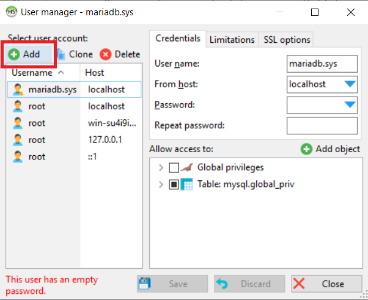

## **Step 16. Set the username as admindb. Set from the host as Access from everywhere**

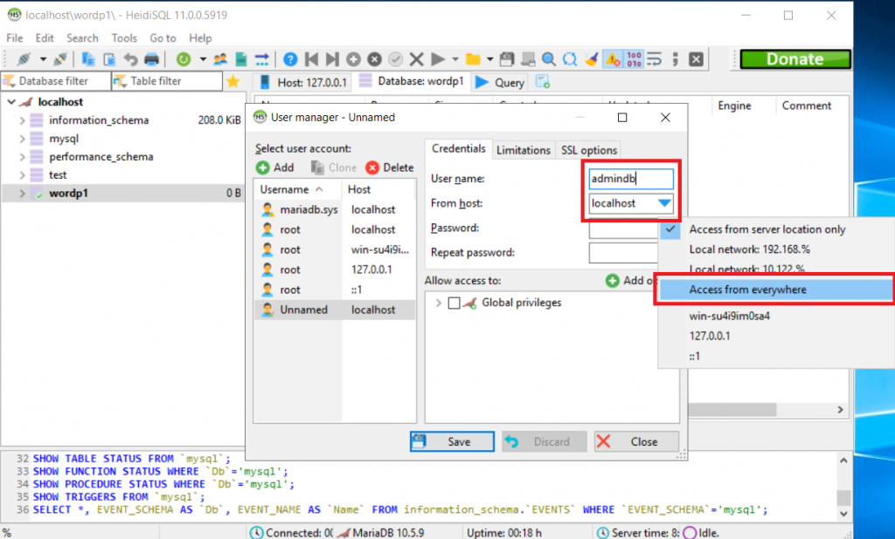

## **Step 17. Set a password for the new user and retype the password**

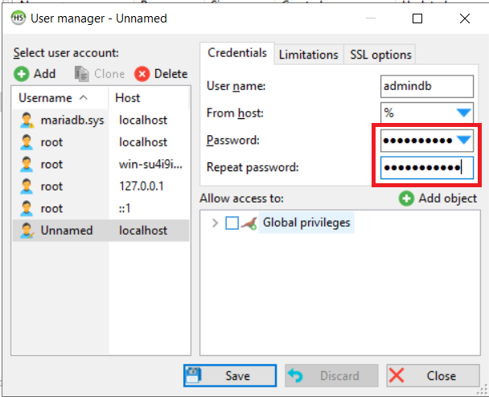

Allow Global Privileges

Click save, then close.

## **Step 18. Download Wordpress**

Use the link to download: [Wordpress Downloads Page](https://wordpress.org/download/)

## **Step 19. Copy the contents of the downloaded WordPress file.**

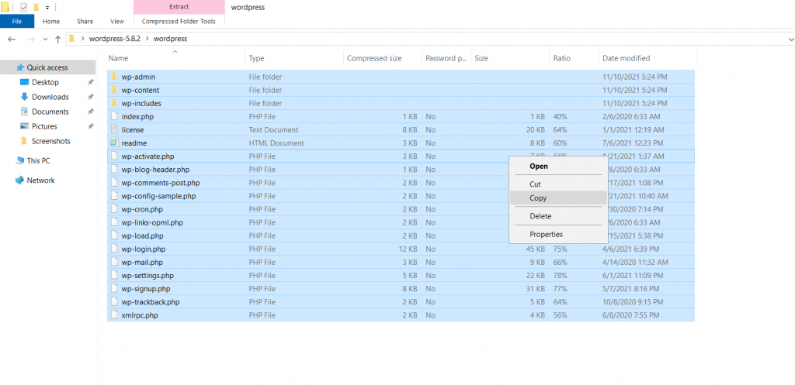

## **Step 20. Go to the following location: C:\\inetpub\\wwwroot**

Create a folder there, (we will name it "**test"**)

And paste the copied Wordpress contents into this folder.

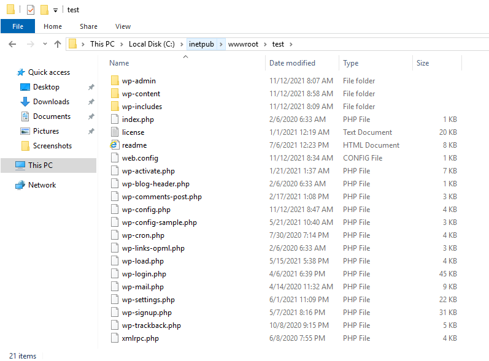

## **Step 21**. **Open IIS**Go to sites and click on **Add Website.**

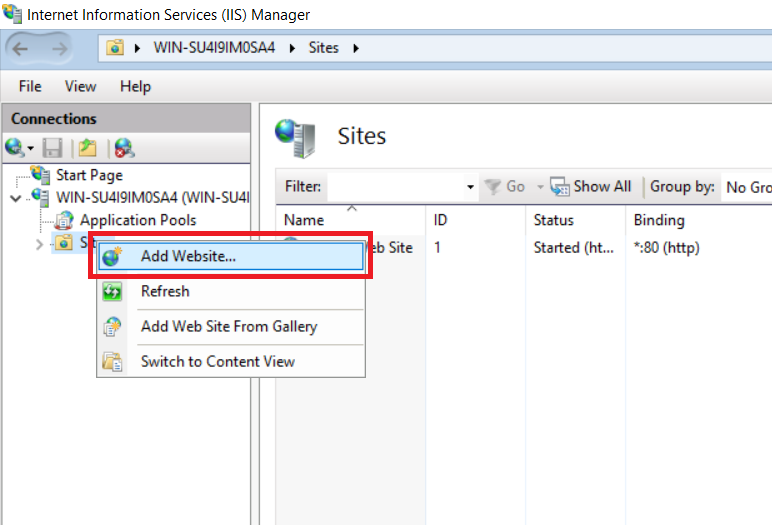

## **Step 22. Set the site name as: APP1**

Set the physical path as: C:\\inetpub\\wwwroot\\test

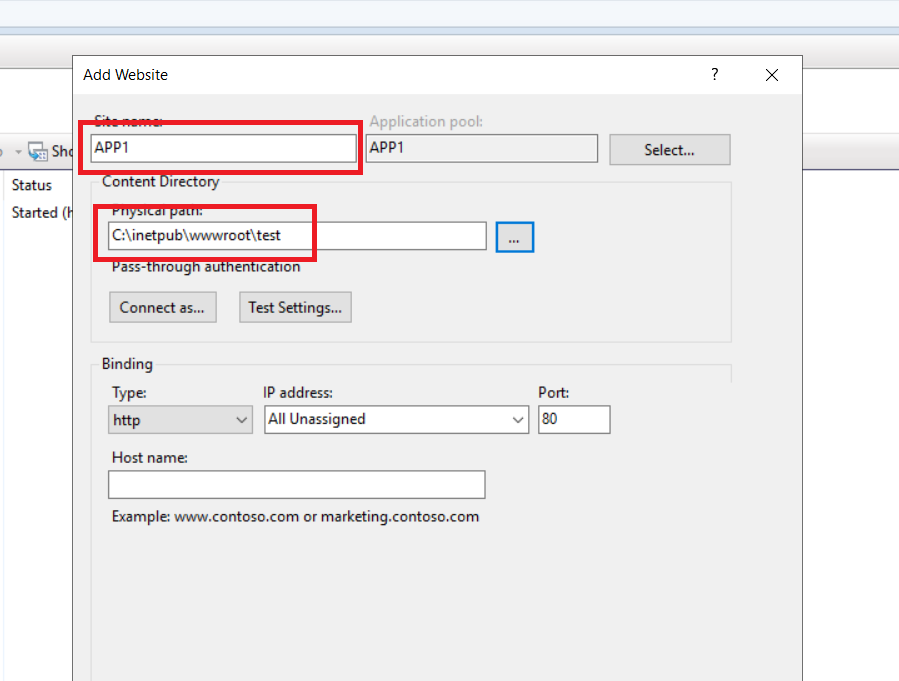

## **Step 22. Click on "Connect as..." > Specific user > set**

Set user name as Administrator

Set user password

Retype the password; click OK.  
  
Click on Test Settings..

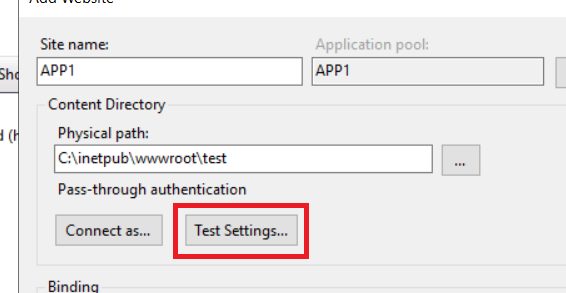

Proceed if the connection is valid.

Set port to: 8041

## **Step 23. Open IIS and open 'APP1'  
**Open **PHP Manager**

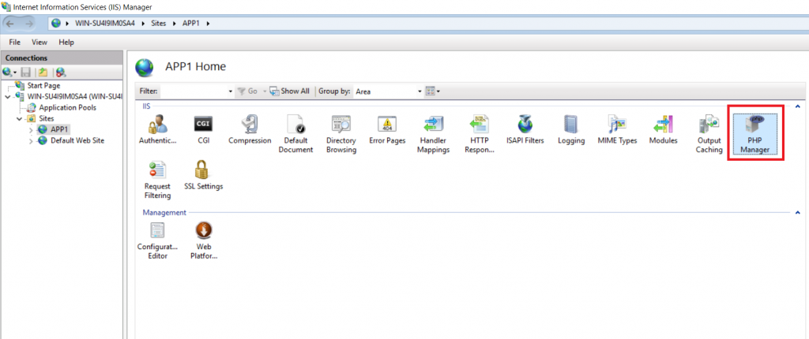

## **Step 24. Click on "View Recommendations,"**

change the PHP configuration for your machine. Select both options available and click OK.

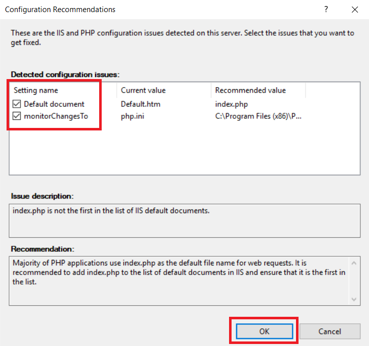

## **Step 25. Go to APP1  
**Under the **Actions** section, click on **Browse \*.8041 (http)**

**The Wordpress installation page will open.**

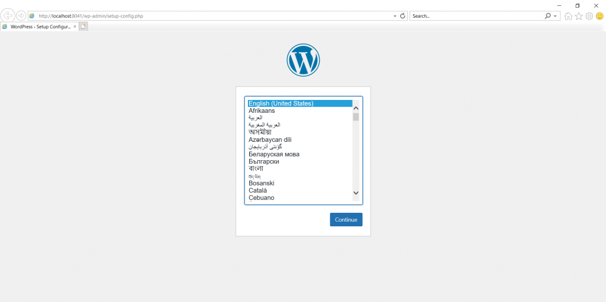

## **Step 26. Select the installation language and proceed.**

## **Step 27. Set the Database Name as: wordp1.**

Set Username as: **admindb**

Type your admindb **password**

Set Database Host as: **localhost**

Set the table prefix as: **wp\_**

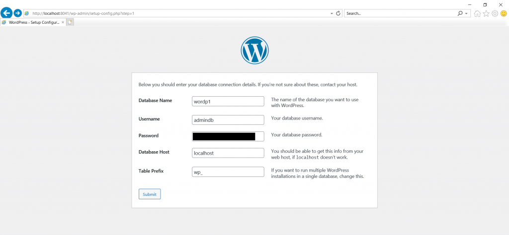

Click on "submit."

## **Step 28. Set the Site Title as: APP1**

Set Username as: admin

Set Password

Enter your email Id

Check the search **engine visibility** option.

Click on **Install Wordpress.**

**  
Installation was successful.**

## **Step 29. Login with your username and password.**

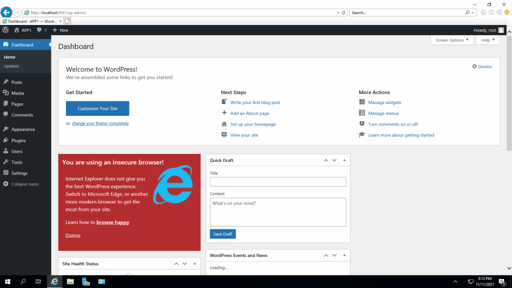

## **Wordpress successfully installed.**

Thank You.
