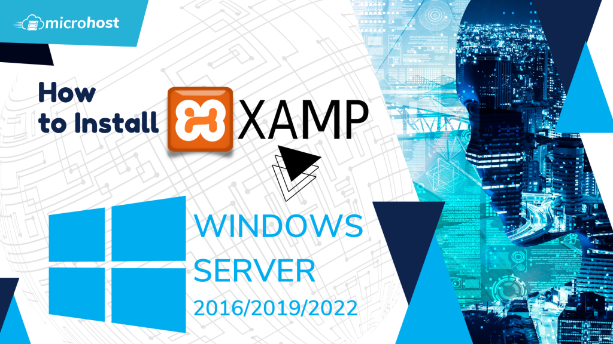
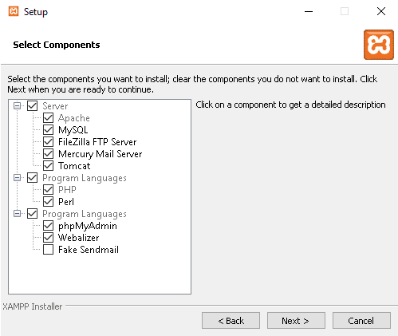
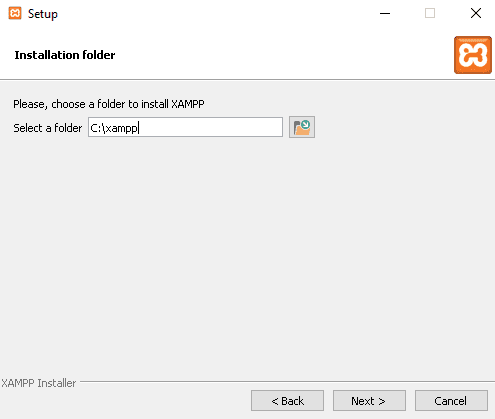
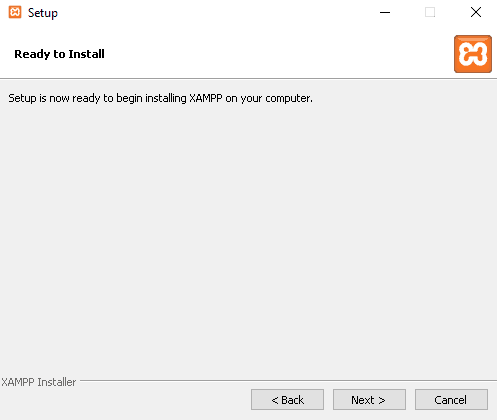
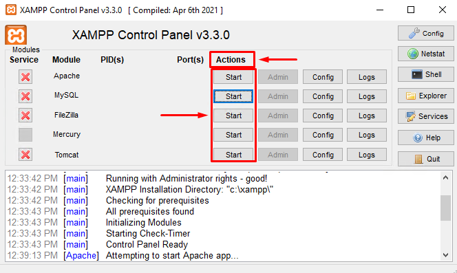

## Introduction

In this article, you will learn how to install XAMPP on Windows Server 2016/2019/2022.

The Apache Friends organisation created [XAMPP](https://en.wikipedia.org/wiki/XAMPP), a cross-platform software stack used to develop and test programmes and web applications. It streamlines your web development process by eliminating the need to install each component separately.

Generally known as Cross-Platform, Apache, MySQL, PHP, and Per[l](https://en.wikipedia.org/wiki/Perl), or XAMPP for short, it is the most widely used free software stack available. Apache is included for multiple server delivery and command line executables in this web solution package.

## Download and install the XAMPP application

Before getting started, you will need to go to the Apache Friends official website and download the most recent version of XAMPP on your server. You can find the page here. To successfully install XAMPP on Windows Server, please follow the procedures below:

Step 1. To reach the XAMPP download page, which is seen below, click [here](https://www.apachefriends.org/download.html):

Step 2. Choose the version that you want, and then download it to your server.

Step 3. When the download is finished, you will see the image below. 

Step 4. You can proceed by clicking the Next button. Your device's screen should now be on the component selection screen.

Step 5. Make your selections and proceed by clicking Next. The installation folder selection screen should appear:

Step 6. Choose a destination for the installation, then proceed. The language menu should load, which will look like this:

Step 7. To proceed, choose your language and press the Next button. There's a XAMPP info screen that should load:

Step 8. Click the Next button after reading all of the information. At this point, you should be presented with the Ready to Install screen:

Step 9. The installation can be started by clicking the Next button. When XAMPP is finished installing, the following window will appear:

Step 10. To complete the setup process, select Final. When you're done setting up XAMPP, the admin panel will look like this:

Step 11. As shown below, you can start various services by clicking the Start button under the Action column.

## Conclusion

Hopefully, now you have learned how to install XAMPP on Windows Server 2016/2019/2022.

Thank You 🙂

Also read: [How to Block or Allow TCP/IP Port in Windows Firewall](https://utho.com/docs/tutorial/how-to-block-or-allow-tcp-ip-port-in-windows-firewall/)
