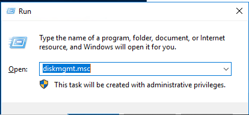
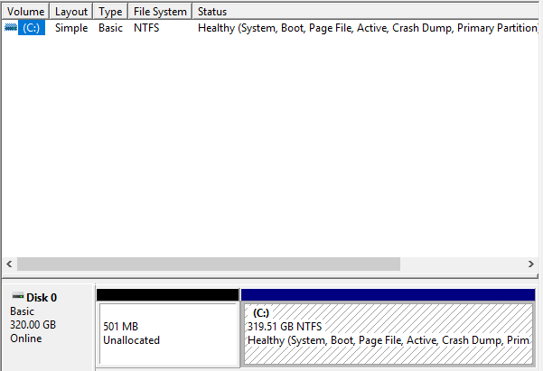
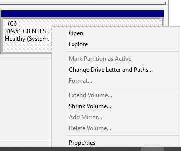
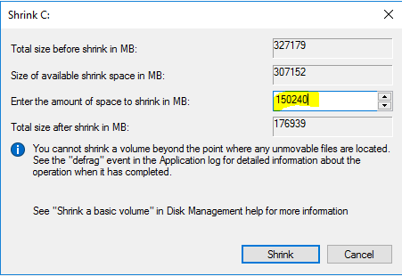
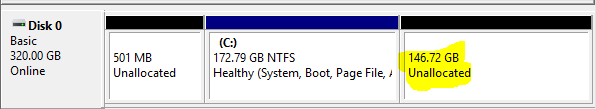
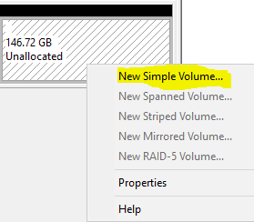
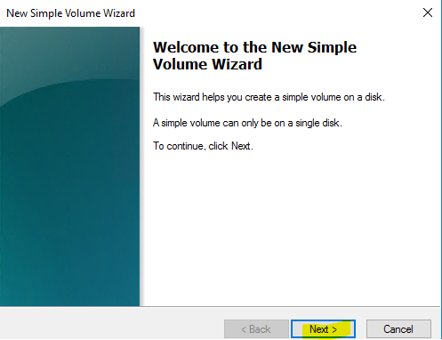
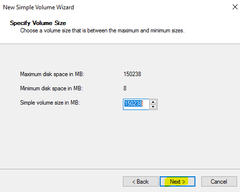
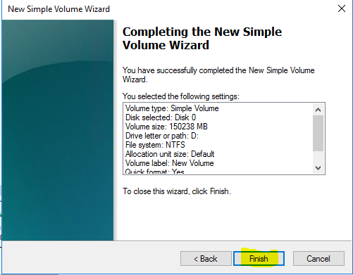
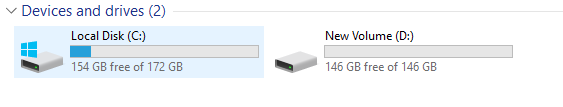

**How to make a partition from an existing drive on Windows Server**

**Step1: Firstly, we need to login into the server using Remote Desktop Connection (RDP Client) or type the following commands on the RUN prompt mstsc**

**Step2: After executing the mstsc command on the RUN prompt, type the server IP address which you need to connect to.**

**Step3: Now you need to login to the server with admin privileges to check the current disk size, and thenyou need to create a new disk size from the existing one.**

**As you see in the above screenshot, there is only 1 logical drive present on the server. Now we are going to create a new drive from the server's existing drive.**

**Note:** _To edit disks on a server, you need to access the server with admin rights._

**Step5: Need to go to disk management by typing the following command: diskmgmt.msc**

Or  

**Step 5:** **You have to open Server Manager in the server start option, then click on the tools section, then select “Computer Management," and then you need to select "Disk Management" on the screen.**

**Step6: After either of the above 2 methods, you will go on the below screen.**

**Step7: Now we are ready to add a new partition on the server. Just follow these steps below.**

**Step8: Now we need to click on Shrink Volume, as we are going to make a partition from the existing drive of the server.**

**Step 9: Now we have to enter the amount of space we need to give to the new drive.**

**Step 10:** **Now, by clicking on the shrink button, we are going to create a new partition from the drive.**

**Step11: Now we need to allocate the new partition from the unallocated zone. Follow the below screenshot.**

**Step12: After doing all the above steps, we are now able to access the newly allocated partition on the server, which is shrinked from the existing partition.**

Thank you :)
