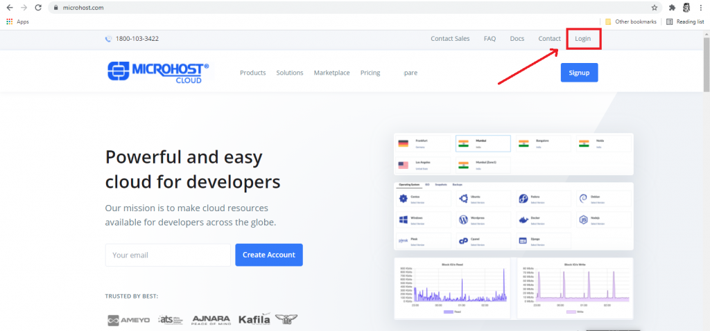
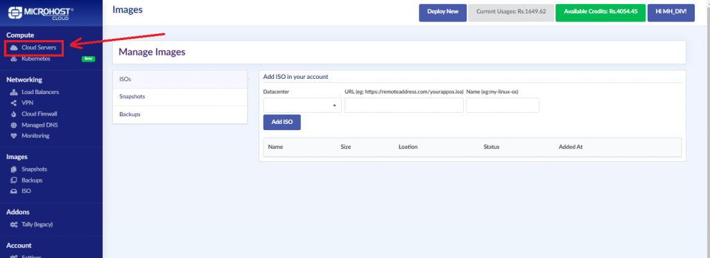
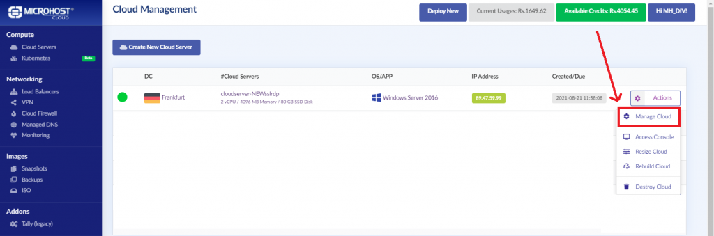
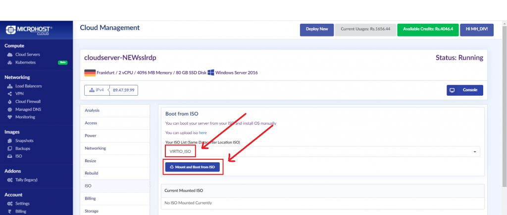

**Step 1. Go to a Virtio ISO downloading site.**

Copy the address link of the Virtio ISO

You can find the link to the Virtio ISO below:

LINK:  [https://github.com/virtio-win/virtio-win-pkg-scripts/blob/master/README.md](https://github.com/virtio-win/virtio-win-pkg-scripts/blob/master/README.md)

**Step 2. Login to the Microhost Cloud Dashboard**

**Step 3. Go to the ISO section in the Microhost Cloud Dashboard.**

**Step 4. ISO downloading step**

·        Select data center same as your server’s data center location.

·        In the URL section, paste the link copied in step 1.

·        Add any name to the ISO

·        Click on **Add ISO**

**Step 5. Go to the Cloud Servers**

**Step 6. Go to the Manage Cloud of your cloud server.**

**Step 7. Go to ISO in your server options**

**Step 8. In the mount ISO section, select the Virtio ISO that you downloaded and click on “Mount and Boot from ISO”**

**Step 9. Virtio ISO mounted successfully.**

Thank you.
