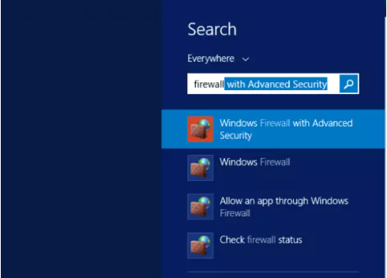
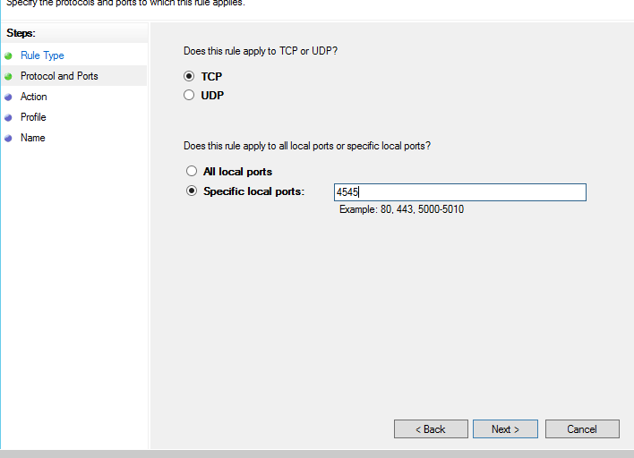
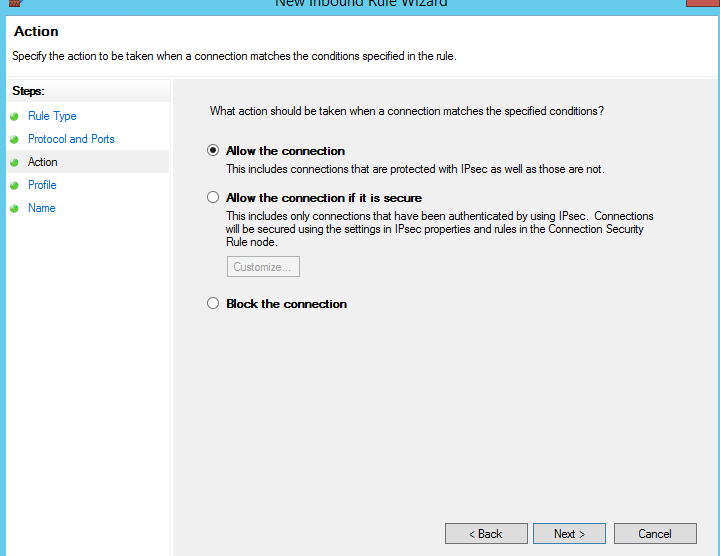

#### Open Windows Firewall

Hit the Windows key and find "firewall with Advanced Security." Select the first option as described below. Once the window of the firewall opens, go to the next step.

#### Configure Inbound rule.

In the top-left section , click on the "Inbound Rule" button and in the top right-hand section, select the "New Rule." For a better photo view, see below. A window will open "New Inbound Rule Wizard." Continue to the following step.

#### Go to Wizard

On the new window, follow the steps shown in the screenshots below

Choose **port** and hit **next**.

Click on TCP and add the port, whatever port you want to open. Then click next.

Click on Allow the Connection.

Now, click on next and select the domain, Private & Public as per the screenshot:

In the last section, Give the name and description.

We have successfully completed the Port opening section.

Thank You :)
