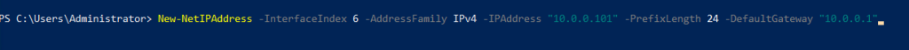
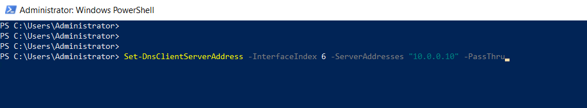

## INTRODUCTION Set Static IP Address

A static IP address is a 32 bit number assigned to a computer as an address on the internet. This number is in the form of a [dotted quad](https://support.google.com/fiber/answer/3547208?hl=en) and is typically provided by an internet service provider (ISP). In this tutorial, we will learn how to Set Static IP Address in Windows Server via PowerShell.

#### Prerequisites

- [Windows Server](https://utho.com/docs/tutorial/how-to-install-active-directory-domain-service-on-windows-server/?preview_id=11159&preview_nonce=171803715d&preview=true)

- PowerShell with Administrator rights

- Internet connectivity

Step 1. Login to your Windows Server

Step 2. Open PowerShell as an Administrator

**Step 3. Run the following command to get Network Interface**

**Step 4. Run the following command to set DHCP off**

**Step 5. Run the following command to set DNS**

_PS: 10.0.0.10 is just a test IP._

**Step 6. **Run the following command to**** **confirm settings**

Thank You.
