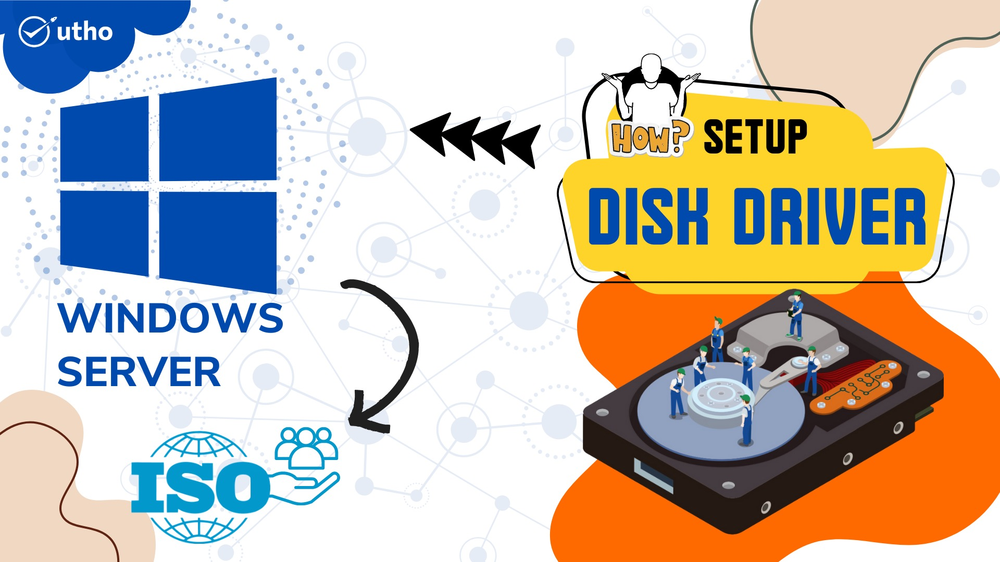
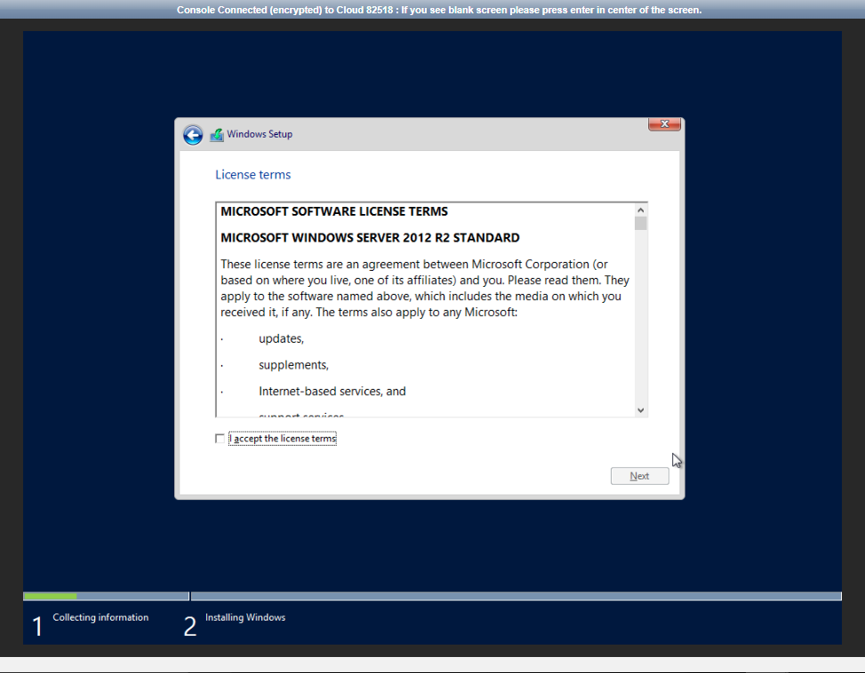
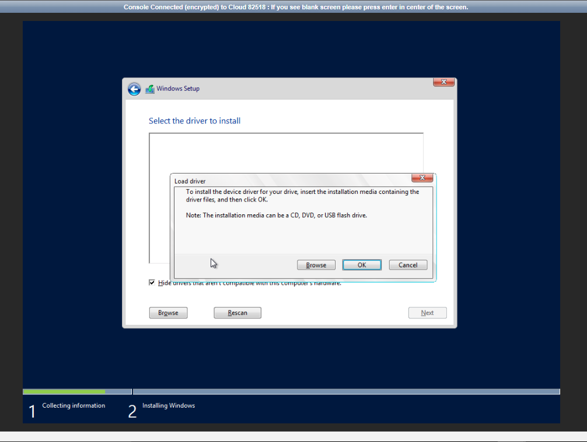
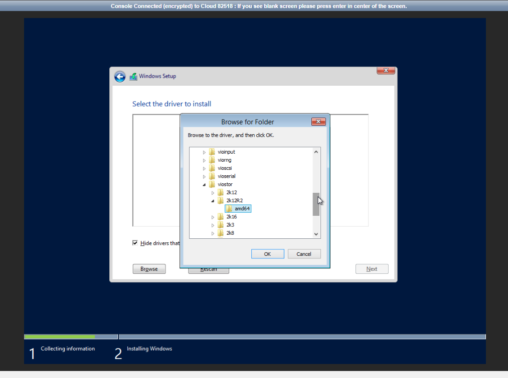
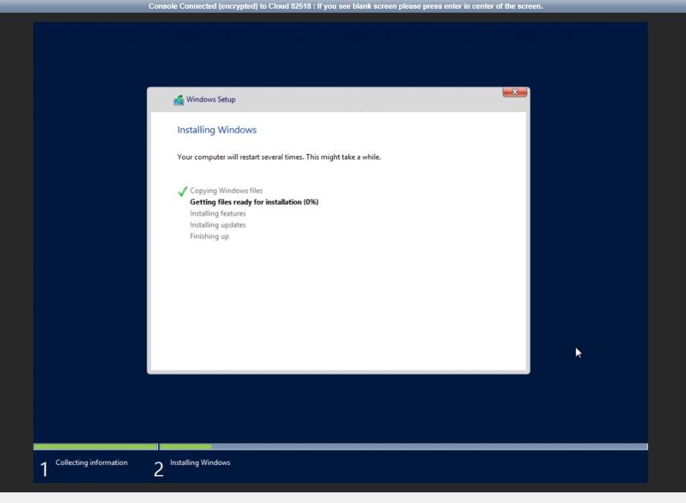

Step 1. Download ISO

Step 2. Deploy a server using the ISO

Step 3. Open console to install OS

Step 4. Begin OS isntallation

Click "I accept the license terms"

Step 5. Select "Custom"

step 6. Select "Load Driver"

Step 7. Click on "Browse"

Step 8. Search for "Cd Drive (E:) virtio-win-version"

Step 9. Search for the OS version same as your ISO OS version, select "and64" for 64bits

Step 10. Red Hat Virtio SCSI controller will appear, selct that and click "next"

Step 11. Then select "Windows Server Standard Evolution (Server with a Graphical Interface)"

Step 12. Allocate Drive (Click on 'New')

Step 13. Select "Primary Drive" and click on 'Next'

Step 14. OS installation begins.

Thank You!
