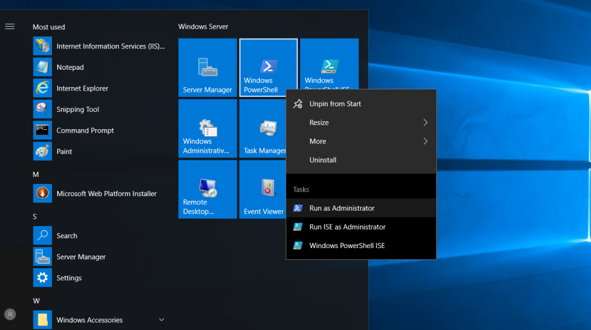

Step 1. Login to your [Windows Server](https://utho.com/docs/tutorial/how-to-connect-virtual-server-remotely-using-rdp-in-windows-os/) setup SSH Server via PowerShell

Step 2. Open [PowerShell](https://learn.microsoft.com/en-us/powershell/) as Administrator



Step 3. Check the names of installable features using the following command

```
Get-WindowsCapability -Online | ? Name -like 'OpenSSH*'
```

Name : OpenSSH.Client~~~~0.0.1.0

State: Installed

Name : OpenSSH.Server~~~~0.0.1.0

State : NotPresent

Step 4. Install OpenSSH Server

```
Add-WindowsCapability -Online -Name OpenSSH.Server~~~~0.0.1.0
```

Path:

Online : True

RestartNeeded : False

Step 5. Start service

```
Start-Service -Name "sshd"
```

step 6. Set Startup to \[Automatic\]

```
Set-Service -Name "sshd" -StartupType Automatic
```

step 7. Check

```
Get-Service -Name "sshd" | Select-Object *
```

Name : sshd

RequiredServices : {}

CanPauseAndContinue : False

Can Shutdown : False

CanStop : True

DisplayName : OpenSSH SSH Server

DependentServices : {}

MachineName : .

ServiceName : sshd

ServicesDependedOn : {}

ServiceHandle : SafeServiceHandle

Status : Running

ServiceType : Win32OwnProcess

StartType : Automatic

Site: Container: setup SSH Server via PowerShell

Step 8. Allow 22/TCP if Windows Firewall is running

```
New-NetFirewallRule -Name "SSH" `
```

```
-DisplayName "SSH" `
-Description "Allow SSH" `
-Profile Any `
-Direction Inbound`
-Action Allow`
-Protocol TCP`
-Program Any`
-LocalAddress Any `
-RemoteAddress Any`
-LocalPort 22`
-Remote Port Any
```

Name : SSH

DisplayName : SSH

Description : Allow SSH

DisplayGroup:

Group :

Enabled : True

Profile: Any

Platform : {}

Direction: Inbound

Action: Allow

EdgeTraversalPolicy : Block

LooseSourceMapping : False

LocalOnlyMapping : False

Owner:

Primary Status : OK

Status : The rule was parsed successfully from the store. (65536)

EnforcementStatus : NotApplicable

PolicyStoreSource : PersistentStore

PolicyStoreSourceType : Local

Thank You!
