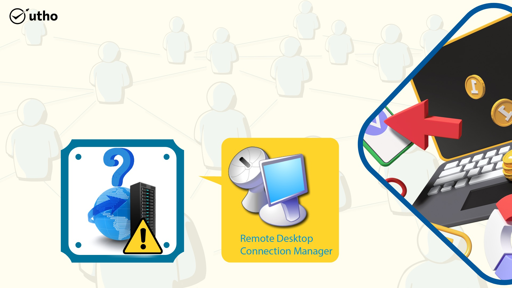
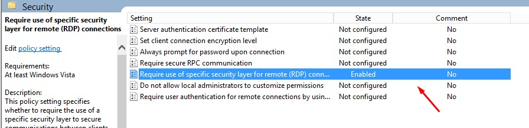

**When you face an internal server error while connecting to RDP, please follow these steps:**

1. **Login to the Windows server through the console.**

3. **Now we need to open the Remote Desktop Group Policy. Press _Win + R_ on the keyboard to open the run window. In the _Open_ field, type _“gpedit.msc_” and press _Enter_ on the keyboard or click _OK._**

**Step 3. After Local Group Policy Editor opens, expand Computer Configuration >> Administrative Templates >> Windows Components >> Remote Desktop Services >> Remote Desktop Session Host >> Security.**

**step 4. On the right-side panel. Double-click on “Require use of specific security layer for remote (RDP) connection and enable it. See below in the screenshot-**

**Step 5. Open cmd and type - gpupdate**

Thank you!!
