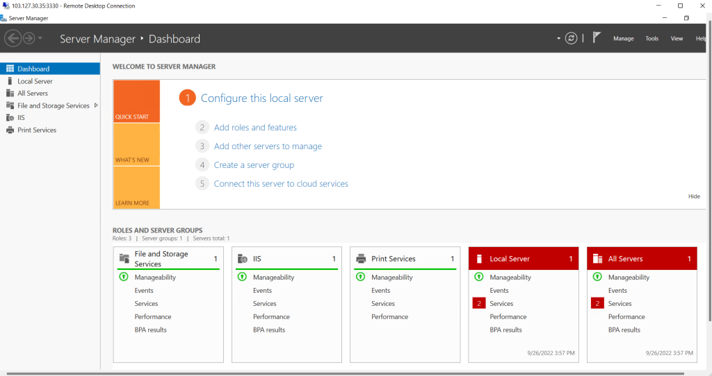
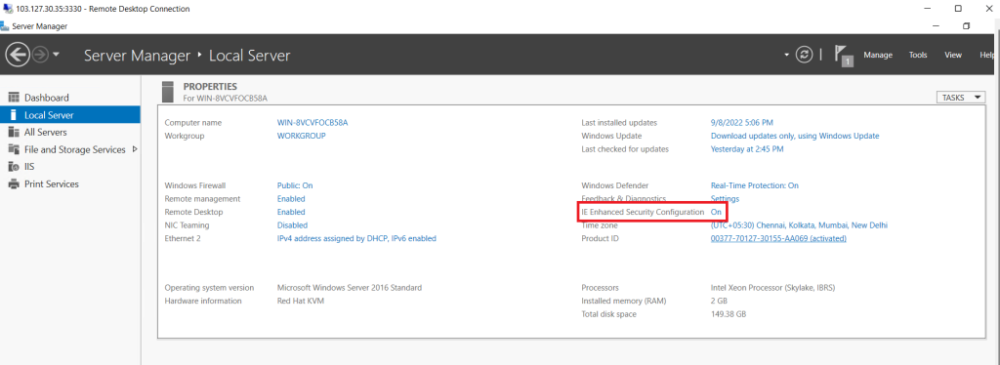
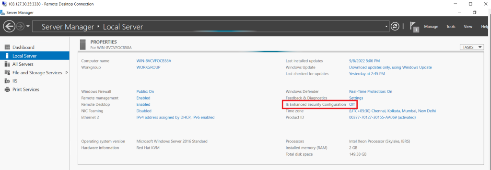

## Introduction

Internet Explorer [Enhanced Security Configuration](https://learn.microsoft.com/en-us/troubleshoot/developer/browsers/security-privacy/enhanced-security-configuration-faq) (ESC) **establishes security settings that define how users browse the internet and intranet websites**. These settings also reduce the exposure of servers to websites that might present a security risk. This process is also known as IEHarden.

Step 1. Connect to your Windows server with Remote Desktop Protocol (RDP).

Step 2. Open **[Server Manager](https://utho.com/docs/tutorial/how-to-setup-ssh-server-on-windows-server-via-powershell/)** from the Windows start menu.

Step 3. Open Local Server

Step 4. Click on "**IE Enhanced Security Configuration**" property in the right-hand panel, and click on "**ON"**

step 5. Click on Turn the option **"off"** for Administrators and Users, then click "**OK**"

Step 6. Select **refresh** on the Server Manager toolbar for changes to take effect.

Step 7. Server Manager will now show **"off**" for the IE Enhanced Security Configuration property, and you will be able to browse the web without any warnings in Internet Explorer.

Thank You.
