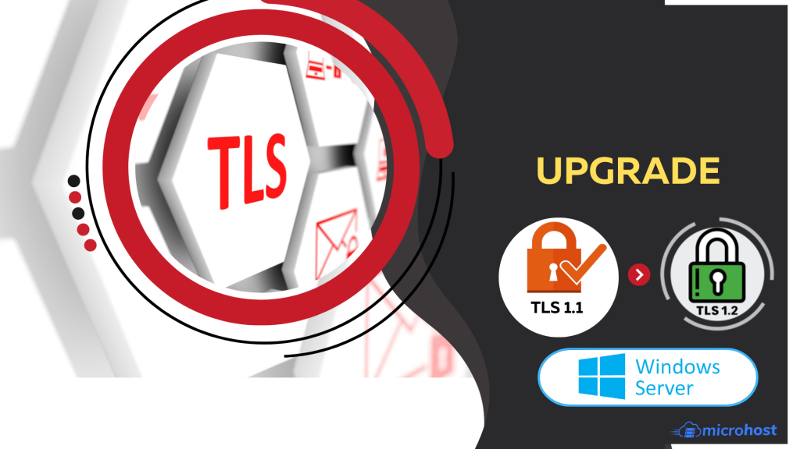
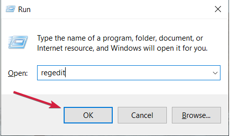
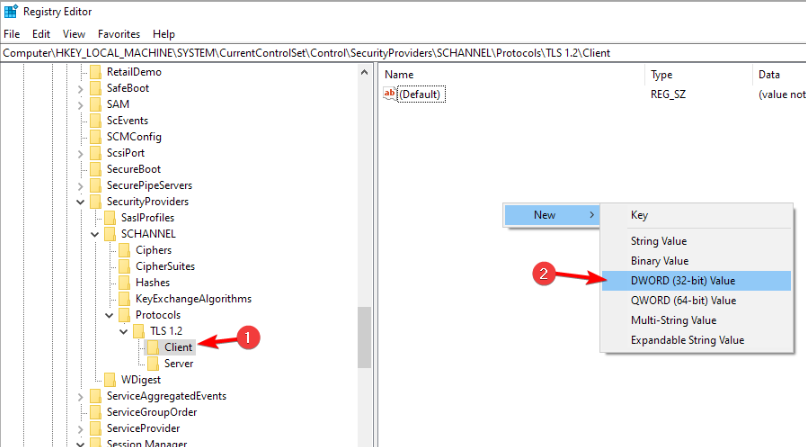
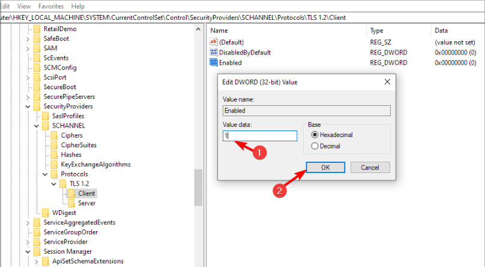

## Introduction

In this article, you will learn how to upgrade TLS 1.1 to TLS 1.2 in window server.

**What is TLS**?

[TLS](https://en.wikipedia.org/wiki/Transport_Layer_Security) is a cryptographic protocol that provides end-to-end security of data sent between applications over the Internet. It is mostly familiar to users through its use in secure web browsing, and in particular the padlock icon that appears in web browsers when a secure session is established. However, it can and indeed should also be used for other applications such as e-mail, file transfers, video/audioconferencing, instant messaging and voice-over-IP, as well as Internet services such as DNS and NTP.

**Need to connect windows server with Administrator privilege, then type below command in search box “regedit”**

**Search regedit >> computer >> HKEY\_LOCAL MACHINE >> SYSTEM >> current control set >> control >> security providers >> SCHANNEL >> protocols \[right click on protocols\] then NEW >> key then rename the new folder with TLS 1.2**

**Right click on TLS 1.2 folder then NEW >> key**  
**Rename the new folder with client**

**Right click on client name folder >> new >> DWORD \[32-bit\] value after that in the right side of the page a new folder will be added and renamed it with DisabledByDefault**

**Then right click on DisabledByDefault folder go to modify >> value data=0 >> hexadecimal >> ok**

**Right click on client name folder >> new >> DWORD \[32-bit\] value after that in the right side of the page a new folder will be added and renamed it with Enabled**

**Then right click on Enabled folder go to modify >> value data=1 >> hexadecimal >> ok**

**How do I know if TLS version is enabled on Windows Server?**

1. Click on: Start -> Control Panel -> Internet Options
2. Click on the Advanced tab
3. Scroll to the bottom and check the TLS version described in steps 3
4. Select \[use TLS 1.2\] >> ok

## Conclusion

Hopefully, you have learned how to upgrade TLS 1.1 to TLS 1.2 in window server.

Also read: [How to Block or Allow TCP/IP Ports in Windows Firewall](https://utho.com/docs/tutorial/how-to-block-or-allow-tcp-ip-port-in-windows-firewall/)

Thank You 🙂
