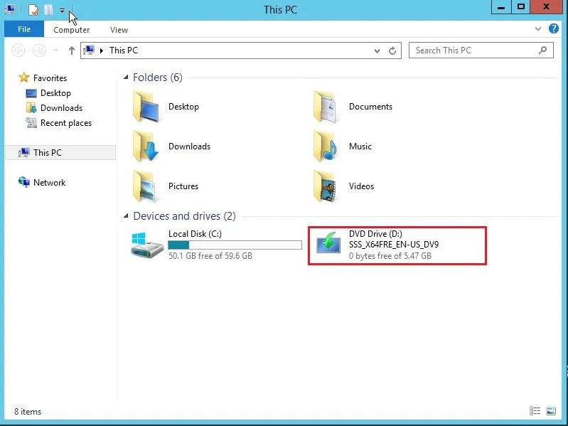
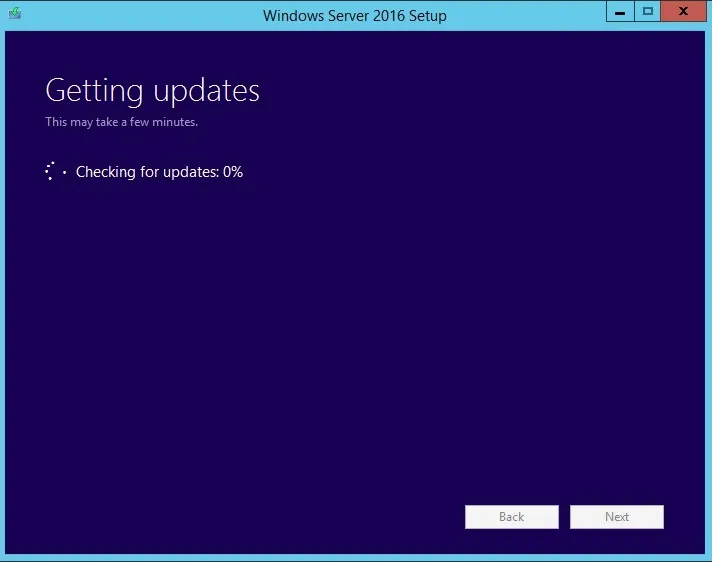
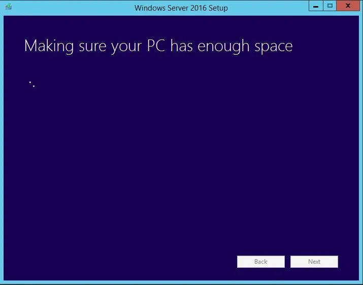
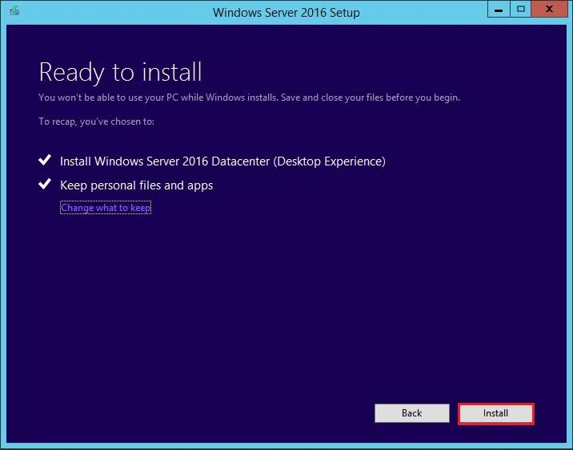
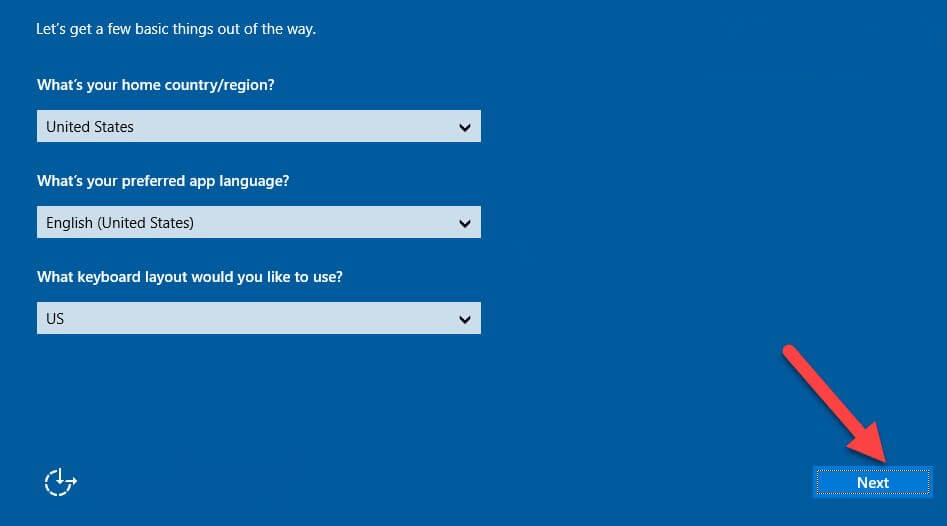
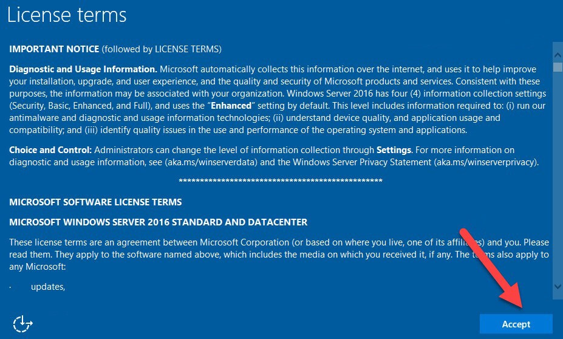

```
Introduction
```
Unlike upgrading previous versions of [Windows Server to 2012](https://www.microsoft.com/en-in/evalcenter/evaluate-windows-server-2012-r2), [Windows Server 2016](https://www.microsoft.com/en-in/evalcenter/evaluate-windows-server-2016) only supports [64-bit architecture](https://en.wikipedia.org/wiki/64-bit_computing). In addition, Windows Server 2012 and 2016 have only 4 versions. Upgrading Windows Server is a complicated process. So, Microsoft recommends that instead of updating the entire Windows server, it upgrades the roles and settings of the Windows 2016 server. Hence, we are going to learn you **How to upgrade Windows Server 2012R2 to Windows Server 2016**.

### Prerequisites for the upgrade Windows 2012R2 to 2016

1\. Upgrading from 32-bit to 64-bit is not possible.

2\. All Windows Server versions before to 2012 are incompatible with the 2016 upgrade.

3\. A version to version upgrade is not supported. You can’t upgrade the standard version of Windows Server 2012 to the Data Center version of Windows Server 2016.

4\. It is not possible to upgrade from one language to another. For example, you can’t upgrade the German version of Windows Server to Chinese.

5\. Upgrades between Server Core and Desktop versions (or vice versa) are not supported.

6\. Upgrading from older versions of Windows Server to trial versions of Windows Server is not supported. Trial versions must be installed manually.

7\. If this server uses NIC Teaming, disable it and reactivate it.

8\. Make a full backup of the server, as you may have a problem during the upgrade and want to go back to the previous version.

\-------------------------------------------------------------------------

Check out [disk allocation](https://utho.com/docs/tutorial/how-to-allocate-unallocated-disk-space-in-windows/) steps in case you need them after the server upgrade.

\-------------------------------------------------------------------------

Step 1. Log in to Windows Server 2012 and install DVD or Flash. You can also mount an ISO of Windows Server 2016 that we will be using to upgrade the server from 2012R2 to 2016. Open **File Explorer** and click on **DVD Drive** as shown below:



Step 2. Select **Download & install updates** to begin the Windows installation process.


Step 3. Choose a version of Windows Server 2016 that suits your needs. You may need to enlarge the network in the future and require more roles and licenses. So be careful at this point.


Step 4. In the **license** stage, click **Accept**. You will enter the next step.


Step 5. If you have selected the same version as the previous version, you can keep all the applications and files in the system. The apps and files will be erased if the prior version is not selected. Select **Keep personal files and apps** to save files and apps, otherwise, click **Nothing** to delete all files. Then click **Next**.


Step 6. Microsoft will check for updates.



Step 7. You receive a warning prior to beginning the installation, which you must ignore (confirm) before it can proceed.


Step 8. The install check disk space.



Step 9. Now the critical moment, review the settings that we have been specified and then select Install to start the process:



Step 10. Windows Server 2016 Installation begins


Step 11. The Server will restart several times after that. The whole process will take some time to complete the process.







Step 12. The new Windows Server 2016 login screen will appear following the upgrade.


Windows Server 2012R2 successfully upgraded to Windows Server 2016

Thank You!
