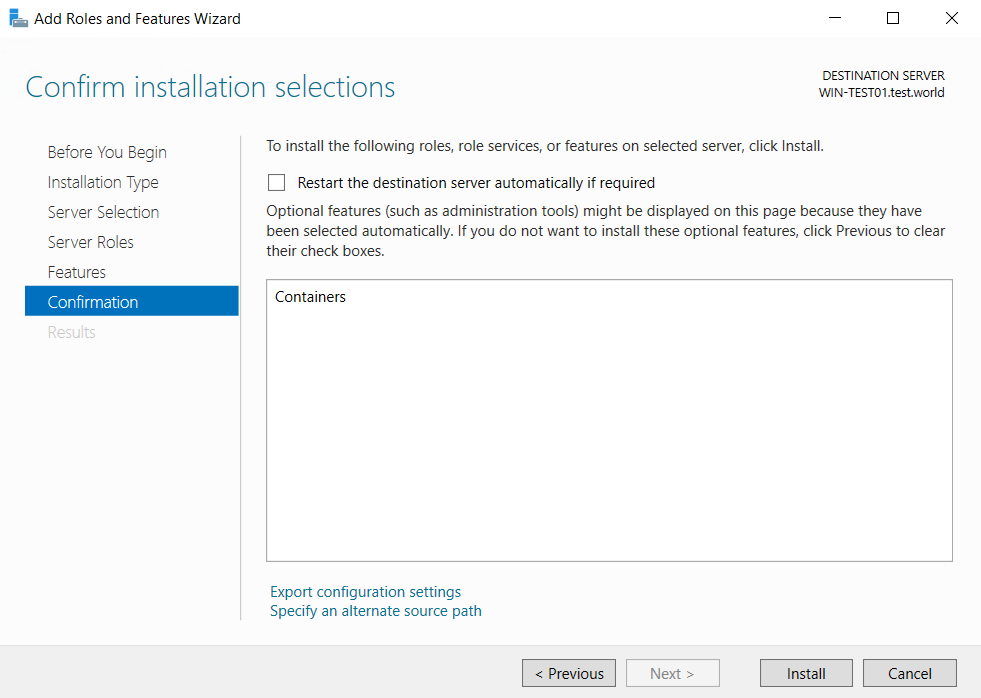
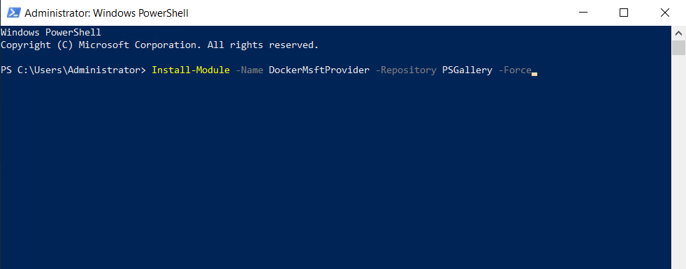
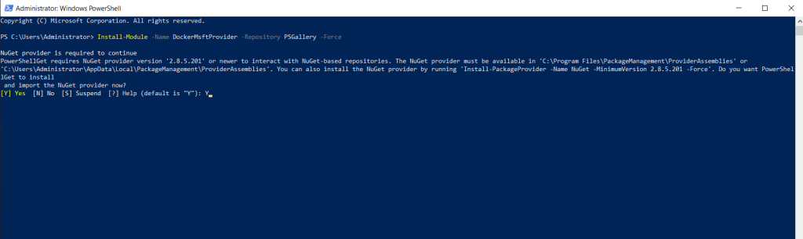
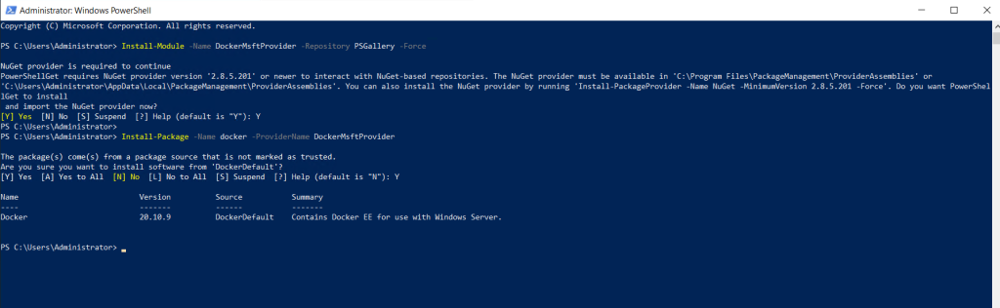

#### INTRODUCTION

[Docker](https://www.docker.com/) is a set of platform as a service products that use OS-level virtualization to deliver software in packages called containers. The service has both free and premium tiers. The software that hosts the containers is called Docker Engine. It was first started in 2013 and is developed by Docker, Inc. In this tutorial, we will learn how to install Docker in a Windows Server.

#### Prerequisites

- [Windows Server](https://utho.com/docs/tutorial/how-to-install-active-directory-domain-service-on-windows-server/?preview_id=11159&preview_nonce=171803715d&preview=true)

- PowerShell with Administrator rights

- Internet connectivity

Step 1. Run Server Manager and start Add roles and features, then select **Containers** feature on Select features section like follows to install. After installing, restart computer.

Install Docker on Windows Server

Step 2. After restarting, Run PowerShell with Admin Privilege and Install Docker.  
Answer Y (Yes) to all confirmations during the installation.

PS > Install-Module -Name DockerMsftProvider -Repository PSGallery -Force

PS > **Install-Package -Name docker -ProviderName DockerMsftProvider**

Thank You!
