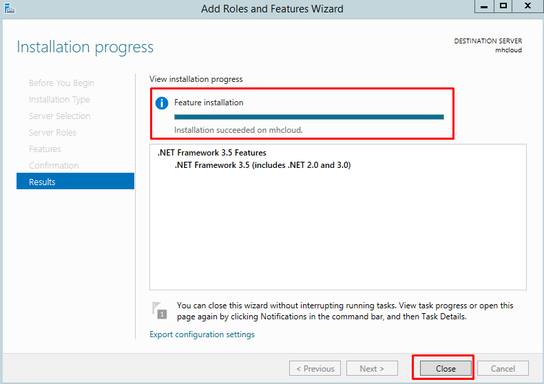
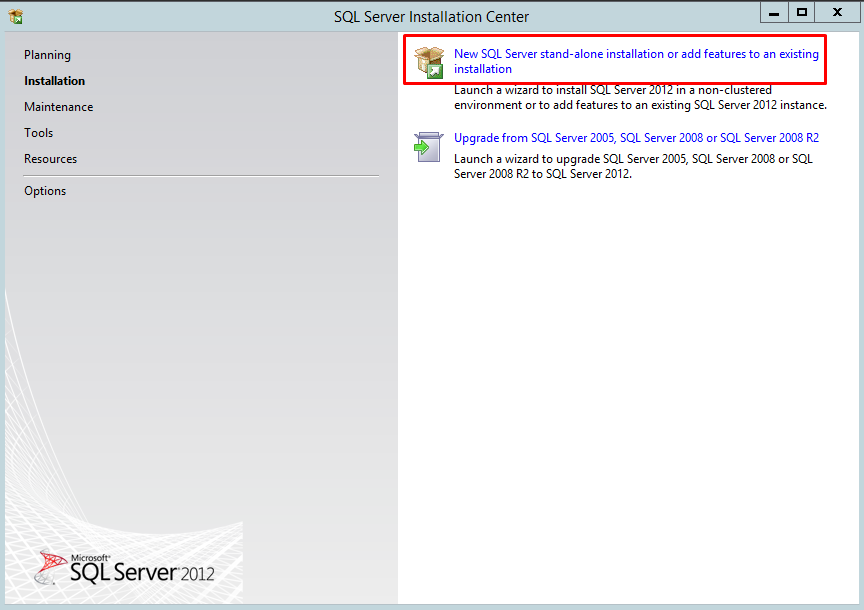
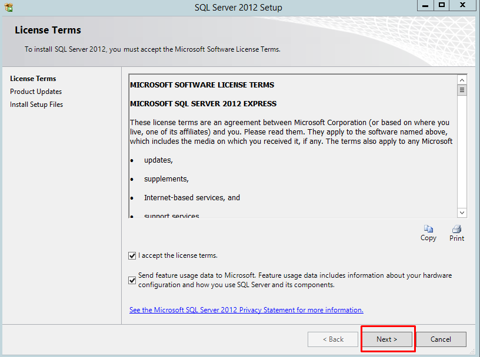
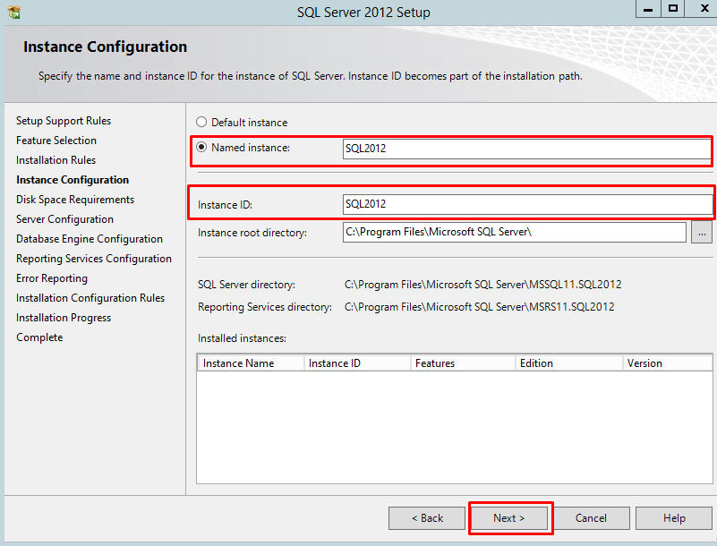

Asp.net 3.5 version should be installed on server before install SQL server and you have access administrator RDP user login details.

Step:- 1. Install Asp.net 3.5 version using server manager.

(i) Open server manager click on server manager button.

(ii) Click on Add roles and features.

(iii) Select .NET framework 3.5 Features and install.

(iv) Click on next.

(v) When you will get below message in screenshot close and exit the server manager installation wizard.

Step:- 2. For download SQL express edition 2012 setup click **[here](https://www.microsoft.com/en-in/download/confirmation.aspx?id=29062&6B49FDFB-8E5B-4B07-BC31-15695C5A2143=1)** and save it on your server.

Step: 3. When setup will download on your server. Double click on the setup file.

Step:- 4. Click on "New Sql stand-alone installation or add features in existing installation".

Step:- 5. Select terms and policy and click on next.

Step:- 6. Select features which you want to install in SQL database and defined installation directory and click on next.

Step:- 7 Enter instance name and id of SQL database server.

Step:- 8 Select mixed mode enter sa user password of sql database server.

Step:- 9. Select option "install and configure" and click on next and next again. Now the installation is started of sql and it will take 20-40 minutes for complete.

Step:- 10. When you will get the message below means sql installation is completed.

Now SQL database server is installed and operational.

Thankyou..
