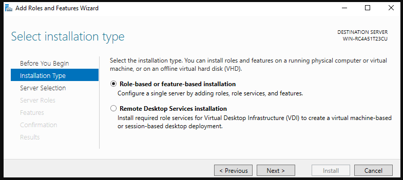
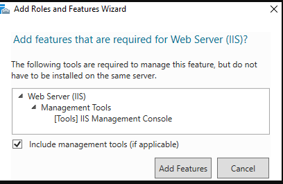
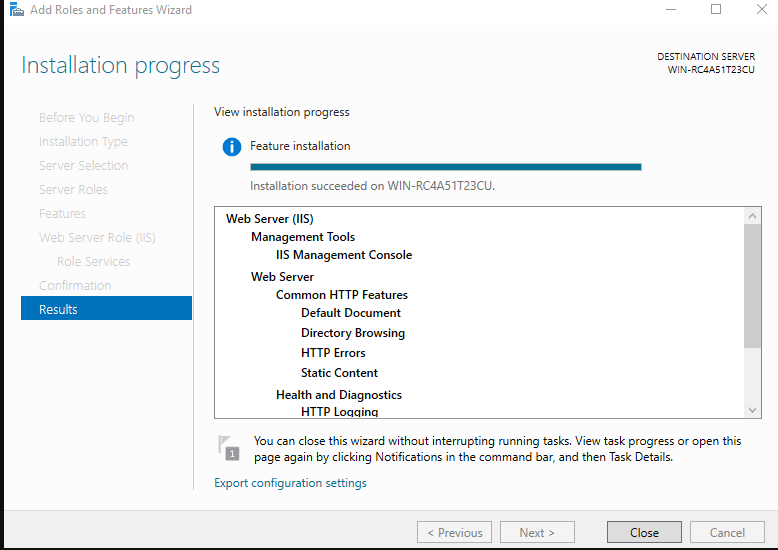
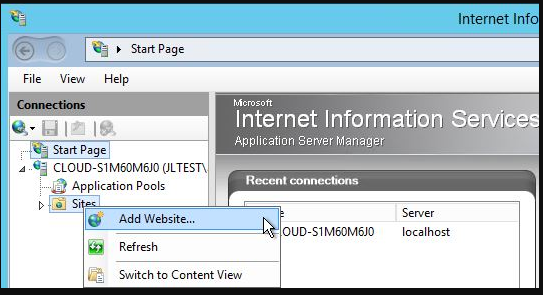

**Internet Information Services** (**IIS**, formerly **Internet Information Server**) is an extensible web server software created by Microsoft for use with the Windows NT family. IIS supports HTTP, HTTP/2, HTTPS, FTP, FTPS, SMTP and NNTP. It has been an integral part of the Windows NT family since Windows NT 4.0, though it may be absent from some editions (e.g. Windows XP Home edition), and is not active by default.

### Install IIS Through GUI

Installation of IIS can also take these steps if your server has the graphical user interface component installed.

Open Server Manager, this can be found in the start menu. If it’s not there simply type “Server Manager” with the start menu open and it should be found in the search.

**Step:1** You can find this in the start menu, Open Server Manager. If not, just enter "Server Manager" with the open start menu to find it in the search.

The output will be shown as follows. Now click on **ADD ROLE AND FEATURES**

The Next output Will be shown as follow. On the “Before you begin” window, simply click the Next button .

Select "Role-based or feature-based installation" and click Next.

When we install on our local machine, leave the current machine, and click "Select a server from the server pool." You can also choose another server that you are managing from here or a VHD server.

Check the box next to "Web Server (IIS)" from the "select server roles" window. If this is done, you can open a new window to indicate additional functions, just click on the 'Add Features' button. Once completed, click Next back on Select server roles menu.

The next prompt will be shown as follow.

At this stage, we won't install additional features, so just click Next on the 'Chose Functions' window.

After reading the information provided click on the "Web Server Role (IIS)" window

You can install additional IIS services at this point on the "Select roles services" windows if necessary. You do not need to worry about that now because you can always return and add later, just click Next to install the defaults.

In the "Confirm installation selections" window, you will finally check the items to be installed and then you will install the IIS web server when you are ready.

No reboot should be required with a standard IIS installation, however, if you remove the role a reboot will be needed.

Click the close button once the installation is successful. The firewall rules "World Wide Web Services" (HTTP Traffic-In) activated by firewall in the Windows firewall should be enabled by default at this point. at port 80.

We have completed the Installation of IIS. Now we will proceed to the configuration portion.

Open Server Manager and choose IIS, right-click on your server and select IIS Manager.

Right-click on the Sites node in the tree in the Connections pane, then click Add site.

Enter a friendly website name in the Site name box in the Add Website dialog box.

Click Select if you want to choose another application pool, compared to the application pool box. Choose an application pool from the application pool list and then click OK in the Application pool dialog box.

Enter the website's physical path box or click the browse button (…) to navigate the folder in the file system. (Note: The best way is to build a folder in your C: for your websites.

Click Connect to specify credentials with permission to access the path if the physical path that is entered in the previous phase has to a remote share. Select the User's (pass-through Authentication) option in the Connect As dialog box if you don't use specific credentials.

Select from the Type list the protocol for the website.

In the IP address box, enter the IP address if you are asked for a static IP address for the site (the default is All Unassigned).

In the port text box enter a port number.

Enter a host website header name in the host header box, optionally.

In case you do not need to modify the site and want the website to be available immediately, select the Start Website check box immediately.

Then Click OK.

Now we have completed the Site addition portion.

Thank You :)
