## Introduction

[Windows Server Backup](https://learn.microsoft.com/en-us/previous-versions/windows/it-pro/windows-server-2012-r2-and-2012/jj614621(v=ws.11)) (WSB) is a feature that provides backup and recovery options for Windows server environments. Windows Server Backup is a feature that provides a set of wizards and other tools for you to perform basic backup and recovery tasks for the server it is installed on. Administrators can use Windows Server Backup to back up a full server, the system state, selected storage volumes or specific files or folders, as long as the data volume is less than 2 terabytes. Windows Server Backup replaced the Ntbackup feature in earlier Windows Server operating systems. 

In this article we will learn to take backup of one Windows Server into another Windows Server. For this we obviously need, two windows servers. For better understing, we will call them Server1 and Server2.

## Prerequisites

1. 2 Windows Servers with **IIS** and **Windows Server Backup** feature installed.
2. Internet connectivity on both the servers.
3. Backup user wih same credentials on both the servers.

## Stage ONE in SERVER-1 Windows Server Backup feature

Step 1. Login to server **1**

Step 2. Open [Server Manager](https://learn.microsoft.com/en-us/windows-server/administration/server-manager/server-manager)

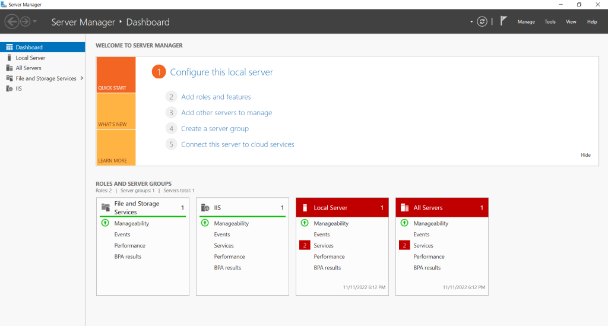

Step 3. Click on **Add roles and feartures**

Install **Windows Server Backup**

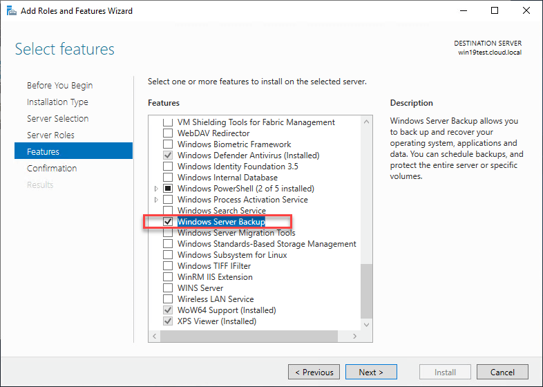

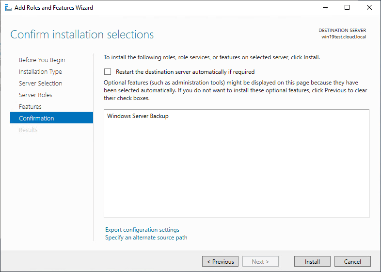

## Stage TWO in SERVER-2

Step 1. We will create a folder in server-2 and share it over network, in order to be able store the backup from server-1

Create a folder

Go to it's Properties

Go to Sharing tab, and click on "**Share...**"

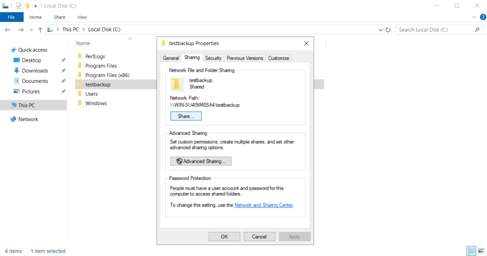

Click on "**Share...**"

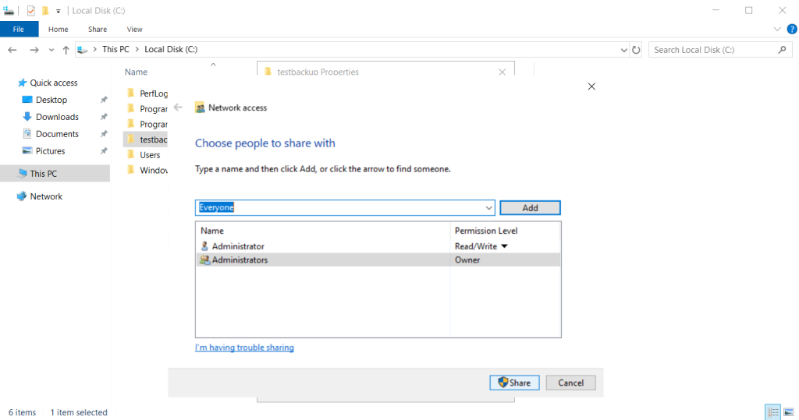

Copy the path of the shared folder \\\\server\_ip\\foldername

## Stage THREE in SERVER-1 Windows Server Backup feature

Step 1. Click on Tools and open Windows Server Backup

Step 2. We will a create one backup for this posts' purpose. Click on 'Backup once...'

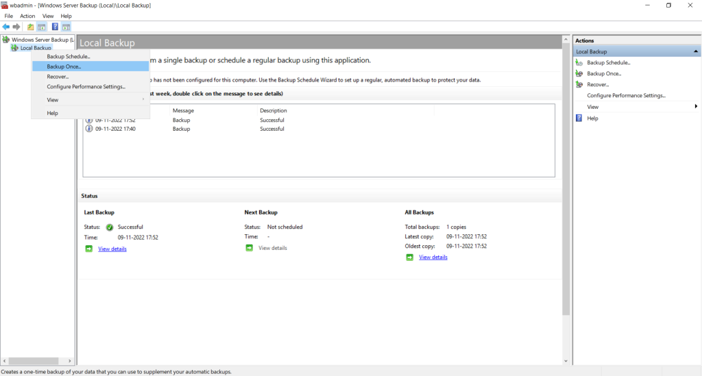

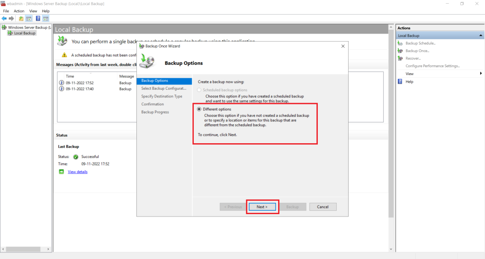

We will choose the "Custom" option to backup specific files/folder

Click on "Add Items" to select folders for backup

We will select the folder "ftpbackup"

Click on "Remote shared folder"

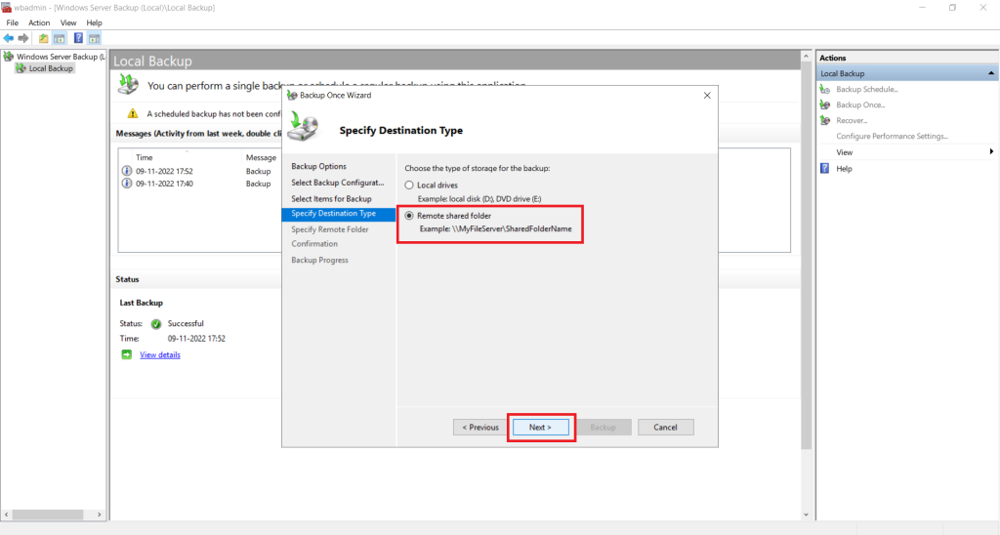

Input the folder path in location and click on next

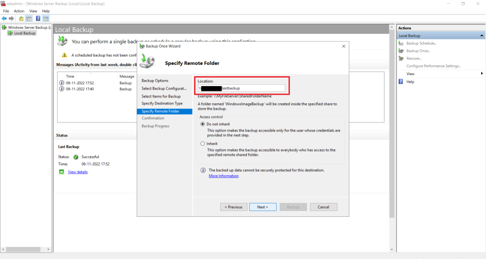

Input the server credentials of SERVER-2

Click on "**Backup**" to initiate backup

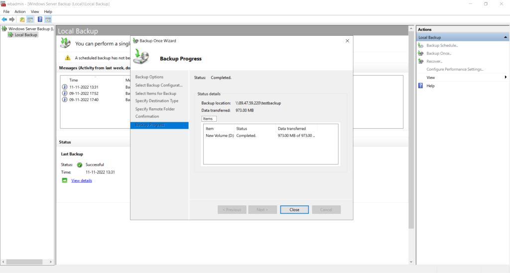

Backup created in the shared folder.

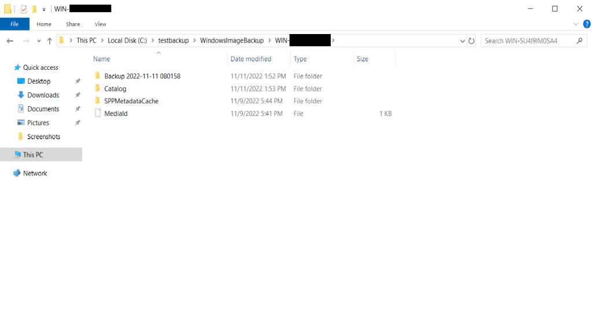

Thank You!
