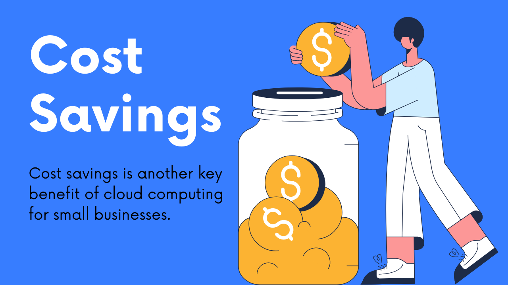

Cloud computing is becoming an increasingly popular choice for small businesses due to the many benefits it offers, including increased efficiency, cost savings, and greater flexibility. Whether you're looking to transition your entire business to the cloud or just want to take advantage of its many benefits, there are a number of things you should consider when making this transition.

### **Increase Efficiency**

One of the biggest benefits of cloud computing is increased efficiency. Cloud-based systems enable employees to collaborate more easily and work from anywhere, making it easier for them to get their work done on time and meet deadlines. This also means less time wasted on communication issues or ineffective tools that slow down productivity.  
  
For instance, one set of cloud-based systems that have made a significant impact are cloud HR tools. To highlight this point, companies like SnackNation have compiled lists of their **[top 10 cloud HR tools](https://snacknation.com/blog/cloud-hr-software/)**, showcasing how they contribute to increasing overall efficiency, collaboration, and flexibility in the modern workforce environment.

### ****Cost Savings****

Cost savings is another key benefit of cloud computing for small businesses. Because cloud-based systems require less up-front investment on your part, you can get the same features and functionality as larger organizations without having to pay a premium. Additionally, many cloud service providers offer subscription-based pricing plans that are more cost-effective in the long run compared to traditional software licenses.

### **Greater Flexibility**

Finally, cloud computing also offers greater flexibility for small businesses. With cloud hosting solutions, it's easy to scale up or down depending on your needs, meaning you can add or remove resources as needed without having to invest in additional equipment or make expensive upgrades.

Whether you're looking to expand your business or scale back during slower periods, the cloud is a great option that gives you the flexibility to adapt quickly and stay competitive. If you're ready to take advantage of the many benefits of cloud computing for your small business, consider partnering with a trusted cloud service provider to help you make the transition. With their expertise and support, you can be confident that your move to the cloud will be a success.

**Read Also:** [6 Cloud Computing Myths, Busted!](https://utho.com/docs/tutorial/6-cloud-computing-myths-busted/)
