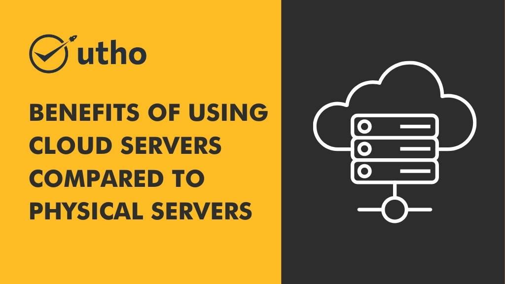

There are many benefits of using cloud servers compared to physical servers. Cloud servers are more scalable and flexible and provide better performance. They are also more secure and offer better uptime. 

## **Here are some of the key benefits of using cloud servers:-**

- Cloud servers offer scalability and flexibility, allowing businesses to easily adjust their storage and computing power as needed. 

- Cloud servers provide cost savings, as there is no need for expensive hardware or maintenance costs. 

- Cloud servers offer improved security measures, with built-in backups and disaster recovery plans. 

- Cloud servers allow for remote access and collaboration, making it easy for teams to work together from anywhere.

- Cloud servers have a high uptime, ensuring reliable and consistent performance.

- With cloud servers, software and system updates are automatic and seamless. 

- Cloud servers offer enhanced accessibility, as information can be accessed from any device with internet connection. 

- Cloud servers provide the ability to test and develop new applications without impacting the current system.

- Cloud servers offer improved disaster recovery capabilities, as data can be easily restored in the event of a security breach or natural disaster. 

- Cloud servers allow for better data management and organization. 

- Cloud servers offer enhanced collaboration opportunities with partners and clients. 

- Cloud servers provide improved agility and responsiveness to changing business needs. 

- Cloud servers offer increased cost-effectiveness for businesses, as they only pay for the resources they use. 

- Cloud servers allow businesses to focus on their core competencies, rather than managing IT infrastructure.

- Cloud server technology is constantly evolving and improving, offering even more benefits for businesses.

As India's first cloud platform, Microhost offers all of these benefits and more. With top-notch security measures, 24/7 support, and a user-friendly interface, Microhost is the premier choice for your cloud server needs. Visit our website to learn more about how we can help your business succeed in today's digital world.

**Also Read:** [7 Reasons Why Cloud Infrastructure is Important for Startups](https://utho.com/docs/tutorial/7-reasons-why-cloud-infrastructure-is-important-for-startups/)
