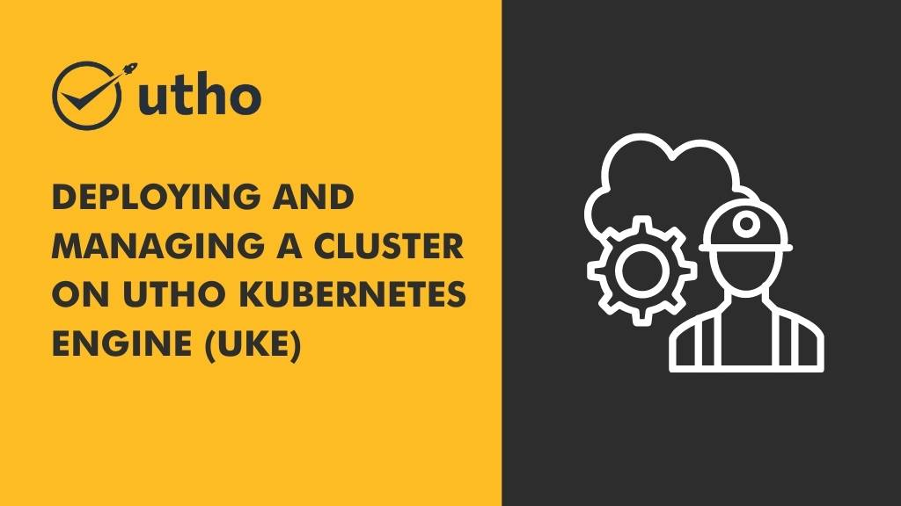
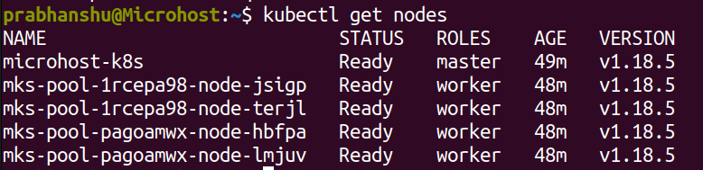
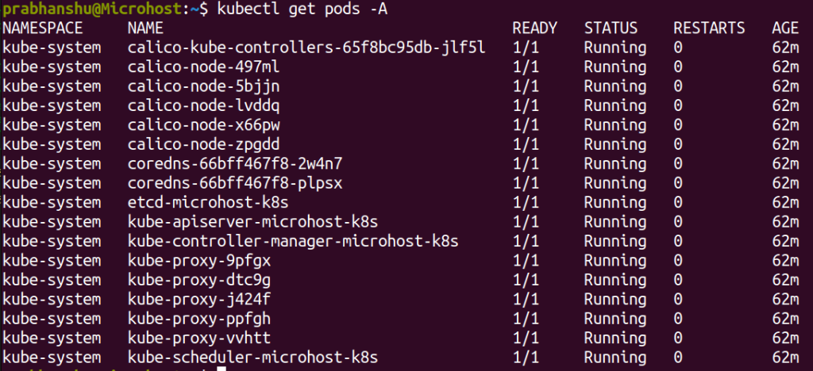
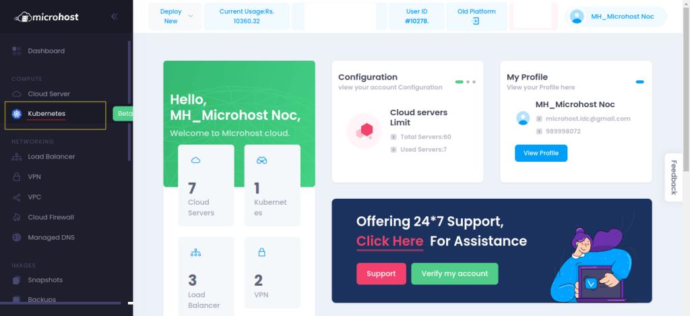
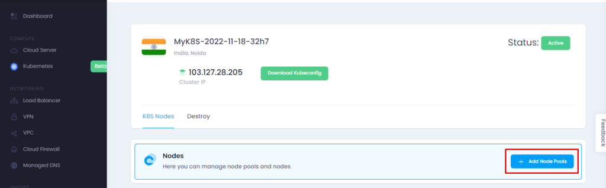
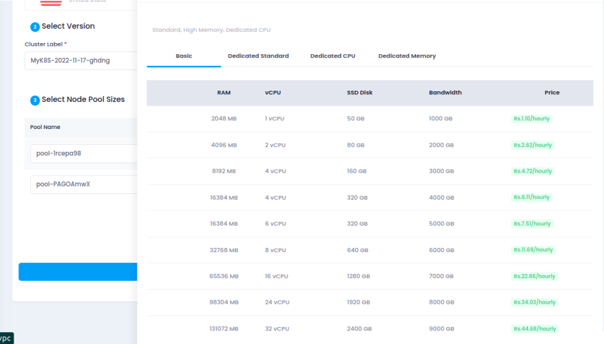
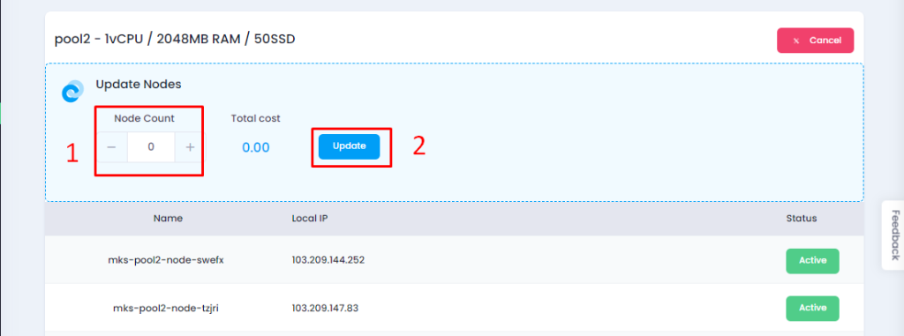
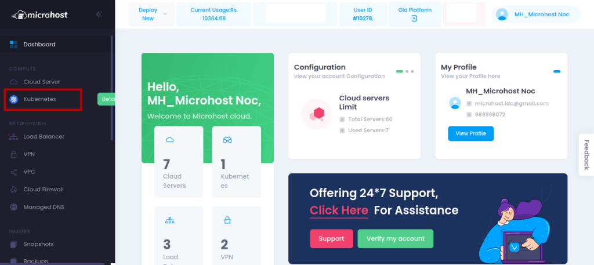
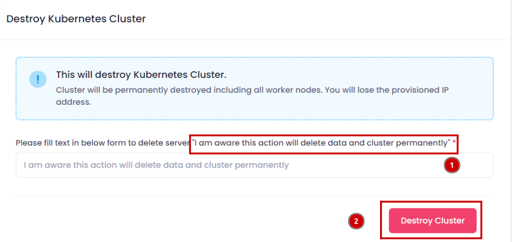

<figure>



<figcaption>

Deploying and Managing a Cluster on Utho Kubernetes Engine (UKE)

</figcaption>

</figure>

In this tutorial we will learn how you can deploy and manage a Cluster on Utho Kubernetes Engine (UKE). The Utho Kubernetes Engine (UKE) is a fully-managed container orchestration engine for deploying and managing containerized applications and workloads. UKE combines Utho’s ease of use and [simple pricing](https://utho.com/pricing) with the infrastructure efficiency of Kubernetes. When you deploy an UKE cluster, you receive a Kubernetes Master at no additional cost; you only pay for the Utho's (worker nodes), load balancers. Your UKE cluster’s Master node runs the Kubernetes control plane processes – including the API, scheduler, and resource controllers.

**Additional UKE features:**

- **etcd Backups**: A snapshot of your cluster’s metadata is backed up continuously, so your cluster is automatically restored in the event of a failure.

## In this guide -

In this guide you will learn-

- How to [](https://utho.com/docs/tutorial/how-to-create-a-kubernetes-cluster-using-the-microhost-kubernetes-engine/)create a Kubernetes cluster using the Utho Kubernetes Engine.

- How to modify a cluster

- How to delete a cluster

- Next steps after deploying cluster

## Before you begin -

### Install kubectl -

You need to install the kubectl client to your computer before proceeding. Follow the steps corresponding to your computer’s operating system.

#### macOS

install via [Homebrew](https://brew.sh/)

```
brew install kubectl
```

#### Linux

1. Download the latest kubectl release:

```
curl -LO "https://dl.k8s.io/release/$(curl -L -s https://dl.k8s.io/release/stable.txt)/bin/linux/amd64/kubectl"
```

2\. Make the downloaded file executable.

```
chmod +x ./kubectl
```

3\. Move the command into your PATH:

```
sudo mv ./kubectl /usr/local/bin/kubectl
```

#### Windows

Visit the [Kubernetes documentation](https://kubernetes.io/docs/tasks/tools/install-kubectl/#install-kubectl-on-windows) for a link to the most recent Windows release.

## Create an UKE Cluster

Step 1: First, We need to login to your [Utho Cloud Dashboard](https://cloud.microhost.com/login).

Step 2: From the Utho cloud dashboard, click on Kubernete option and then you will get the option to deploy the Cluster as per the screenshot.


Step 3: While clicking on deploy Cluster, will get the option to create the cluster in our desired location along with the node Configuration option as per the below screenshot.


Step 4. After clicking on Deploy cluster, a new cluster will be created where we can see the mater and slave node details as per the screenshot.


Step -5. After the successful creation, we need to download the kubeconfig file from the dashboard. Please go through the screenshot for more details.


Step 6: After downloading the file on local system, You can manage the Kubernete Cluster through using Kubectl tool.

## Connect to your UKE Cluster with kubectl

- After you’ve created your UKE cluster using the Cloud Manager, you can begin interacting with and managing your cluster. You connect to it using the kubectl client on your computer. To configure kubectl, download your cluster’s _kubeconfig_ file.

- Anytime after your cluster is created you can download its _kubeconfig_. The kubeconfig is a YAML file that will allow you to use kubectl to communicate with your cluster. Here is an example kubeconfig file:


- Change the kubeconfig.yaml file's permissions so that only the current user may access it to increase security:

```
chmod go-r /Downloads/kubeconfig.yaml
```
- Launch a shell session at the terminal and add the location of your kubeconfig file to the $KUBECONFIG environment variable. The kubeconfig file can be found in the Downloads folder, as shown in the sample command, but you will need to modify this line to reflect the location of the Downloads folder on your own computer:

```
 export KUBECONFIG=~/Downloads/kubeconfig.yaml 
```

- You may look at the nodes that make up your cluster using kubectl.

```
 kubectl get nodes 
```

<figure>



<figcaption>

output of the command

</figcaption>

</figure>

- Your cluster is now prepared, and you can start managing it with kubectl. For further details on kubectl usage, refer to the Kubernetes guide titled "[Overview of kubectl.](https://kubernetes.io/docs/reference/kubectl/overview/)"

- Use the config get-contexts command for kubectl to acquire a list of the available cluster contexts:

```
 kubectl config get-contexts 
```

- If the asterisk in the current column does not indicate that your context is already selected, you can switch to it with the config use-context command. Please supply the full name of the cluster, including the authorised user and the cluster itself:

```
 kubectl config use-context Utho-k8s-ctx 
```

> Output:  
> Switched to context "Utho-k8s-ctx".

- You are now ready to use kubectl to talk to your cluster. By getting a list of Pods, you can test how well you can talk to the cluster. To see all pods running in all namespaces, use the get pods command with the -A flag:

```
 kubectl get pods -A 
```

<figure>



<figcaption>

all node of cluster

</figcaption>

</figure>

## Modify a Cluster’s Node Pools

You can use the Utho Cloud Manager to modify a cluster’s existing node pools by adding or removing nodes. You can also recycle your node pools to replace all of their nodes with new ones that are upgraded to the most recent patch of your cluster’s Kubernetes version, or remove entire node pools from your cluster.

### The details page of your Cluster

Step 1: Click the menu in the sidebar that says "Kubernetes." When you go to the Kubernetes listing page, all of your clusters are shown.

<figure>



<figcaption>

Dashboard of Mirohost Panel

</figcaption>

</figure>

Step 2: Select the cluster's manage button that you want to change. The information page for the Kubernetes cluster displays.

<figure>


<figcaption>

Manage section of K8s

</figcaption>

</figure>

### Scale a Node Pool

Step 1: Go to the cluster's information page and click the "add a node pool" option to the right that shows the node pools if you want to add a new node pool to your cluster.

<figure>



<figcaption>

Scale a cluster

</figcaption>

</figure>

Step 2: Choose the hardware resources that you want to add to your new Node Pool from the menus that appear in the new window that just appeared. To add or remove a node from a node pool one at a time, choose the plus (+) and minus (-) buttons that are located to the right of each plan. Select "Add Pool" when you are pleased with the amount of nodes that are included inside a node pool before incorporating it into your setup. After you have deployed your cluster, you always have the option to alter your Node Pool if you later determine that you need a different quantity of hardware resources.

<figure>



<figcaption>

Configuration of nodes

</figcaption>

</figure>

### Edit or Remove Existing Node Pools

Step 1: On the Node Pools portion of the page that displays information about your cluster, click the Scale Pool option that is shown in the top-right corner of each item.

<figure>


<figcaption>

Scale option of nodes

</figcaption>

</figure>

Step 2: After clicking on the Scale Pool, you will see the below screen. Here, just decrease the Node Count to your desired number and then clink on update button.  
  
Similarly, if you want to delete any Node Pool, you just need to put Node Count to 0 and then click on update

<figure>



<figcaption>

Add or delete the node

</figcaption>

</figure>

> Caution  
> The removal of nodes is an inevitable consequence of reducing the size of a node pool. Any local storage that was previously present on deleted nodes will be removed, including "hostPath" and "emptyDir" volumes, as well as "local" PersistentVolumes.

## Delete a Cluster

Using the Utho Kubernetes Manager, you have the ability to remove a whole cluster. After they have been implemented, these adjustments are irreversible.

Step 1: To access Kubernetes, use the link located in the sidebar. You will then be brought to the Kubernetes listing page, where each of your clusters will be shown in turn.

<figure>



<figcaption>

Dashboard of k8s

</figcaption>

</figure>

Step 2: Choose Manage Options next to the cluster you want to remove

<figure>


<figcaption>

Manage section of Kubernetes

</figcaption>

</figure>

Step 3: Here, click on Destroy option.

<figure>


<figcaption>

Destroy the cluster

</figcaption>

</figure>

You will need a confirmation string to remove the Cluster. Enter the precise string, then confirm by clicking the Delete button.

<figure>



<figcaption>

Delete the cluster

</figcaption>

</figure>

After deletion, The Kubernetes listing page will load, and when it does, you won't be able to find the cluster that you just destroyed.

Hopefully, now you have the understanding of how to deploy and manage a Cluster on Utho Kubernetes Engine (UKE)
