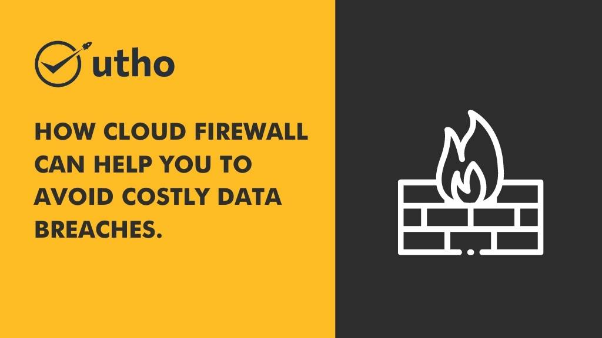

**Data breaches** are becoming more and more common, as cybercriminals become more sophisticated in their methods. Small businesses are especially vulnerable to data breaches, as they often lack the resources to invest in robust security measures. However, there are some steps that small businesses can take to protect themselves, and one of the most effective is to use a cloud [firewall](https://utho.com/docs/tutorial/why-firewalls-are-important-for-your-business/). Here are three ways that a cloud firewall can help you to prevent [data breaches](https://www.trendmicro.com/vinfo/us/security/definition/data-breach).

<figure>

<figcaption>

Using a cloud firewall, you can prevent cyberattacks on your business.

</figcaption>

</figure>

## **1\. It provides an extra layer of security.**

Your first line of defense against data breaches should always be a strong firewall. But cybercriminals are becoming increasingly skilled at bypassing firewalls, so it's important to have an additional layer of security in place. A cloud firewall acts as a second layer of defense, making it much more difficult for hackers to breach your network.

## **2\. A cloud firewall can stop malicious traffic before it reaches your network.**

Another benefit of using a firewall is that it can stop malicious traffic before it even reaches your network. This is because it is situated between your network and the internet, so it can act as a filter, blocking traffic that contains malware or other malicious content. 

## 3\. A cloud firewall is more cost-effective than traditional hardware firewalls.

Finally, another advantage of using a firewall is that it's more cost-effective than traditional hardware firewalls. This is because you don't need to purchase any additional hardware or software, and you can scale up or down as needed, depending on your current security needs. 

Cloud firewall is the best way to prevent data breaches. It's important to have it in place so that you can protect your company's data and ensure that your customers' information remains confidential. If you're not already using, now is the time to get started.
