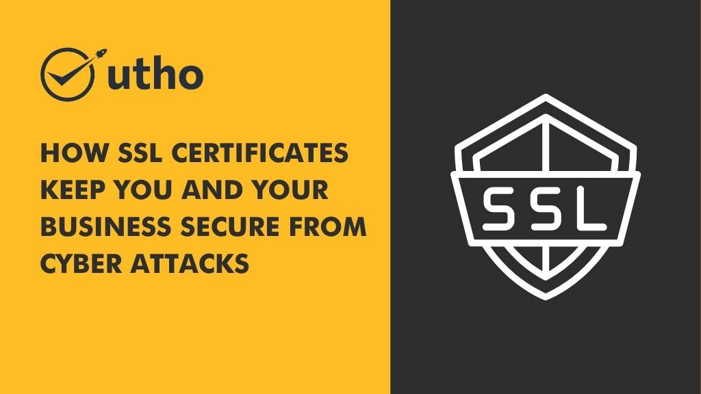

As cyber crimes have become more sophisticated over the past few years, businesses of all sizes must be vigilant about protecting their data. One of the simplest, most effective ways to protect your business from malicious actors is through an SSL certificate. **SSL stands for Secure Socket Layer**, a protocol used by websites to encrypt data sent between the website's server and visitors' browsers. In this blog post, we will discuss what an SSL Certificate is, how it works, and why it is important for businesses. 

<figure>

<figcaption>

How SSL Certificates Keep You and Your Business Secure from Cyber Attacks.

</figcaption>

</figure>

## **What is an SSL Certificate?** 

An SSL Certificate is a digital document issued by an accredited [certification authority](https://en.wikipedia.org/wiki/Certificate_authority) (CA) that verifies the identity of a website or domain and binds that identity to a cryptographic key pair. When installed on a web server, an SSL certificate activates the padlock icon in your browser’s address bar and enables HTTPS encryption. This encryption helps keep any information sent between users’ browsers and your web server secure. It also helps prevent malicious actors from accessing sensitive data like passwords or credit card numbers.

## **How does it work?** 

When a user visits your website, their browser sends out a request asking for information. The web server responds by sending back the requested information in plaintext format (that is, without any encryption). With an SSL Certificate installed on the web server, however, the server will respond with encrypted data instead of plaintext data. This encrypted data can only be decrypted by using the corresponding private key stored on your web server—which means that malicious actors won't be able to access it. 

## **Why it is important?** 

**SSL Certificates** are becoming increasingly important as cybercrime continues to grow in sophistication and scale. By encrypting the information sent between users’ browsers and your web server with an SSL Certificate, you can help keep sensitive information safe from malicious actors who might try to intercept it during transmission or use it for nefarious purposes such as identity theft or fraud. Additionally, having an active certificate installed on your website may help boost its search engine rankings—a benefit that cannot be overlooked in today’s highly competitive online landscape! 

## **How to choose the right SSL for your needs.**

When choosing an SSL certificate for your website, there are several factors to consider:

1. **Validation level:** SSL certificates come in three validation levels: domain validation, organization validation, and extended validation. Domain validation is the most basic and only verifies that you own the domain name. Organization validation verifies your organization's information and Extended validation verifies your organization and also authenticates its legal existence.

3. **Brand recognition:** Some SSL certificate providers are more well-known and have more brand recognition than others. Consider whether the provider's reputation is important to you and your customers.

5. **Warranty:** Some SSL certificates come with a warranty that covers financial losses if the certificate is found to be invalid. Consider whether this is important to you.

7. **Compatibility:** Make sure the SSL certificate is compatible with your web server and any other software or systems you use.

9. **Price:** Compare the prices of different SSL certificates and choose one that fits within your budget.

11. **Technical support:** Consider whether the provider offers good technical support in case you need help with installation or troubleshooting.

It's important to prioritize the security of your customers' personal information. One way to do this is by implementing an **up-to-date SSL certificate on your website**. This ensures that any sensitive data, such as credit card information or personal details, is securely transmitted over the internet which will help to prevent cyber threats. Not only that, but having it can also improve your search engine rankings, which can lead to more traffic and leads for your business. So if you haven't already, consider investing in an SSL certificate to protect your customers' data and give your online presence a boost.

**Must Read : [Top 05 Cloud Security Threats in 2023 and Proven Strategies to Mitigate Them](https://utho.com/docs/tutorial/top-05-cloud-security-threats-in-2023-and-proven-strategies-to-mitigate-them/)**

Thank You 😊
