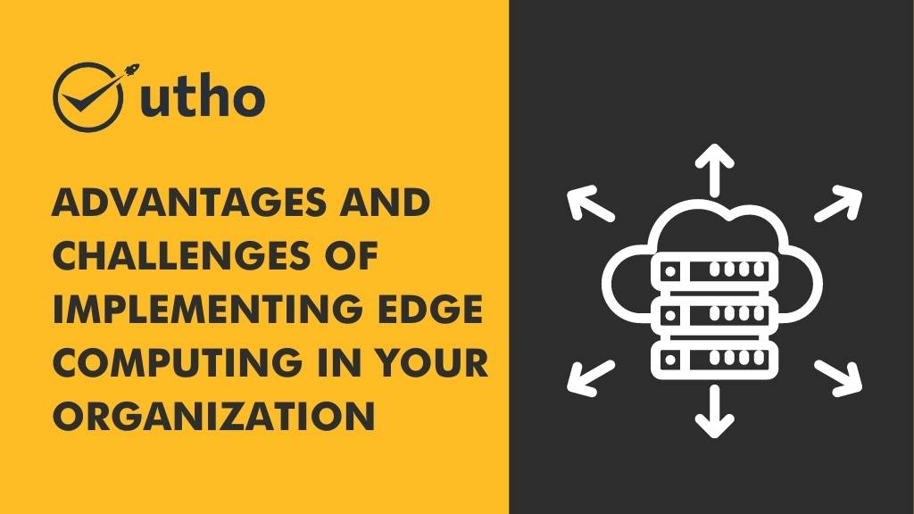

## **Introduction**

Kubernetes has become the de facto standard for container orchestration, offering scalability, flexibility, and automation for managing containerized applications. However, with a wide range of Kubernetes solutions available, choosing the right one for your business can be a daunting task. In this article, we will provide you with practical tips and considerations to help you select the best Kubernetes solution that aligns with your business needs.

## **Assess Your Business Requirements**

Before diving into the world of Kubernetes solutions, it's essential to assess your business requirements. Consider factors such as the size of your organization, the complexity of your applications, scalability needs, and resource constraints. Understanding your specific needs will help you determine the features and capabilities required from a Kubernetes solution.

## **Evaluate Managed Kubernetes Services**

Managed Kubernetes services provide a hassle-free way to leverage the power of Kubernetes without the burden of infrastructure management. Evaluate different managed Kubernetes service providers, such as Amazon EKS, Google Kubernetes Engine, and Azure Kubernetes Service. Look for providers that offer seamless integration with your existing cloud infrastructure, robust security features, scalability options, and reliable support.

## **Consider On-Premises or Hybrid Options**

If you have strict data governance requirements or specific regulatory constraints, an on-premises or hybrid Kubernetes solution might be more suitable. Evaluate Kubernetes distributions that can be deployed on your own infrastructure, allowing you to have complete control over your environment. Consider factors such as ease of installation, ongoing maintenance, and integration capabilities with your existing systems.

## **Assess Community Support and Ecosystem**

Kubernetes has a vibrant and active community, which translates into a rich ecosystem of tools, plugins, and resources. Assess the community support surrounding different Kubernetes solutions. Look for solutions with an active developer community, regular updates, and a wide range of compatible tools and extensions. A robust ecosystem ensures that you can leverage the latest innovations and easily integrate with other technologies.

## **Scalability and Performance**

As your business grows, so does the demand on your infrastructure. Assess the scalability and performance capabilities of the Kubernetes solution you are considering. Look for features like automatic scaling, load balancing, and resource optimization. A Kubernetes solution that can efficiently handle increased workloads and ensure consistent performance will be crucial for the success of your applications.

## **Security and Compliance**

Security is paramount when it comes to managing your applications in a Kubernetes environment. Evaluate the security features offered by different Kubernetes solutions. Look for features such as role-based access control (RBAC), network policies, image scanning, and encryption at rest and in transit. Additionally, ensure that the Kubernetes solution aligns with your compliance requirements, whether it be GDPR, HIPAA, or industry-specific regulations.

## **Total Cost of Ownership (TCO)**

Consider the total cost of ownership (TCO) associated with the Kubernetes solution. Evaluate not only the upfront costs but also ongoing maintenance, support, and potential hidden expenses. Compare the pricing models of different solutions, including factors such as infrastructure costs, licensing fees, and additional services. Understanding the TCO will help you make an informed decision and avoid any budgetary surprises.

## **Conclusion**

Choosing the right Kubernetes solution for your business is a critical decision that can significantly impact your application's performance, scalability, and security. Assess your business requirements, evaluate managed services, consider on-premises or hybrid options, assess community support, scalability, and performance, and ensure security and compliance. Additionally, factor in the total cost of ownership. By following these guidelines, you will be able to select a Kubernetes solution that empowers your business to leverage the full potential of container orchestration.

**Read Also:** [2 Methods for Re-Running Last Executed Commands in Linux](https://utho.com/docs/tutorial/2-methods-for-re-running-last-executed-commands-in-linux/)
