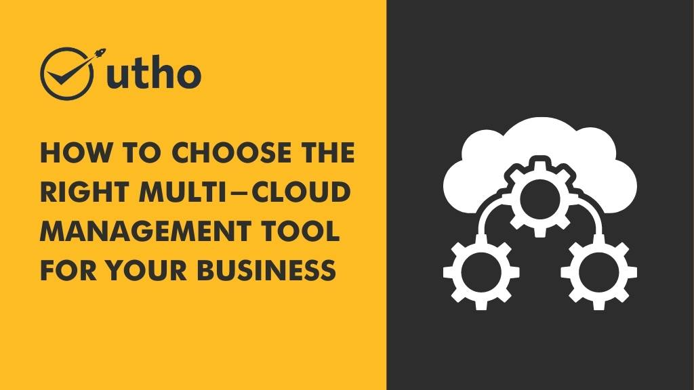

## **Introduction**

Managing multiple cloud platforms can be a challenging task, especially if you are using different providers. Each cloud platform has its own set of tools and processes, making it difficult to manage them all efficiently. However, with the help of multi-cloud management tools, you can streamline the management of your cloud environments and ensure that your business runs smoothly.

## **What is Multi-Cloud Management?**

Multi-cloud management refers to the process of managing multiple cloud platforms from a single dashboard. It involves monitoring and controlling cloud resources, optimizing performance, and ensuring the security and compliance of your cloud environments. Multi-cloud management tools provide a centralized platform for managing multiple cloud environments, making it easier for IT teams to manage and control their resources.

## **Benefits of Multi-Cloud Management**

There are several benefits to using a multi-cloud management tool for your business:

### **1\. Centralized Management**

One of the biggest benefits of using a multi-cloud management tool is that it provides a centralized platform for managing all of your cloud environments. This makes it easier for IT teams to monitor and control cloud resources from a single dashboard.

### **2\. Cost Optimization**

Multi-cloud management tools can help you optimize your cloud costs by identifying areas where you can save money. They can also help you allocate resources more efficiently, ensuring that you are only paying for what you need.

### **3\. Improved Security**

Multi-cloud management tools can help you improve the security of your cloud environments by providing a centralized platform for managing security policies and configurations. They can also help you identify potential security threats and vulnerabilities, allowing you to take action to mitigate them.

### **4\. Increased Flexibility**

Using multiple cloud providers gives you the flexibility to choose the best services from each provider. A multi-cloud management tool can help you manage these services more efficiently and ensure that they work together seamlessly.

## **Choosing the Right Multi-Cloud Management Tool**

When it comes to choosing the right multi-cloud management tool for your business, there are several factors to consider:

### **1\. Compatibility**

The first factor to consider is compatibility. Ensure that the tool you choose is compatible with all of the cloud platforms you are using. This will ensure that you can manage all of your cloud environments from a single platform.

### **2\. Ease of Use**

The tool you choose should be user-friendly and easy to use. This will ensure that your IT team can easily navigate and manage the platform without requiring extensive training.

### **3\. Scalability**

The tool you choose should be scalable, meaning that it can grow and adapt to your business needs. This will ensure that you can add new cloud platforms and resources as your business grows.

### **4\. Features and Functionality**

Make sure that the tool you choose has all of the features and functionality that your business needs. This includes monitoring and optimization tools, security features, and automation capabilities.

### **5\. Cost**

Finally, consider the cost of the tool. Look for a tool that provides good value for money and fits within your budget.

## **Conclusion**

Managing multiple cloud platforms can be a daunting task, but with the right multi-cloud management tool, you can streamline the process and ensure that your business runs smoothly. When choosing a multi-cloud management tool, consider factors such as compatibility, ease of use, scalability, features and functionality, and cost. By choosing the right tool, you can optimize your cloud resources, improve security, and increase flexibility in your cloud environments.

If you're looking for a reliable and secure multi-cloud management solution for your business, Microhost offers a range of cloud management tools that can help you manage your cloud environments more efficiently. Visit their website to learn more: [https://utho.com](https://utho.com)

**Also Read:** [**Best Practices for Managing and Securing Edge Computing Devices**](https://utho.com/docs/tutorial/best-practices-for-managing-and-securing-edge-computing-devices/)
