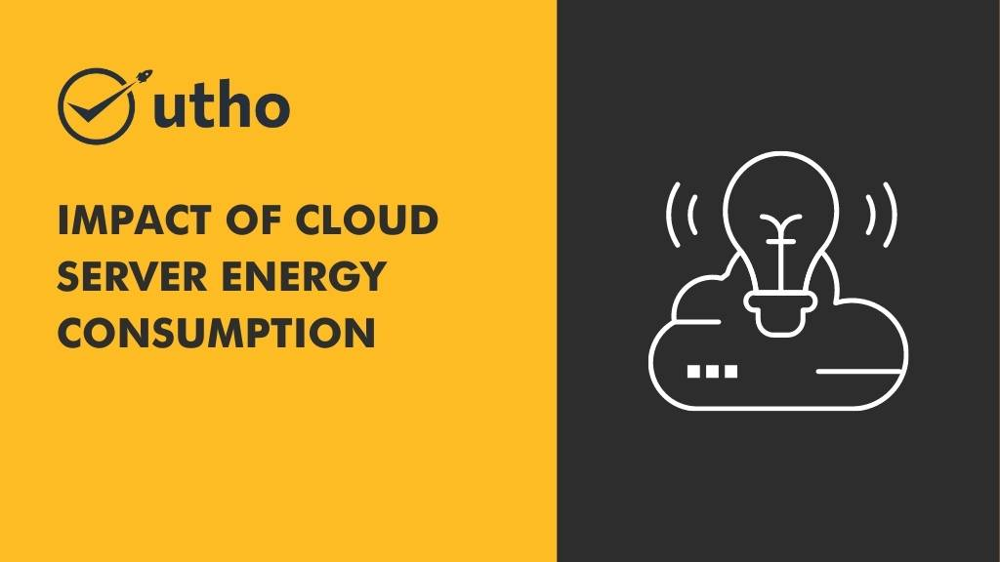

## **The Impact of [Cloud Server](https://utho.com/cloud) Energy Consumption on the Environment: Green Solutions and Best Practices**

The increasing popularity of cloud computing has led to a significant rise in energy consumption by data centers, which has become a growing concern for the environment. According to a study by the Lawrence Berkeley National Laboratory, the energy consumption of data centers in the US alone is estimated to have reached 70 billion kilowatt-hours in 2014, accounting for 1.8% of the country's total electricity consumption.

The environmental impact of this energy consumption is significant, with data centers contributing to carbon emissions and global warming. However, there are ways to reduce the environmental impact of cloud computing, including implementing green solutions and best practices.

### **Green Solutions for Cloud Computing**

Green solutions for cloud computing focus on reducing the amount of energy consumed by data centers, as well as increasing the use of renewable energy sources. One of the most effective ways to reduce energy consumption is through virtualization, which allows multiple virtual servers to run on a single physical server, reducing the need for multiple physical servers.

### **Other green solutions for cloud computing include:**

**Energy-efficient hardware:** Using energy-efficient hardware can significantly reduce the energy consumption of data centers. This can be achieved by using energy-efficient processors, solid-state drives, and power supplies.

Renewable energy sources: Increasing the use of renewable energy sources, such as solar, wind, and hydroelectric power, can significantly reduce the carbon footprint of data centers.

**Data center design:** Optimizing the design of data centers can also reduce their energy consumption. This can include using hot and cold aisle containment, implementing free cooling, and using high-efficiency power distribution systems.

### **Best Practices for Cloud Computing**

In addition to green solutions, there are also best practices that can be implemented to reduce the environmental impact of cloud computing. Some of these best practices include:

**Server consolidation:** Consolidating servers can significantly reduce energy consumption by reducing the number of physical servers required to run applications.

**Energy-efficient cooling:** Using energy-efficient cooling systems can reduce the amount of energy required to cool data centers.

**Power management:** Implementing power management systems can help to reduce energy consumption by ensuring that servers are only running when they are needed.

By implementing green solutions and best practices, cloud computing providers can significantly reduce their impact on the environment, while also reducing their energy costs.

### **Microhost - Your Green Cloud Computing Partner**

At Microhost, we are committed to providing environmentally friendly cloud computing solutions to our customers. We use energy-efficient hardware and renewable energy sources to power our data centers, and we implement best practices to reduce our energy consumption.

By choosing Microhost as your cloud computing partner, you can be sure that you are making a positive impact on the environment, while also enjoying reliable and secure cloud computing services. Visit our website to learn more about our green cloud computing solutions.
