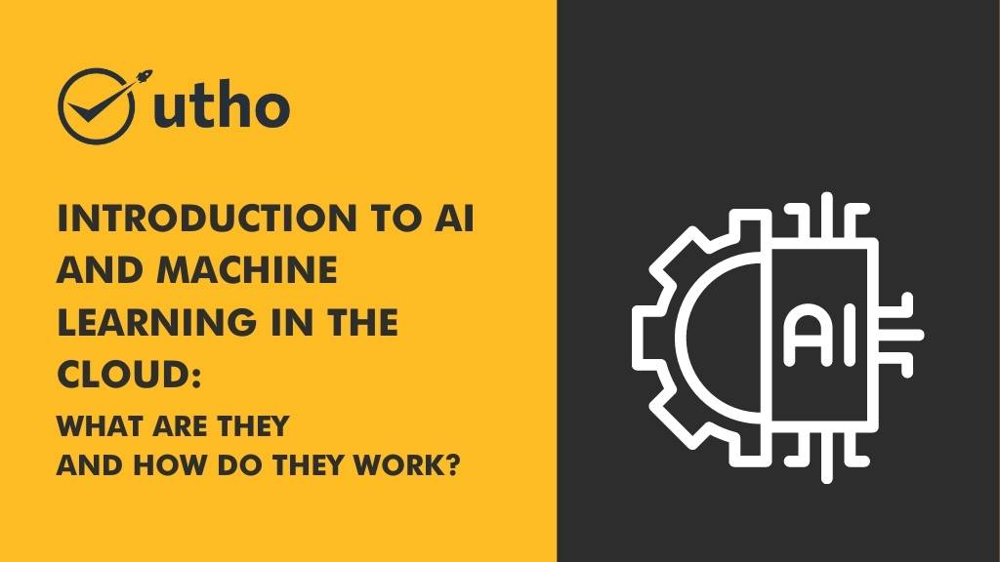

Artificial intelligence and machine learning (ML) are revolutionizing the way businesses operate, and cloud computing is making it easier than ever to access and utilize these powerful technologies. But what exactly are AI and ML, and how do they work in the cloud?

## What Is AI?

AI refers to a broad range of technologies that enable machines to perform tasks that would typically require human intelligence, such as recognizing speech, making decisions, and even driving cars. AI is typically broken down into two categories: narrow AI and general AI.

Narrow AI refers to systems that are designed to perform a specific task, such as recognizing faces or playing chess. These systems are highly effective at their specific task, but they lack the flexibility to perform other tasks.

General AI, on the other hand, refers to systems that can perform any intellectual task that a human can. While we are still far from achieving true general AI, many researchers and companies are working towards this goal.

## What Is Machine Learning?

Machine learning is a subset of AI that refers to systems that can learn and improve without being explicitly programmed. Machine learning algorithms use statistical models to analyze data and identify patterns, which they can then use to make predictions or perform other tasks.

There are two main types of machine learning: supervised learning and unsupervised learning. In supervised learning, the machine learning algorithm is trained on a labeled dataset, meaning that the correct answer is provided for each example. In unsupervised learning, the algorithm is not provided with labeled data and must identify patterns on its own.

## How Does AI and Machine Learning Work in the Cloud?

Cloud computing has made it easier than ever to access and utilize Artificial Intelligence and machine learning technologies. With cloud-based AI and machine learning platforms, businesses can quickly and easily build and deploy sophisticated AI models without needing to invest in expensive hardware or hire specialized talent.

Cloud-based Artificial Intelligence and machine learning platforms typically provide a range of tools and services that make it easy for businesses to build and train models, such as pre-built algorithms, data preprocessing tools, and visualization tools. These platforms also typically offer APIs that businesses can use to integrate AI and machine learning capabilities into their existing applications.

## Advantages of AI and Machine Learning in the Cloud

There are several advantages to using AI and machine learning in the cloud:

**Cost savings:** Cloud-based AI and machine learning platforms eliminate the need for businesses to invest in expensive hardware or hire specialized talent, which can result in significant cost savings.

**Scalability:** Cloud-based platforms can easily scale up or down to meet the needs of businesses of all sizes.

**Ease of use:** Cloud-based platforms typically offer user-friendly tools and services that make it easy for businesses to build and deploy AI models.

## Challenges of AI and Machine Learning in the Cloud

While there are many advantages to using AI and machine learning in the cloud, there are also some challenges to consider:

**Security:** Cloud-based platforms can be vulnerable to cyber attacks, which can compromise sensitive data and models.

**Data privacy:** Cloud-based platforms typically require businesses to share data with third-party providers, which can raise concerns about data privacy and compliance.

**Integration:** Integrating AI and machine learning capabilities into existing applications can be challenging and require specialized expertise.

## Conclusion

AI and machine learning are powerful technologies that are transforming the way businesses operate, and cloud computing is making it easier than ever to access and utilize these technologies. By understanding the basics of AI and machine learning and the advantages and challenges of using them in the cloud, businesses can make informed decisions about how to best leverage these technologies to drive innovation and growth.

At Microhost, we understand the importance of AI and machine learning in the cloud and the potential it has to revolutionize businesses. That's why we offer a range of cloud hosting solutions, including managed cloud services and cloud-based AI platforms, to help businesses stay ahead of the curve. Contact us today to learn more about how we can help you leverage the power of AI and machine learning in the cloud for your business.

**Also Read:** [Advantages and Challenges of Using AI and Machine Learning in the Cloud](https://utho.com/docs/tutorial/advantages-and-challenges-of-using-ai-and-machine-learning-in-the-cloud/)
