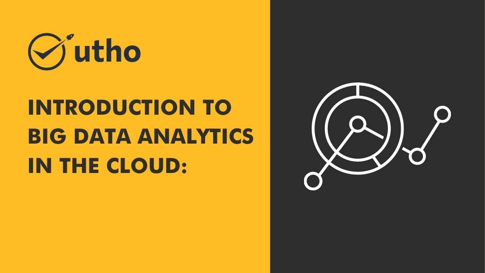

In today's data-driven world, organizations are faced with the challenge of managing and extracting insights from vast amounts of data. Big data analytics, combined with the power of cloud computing, has emerged as a game-changer in this regard. This article will provide an introduction to big data analytics in the cloud and explore the benefits it offers.

## What is Big Data Analytics in the Cloud?

Big data analytics in the cloud refers to the practice of analyzing large and complex datasets using cloud-based platforms and tools. By leveraging the scalability and computing power of the cloud, organizations can process, store, and analyze massive volumes of data quickly and cost-effectively.

## Benefits of Big Data Analytics in the Cloud

### 1\. Scalability and Flexibility

Cloud-based big data analytics platforms provide on-demand scalability, allowing organizations to scale up or down their computing resources based on their needs. This flexibility ensures that you have the necessary resources to process and analyze data without worrying about infrastructure limitations.

### 2\. Cost Efficiency

Traditional on-premises infrastructure for big data analytics can be expensive to set up and maintain. With cloud-based solutions, organizations can reduce upfront costs by paying only for the resources they consume. Additionally, the cloud's pay-as-you-go model enables cost optimization by eliminating the need for overprovisioning.

### 3\. Enhanced Performance

Cloud providers offer high-performance computing capabilities, allowing for faster data processing and analysis. With distributed computing and parallel processing, big data analytics tasks can be completed more efficiently, resulting in quicker insights and actionable outcomes.

### 4\. Advanced Analytics Capabilities

Cloud-based big DA platforms often come equipped with a wide range of tools and technologies for advanced analytics. These include machine learning algorithms, natural language processing, and predictive analytics, enabling organizations to uncover valuable insights and make data-driven decisions.

### 5\. Data Security and Compliance

Cloud providers prioritize data security and compliance, implementing robust measures to protect sensitive data. Encryption, access controls, and regular security audits are some of the security features offered by cloud platforms. Additionally, many cloud providers comply with industry-specific regulations, making it easier for organizations to meet compliance requirements.

## Conclusion

Big DA in the cloud presents numerous benefits for organizations looking to extract meaningful insights from their data. The scalability, cost efficiency, enhanced performance, advanced analytics capabilities, and data security provided by cloud-based solutions make it an attractive option for businesses of all sizes.

Microhost offers a comprehensive suite of cloud-based big data analytics services and solutions to help organizations harness the power of their data. To learn more about how Microhost can assist you in unlocking the potential of big DA in the cloud, visit [https://utho.com/](https://utho.com/).

By leveraging the benefits of big DA in the cloud, organizations can gain valuable insights, drive innovation, and stay ahead in today's competitive landscape.

**Read Also:** [Benefits of using Cloud Servers compared to Physical Servers](https://utho.com/docs/tutorial/benefits-of-using-cloud-servers-compared-to-physical-servers/)
