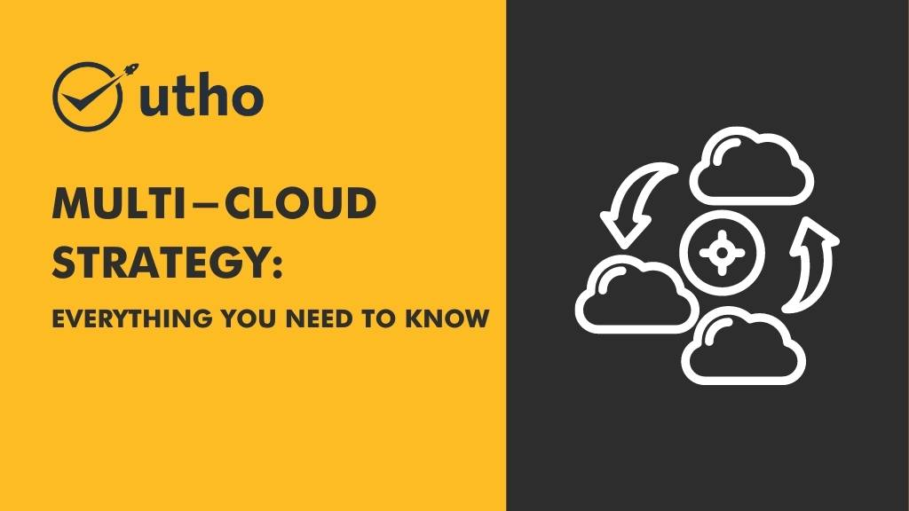

As more and more businesses adopt cloud computing, many are realizing that one cloud provider may not be enough. That's where a multi-cloud strategy comes in. In this article, we'll explain what a multi-cloud strategy is, why it's important, and how to implement it.

## **What is Multi-Cloud Strategy?**

A multi-cloud strategy is simply the practice of using more than one cloud provider for your computing needs. This could mean using one provider for storage, another for compute, and another for machine learning, for example. The goal is to take advantage of the unique strengths of each provider and avoid being locked into a single vendor.

## **Why is Multi-Cloud Strategy Important?**

There are a few reasons why a multi-cloud strategy might make sense for your business. First, it can help you avoid vendor lock-in, which can be a real concern if you're heavily invested in one cloud provider. By using multiple providers, you can spread your risk and avoid being at the mercy of a single vendor's pricing or service changes.

Second, a multi-cloud strategy can help you take advantage of the strengths of different cloud providers. Maybe one provider has better security features, while another has a more user-friendly interface. By using multiple providers, you can get the best of both worlds.

Finally, a multi-cloud strategy can help you avoid downtime. If one provider experiences an outage, you can quickly switch to another provider to keep your services up and running.

## **Implementing a Multi-Cloud Strategy**

Implementing a multi-cloud strategy can be challenging, but it doesn't have to be overwhelming. Here are a few tips to get started:

Identify your business needs: Figure out which cloud providers and services will best meet your business needs.

Develop a governance plan: Make sure you have a plan in place for managing multiple cloud providers and keeping your data secure.

Automate where possible: Use automation tools to simplify the process of deploying and managing resources across multiple cloud providers.

Monitor and optimize: Regularly monitor your multi-cloud environment and optimize as needed to ensure you're getting the best possible performance and value.

## **Microhost and Multi-Cloud Strategy**

If you're interested in exploring a multi-cloud strategy for your business, Microhost can help. We offer a range of cloud computing solutions, including multi-cloud management tools, to help you take advantage of the benefits of a multi-cloud strategy. To learn more, visit us at [https://utho.com/](https://utho.com/).
