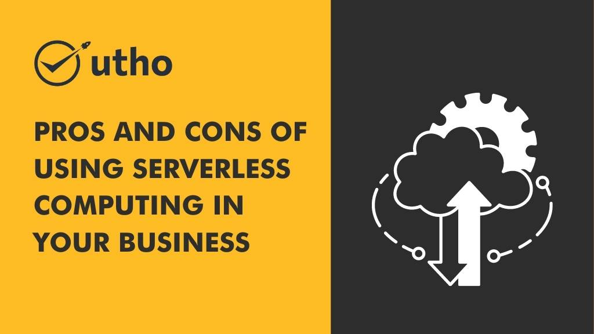

## **Introduction**

Serverless computing is a relatively new cloud computing model that allows developers to build and run applications without having to manage the underlying infrastructure. Instead of provisioning, scaling, and managing servers, developers can focus on writing code that responds to specific events or triggers. Serverless computing offers many benefits, but it also has some drawbacks that you should be aware of before deciding whether to adopt it for your business.

## **Pros of Serverless Computing**

### **Cost Savings**

One of the most significant advantages of serverless computing is cost savings. With traditional server-based computing, you typically pay for a fixed amount of resources, even if you don't use them all. With serverless computing, you only pay for the resources you use, which can result in significant cost savings over time.

### **Increased Scalability**

Serverless computing also offers increased scalability. With traditional server-based computing, you need to manually provision and scale your servers to handle increases in traffic. With serverless computing, the infrastructure automatically scales based on the demand, so you don't have to worry about overprovisioning or underprovisioning resources.

### **Faster Development**

Serverless computing can also speed up the development process. Because developers don't have to worry about infrastructure management, they can focus on writing code and delivering features faster. This can be particularly beneficial for businesses that need to move quickly to stay competitive.

### **Reduced Maintenance**

Since serverless computing providers manage the underlying infrastructure, businesses can reduce the maintenance burden on their IT teams. This can free up resources to focus on other critical tasks, such as security, testing, and optimization.

## **Cons of Serverless Computing**

### **Vendor Lock-In**

One of the significant drawbacks of serverless computing is vendor lock-in. When you adopt a serverless computing model, you become dependent on a specific provider's platform, which can make it challenging to switch providers if you need to. This can be particularly problematic if the provider raises prices, changes its service offerings, or goes out of business.

### **Performance Issues**

Serverless computing may also have performance issues, especially if you have a large number of functions running simultaneously. Each function is executed in its own container, which can lead to latency issues if you have a high volume of requests.

### **Debugging Challenges**

Since serverless computing is event-driven, debugging can be challenging, particularly if there are many functions involved. You may need to use specialized tools to trace and debug your application, which can be time-consuming and expensive.

## **Conclusion**

Serverless computing offers many benefits, including cost savings, increased scalability, faster development, and reduced maintenance. However, it also has some drawbacks, such as vendor lock-in, performance issues, and debugging challenges. Before deciding whether to adopt serverless computing for your business, it's essential to weigh the pros and cons carefully.

If you're interested in learning more about serverless computing and how it can benefit your business, visit Microhost's website. Their [cloud computing](https://www.bloglovin.com/@microhost/future-cloud-computing-10-trends-to-watch-6144056) experts can help you navigate the serverless landscape and find the right solution for your needs.

**Read Also**: [serverless computing: What is it and how does it work?](https://utho.com/docs/tutorial/serverless-computing-what-is-it-and-how-does-it-work/)
