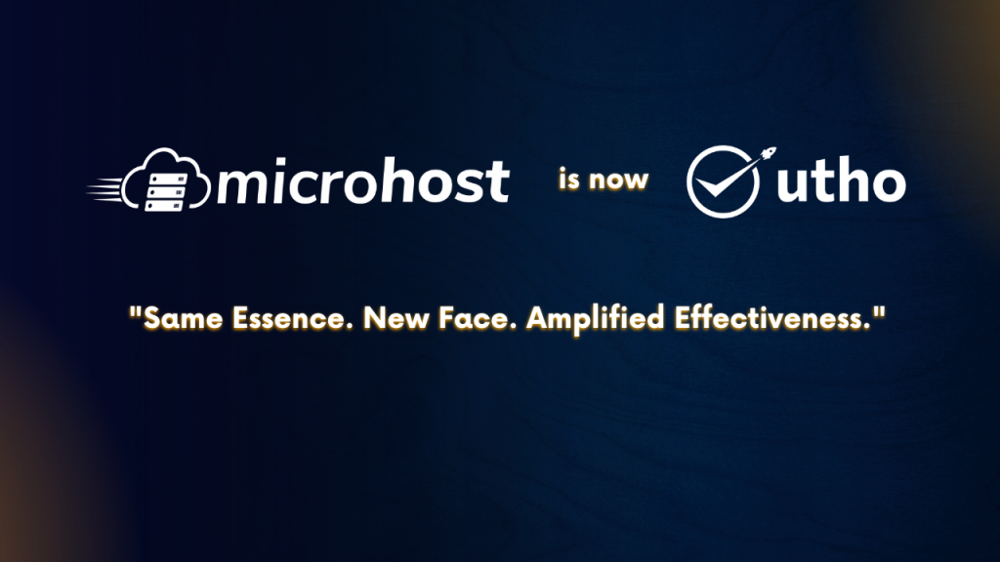

**“Change is the driving force behind growth and evolution.”** 

As you know, MicroHost is now **Utho**, a brand that symbolizes rising up, breaking free from limitations, and embracing a fresh approach to cloud solutions.

<figure>

<figcaption>

Microhost is now **Utho**

</figcaption>

</figure>

Let's take a closer look at the reasons behind **Utho's** rebranding and the journey behind it.

_**Why was the name changed to Utho?**_

## **A Mother's Wake-Up Call**

Take a moment to recall those precious childhood memories when your mother's gentle voice nudged you out of bed. Her words had the power to awaken your senses and prepare you for the day ahead. **"Utho, school jana hai" (Get up, it's time to go to school)** were not just ordinary words; they held the magic of motivation and served as a reminder that we all have a purpose to fulfill.

“Our mother's unwavering support has always been our driving force. She believes in us, inspires confidence, and reminds us that obstacles are only opportunities to grow.”

## **The Deep Meaning of UTHO**

**UTHO** holds a deep meaning for all of us as it represents the times when we faced the toughest challenges in our life. It is a voice from our hearts and says, **"UTHO, kaam par lag jao"** (Rise up and get to work). It became a call to action, igniting our determination and propelling us forward.

**_A vision with a purpose._**

## **Need for Change**

We recognized the struggles businesses face with traditional cloud service providers, and we firmly believed that it was time for a change. Our new name, **Utho,** reflects our commitment to providing simple, secure, and reliable cloud solutions that empower businesses to take control of their technology. With Utho, you can **break free from the limitations of vendor lock-in, slow speed, high cost, and unnecessary complexity.**

## **Empowering Your Success**

Our goal is to empower businesses to achieve new heights of success. We are dedicated to delivering the highest level of service to our clients. Our vision is to be the leading provider of cloud services, breaking down barriers and creating opportunities for businesses of all sizes.

## **Standing by Your Side**

Today, our mission is to stand by you, just as your mother stood by you. UTHO symbolizes our commitment to supporting you unconditionally in every situation you encounter. We understand the challenges you face, and we are here to provide the **hands-on assistance** you need to elevate your business to new heights.

## **Unlocking Your Potential**

**Utho** is not just for big corporations; it's for businesses of all sizes. We are passionate about democratizing cloud services, creating opportunities for startups and small businesses to thrive. Let us level the playing field and help you unleash your true potential.

## **A Promise of Exceptional Service**

Throughout our transformation, one thing remains unchanged: **our unwavering dedication to serving you.** Our team is committed to providing an exceptional experience, ensuring you receive the best possible support. With **Utho,** you'll find a partner who understands your needs.

As we begin this journey, we **welcome you to Utho,** a platform where empowerment and innovation meet. Embrace a future filled with endless possibilities, and leave behind the obstacles of the past. It is our pleasure to welcome you to this exciting journey, where you possess the tools and expertise to outperform your competition. It's time to rise up and unleash your business's full potential with Utho by your side. Let's rewrite the rules and shape a brighter future together.

**“Utho Business utha dega**,

**Sabkuch easy bana Dega”**

**The inspiring vision sparked our transformation.**

**Mr. Manoj Dhanda (Founder and CTO - Utho),** strongly believed in empowering businesses and breaking barriers which led him to rebrand MicroHost as Utho.

[Click to See The Video](https://player.vimeo.com/video/829302683?)
