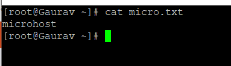
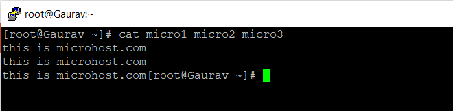
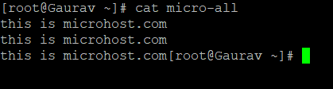
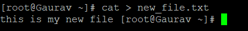
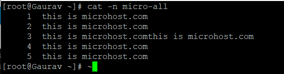
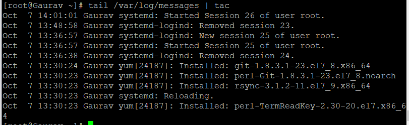

##### **Description**

In this article, we will cover some basic usage of the cat command, which is the command that is used the most frequently in Linux, and tac, which is the reverse of the cat command and prints files in reverse order. We will illustrate these concepts with some examples from real life.

##### **How Cat Command Is Used**

One of the most popular commands in \*nix operating systems is called "cat," which is an acronym for "concatenate." The most fundamental application of the command is to read files and output their contents to the standard output, which simply means to show the contents of files on your computer's terminal.

```
#cat micro.txt
```



In addition, the cat command can be used to read or combine the contents of multiple files into a single output, which can then be displayed on a monitor, as shown in the examples that follow.

```
#cat micro1 micro2 micro3
```



Utilizing the ">" Linux redirection operator enables the command to also be used to combine multiple files into a single file that contains all of the combined contents of the individual files.

```
#cat micro1 micro2 micro3 > micro-all
```

```
#cat micro-all
```



The following syntax allows you to append the contents of a new file to the end of the file-all.txt document by making use of the append redirector.

```
#cat micro4 >> micro-all
```

```
#cat micro4
```

```
#cat micro4 >> micro-all
```

```
#cat micro-all
```


With the cat command, you can copy a file's contents to a new file. Any name can be given to the new file. Copy the file from where it is now to the /tmp/ directory, for example.

```
#cat micro1 >> /mnt/micro1
```

```
#cd /mnt/
```

```
#ls
```


One of the less common uses of the cat command is to generate a new file using the syntax shown below. After you have finished making changes to the file, press CTRL+D to save and close the modified file.

```
#cat > new_file.txt
```



Applying the -n switch to your command line will cause all output lines of a file, including blank lines, to be numbered.

```
# cat -n micro-all
```



Use the -b switch to show only the number of each line that isn't empty.v

```
#cat -b micro-all
```


##### **Discover How to Use the Tac Command**

On the other hand, the tac command is one that is not as well known and is utilised only occasionally in \*nix systems. This command prints each line of a file to your machine's standard output, beginning with the line at the bottom of the file and working its way up to the line at the top. Tac is practically the reverse version of the cat command, which is also spelled backwards.

```
#tac micro-all
```


The -s switch, which separates the contents of the file based on a string or a keyword from the file, is one of the most important options that the command has to offer. It is represented by the asterisk (\*).

```
#tac micro-all --separator "two"
```

The second and most important use of the tac command is that it can be of great assistance when trying to debug log files by inverting the chronological order of the contents of the log.

```
#tac /var/log/messages
```


And if you want the final lines displayed

```
#tail /var/log/messages | tac
```



Similar to the cat command, tac is very useful for manipulating text files, but it should be avoided when dealing with other types of files, particularly binary files and files in which the first line specifies the name of the programme that will execute the file.

#### **Thank You**
