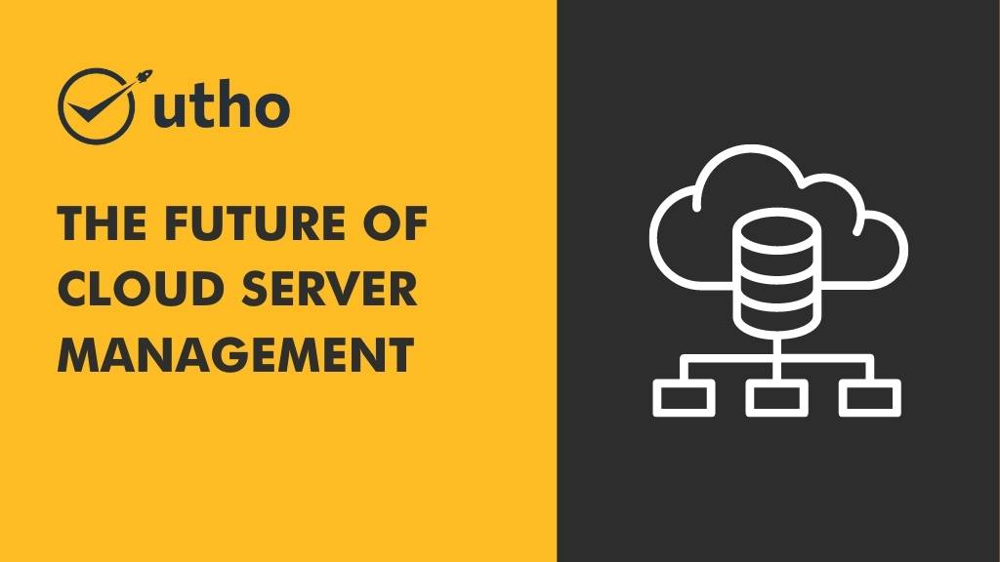

## **The Future of Cloud Server Management: Predictive Analytics and Automation**

Cloud server management is a critical component of modern IT infrastructure, and the industry is evolving at a rapid pace. The future of cloud server management looks promising with the integration of predictive analytics and automation. In this article, we will discuss the latest trends in cloud server management and how predictive analytics and automation are transforming the way businesses manage their cloud infrastructure.

## **The Need for Predictive Analytics and Automation in Cloud Server Management**

Managing cloud servers manually can be a time-consuming and error-prone process. Traditional approaches to cloud server management struggle to keep up with the scale and speed of modern cloud infrastructure. Predictive analytics and automation can address these challenges by providing real-time insights and automating routine tasks. Predictive analytics can anticipate potential issues and proactively take corrective actions before they impact the cloud infrastructure. Automation can reduce manual efforts and improve efficiency, enabling businesses to focus on higher-value tasks.

## **Trends in Predictive Analytics and Automation for Cloud Server Management**

**Machine Learning:** Machine learning algorithms can analyze large amounts of data to identify patterns and predict future outcomes. Machine learning can be used to optimize resource allocation, detect anomalies, and provide real-time insights into cloud server performance.

**Automation:** Automation tools can automate routine tasks such as server provisioning, configuration management, and security updates, reducing manual efforts and improving efficiency.

**Self-Healing Systems:** Self-healing systems can detect and resolve issues automatically, ensuring high availability and minimal downtime.

**Infrastructure as Code:** Infrastructure as code enables cloud infrastructure to be treated as a software application, allowing businesses to automate the deployment and management of their [cloud infrastructure.](https://www.redhat.com/en/topics/cloud-computing/what-is-cloud-infrastructure)

## **Benefits of Predictive Analytics and Automation for Cloud Server Management**

**Improved Efficiency:** Predictive analytics and automation can significantly improve the efficiency of cloud server management by reducing manual efforts and streamlining routine tasks.

**Increased Scalability:** Predictive analytics and automation can enable businesses to scale their cloud infrastructure quickly and efficiently, ensuring that their infrastructure can handle growing workloads.

**Enhanced Security:** Predictive analytics and automation can enhance security by automating security updates, monitoring vulnerabilities, and detecting anomalies.

**Cost Savings:** Predictive analytics and automation can help businesses optimize resource allocation and reduce wastage, leading to cost savings.

## **Managed Cloud Services for Predictive Analytics and Automation**

Managed cloud services such as Microhost provide expert support and management of cloud infrastructure, enabling businesses to leverage the latest trends in predictive analytics and automation for optimal performance and efficiency. Microhost's managed cloud services include automated server management, security updates, and performance optimization, ensuring that your cloud infrastructure is always up-to-date and performing at its best.

## **Conclusion**

Cloud server management is an essential part of modern IT infrastructure, and the integration of predictive analytics and automation is transforming the industry. By leveraging the latest trends in cloud server management, businesses can improve efficiency, scalability, security, and cost savings. For expert-managed cloud services, consider Microhost, a leading provider of cloud hosting services in India. With Microhost's managed cloud services, businesses can leverage the power of predictive analytics and automation for optimal performance and efficiency of their cloud infrastructure.

Visit: [Best Cloud Server](https://utho.com/cloud)
