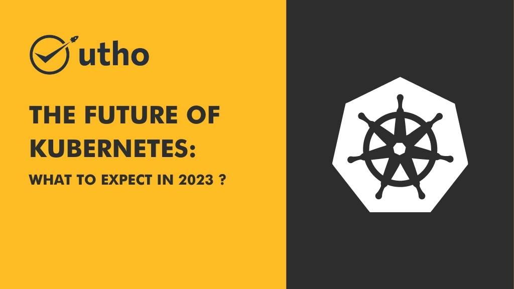

As one of the most popular and widely-**used container orchestration platforms,** **Kubernetes** has a bright future ahead. **In 2023**, we can expect to see a number of exciting developments and trends in the world of Kubernetes. Some of the most promising predictions include an increased focus on cloud-native application development, the adoption of serverless computing, and the integration of artificial intelligence and machine learning into Kubernetes environments.

Additionally, we may see an expansion of the **Kubernetes ecosystem,** with the introduction of new tools and services that make it even easier for organizations to deploy and manage their containerized applications. Overall, the future of Kubernetes looks bright, and we can expect to see continued growth and innovation in the years ahead.

Kubernetes is an open source container platform designed to automate deployment, scaling, and management of **containerized applications.**

It has quickly become one of the most popular DevOps tools on the market today due to its ability to enable organizations to quickly deploy and manage complex workloads across multiple cloud providers with relative ease. As such, it has become a powerful tool for businesses looking to modernize their IT infrastructure. 

Increasingly enterprise-grade features are expected to be a trend in Kubernetes' future**.** This includes things like integration with identity providers **(such as [Okta](https://en.wikipedia.org/wiki/Okta,_Inc.))** for authentication, improved security measures (such as role-based access control), better scalability options (including multi-cluster deployments), and more robust monitoring capabilities (including metric collection). All of these features will be essential for companies wanting to take advantage of Kubernetes in **2023 and beyond.** 

Another trend that is expected over the next few years is an **increase in adoption by smaller businesses and startups.** While this technology has traditionally been used by large enterprises due to its complexity, recent advances have made it more accessible than ever before. Companies are now taking advantage of managed services such as **[Microhost](https://utho.com/kubernetes)**, which make it easier than ever before for businesses of all sizes to take advantage of this powerful technology without needing extensive technical expertise. This increased accessibility will likely lead to increased adoption amongst these types of organizations over time. 

## **Conclusion:** 

Kubernetes has already had a significant impact on the way organizations manage their IT infrastructure since its introduction just a few years ago. As we look ahead towards 2023, we can expect this technology to only continue growing in popularity with advances such as enterprise-grade features becoming available and more small businesses taking advantage of managed services that make adoption easier than ever before.

Keeping an eye out for these trends will help you prepare for using Kubernetes within your organization in the next few years so that you can be sure you are leveraging this powerful technology effectively and efficiently when the time comes!
