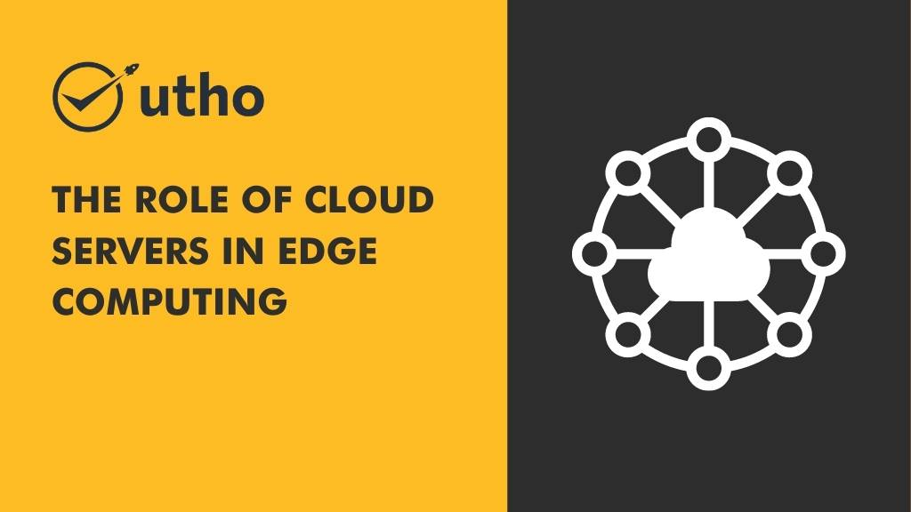

Edge computing is a paradigm shift in the way we process and store data. Rather than sending all data to centralized cloud servers, edge computing distributes data processing and storage closer to where it is generated, allowing for faster and more efficient data processing. However, edge computing also presents challenges, including the need for reliable and scalable cloud servers to support the distributed computing infrastructure. In this article, we will explore the role of cloud servers in edge computing, including the opportunities and challenges they present.

## **Opportunities of Cloud Servers in Edge Computing**

**Scalability:** Cloud servers provide the scalability needed to support the dynamic and distributed nature of edge computing. By using cloud servers, organizations can quickly add or remove computing resources as needed, making it easier to scale up or down based on changing demands.

**Cost Efficiency:** Cloud servers offer cost efficiency by allowing organizations to pay only for the resources they use, rather than investing in expensive hardware that may not be fully utilized. This can be especially beneficial for smaller organizations or those with limited budgets.

**Reliability:** Cloud servers offer high reliability and availability, ensuring that edge computing applications are always up and running. With built-in redundancy and failover mechanisms, cloud servers can provide a high level of reliability and availability that would be difficult to achieve with traditional on-premise infrastructure.

## **Challenges of Cloud Servers in Edge Computing**

**Latency:** Cloud servers may introduce latency in edge computing applications, as data needs to be sent to and from the cloud servers for processing. This can be especially problematic for real-time applications that require low latency, such as those used in the Internet of Things (IoT) and autonomous vehicles.

**Security:** Cloud servers may introduce security risks, as data needs to be transmitted and stored in multiple locations, increasing the potential for data breaches. Organizations need to ensure that their cloud servers are secured and comply with applicable regulations and standards.

**Complexity:** Edge computing and cloud server environments can be complex, requiring specialized knowledge and expertise to manage effectively. Organizations need to ensure that they have the right skills and tools to manage their edge computing infrastructure, including cloud servers.

## Conclusion

Overall, cloud servers play a critical role in supporting edge computing, providing the scalability, cost efficiency, and reliability needed to power distributed computing infrastructure. However, they also present challenges, including latency, security, and complexity. Organizations need to carefully evaluate their edge computing needs and choose the right cloud server solutions to meet their requirements.

### **Microhost**

If you're looking for a cloud service provider that offers reliable and scalable cloud servers for edge computing, consider Microhost. We provide a range of cloud services, including public cloud, private cloud, and hybrid cloud, with built-in redundancy and failover mechanisms to ensure high availability and reliability. With Microhost, you can take advantage of the opportunities of edge computing while minimizing the challenges and risks. Visit our website at [https://utho.com/](https://utho.com/) to learn more about our services and how we can help you achieve your edge computing goals.
