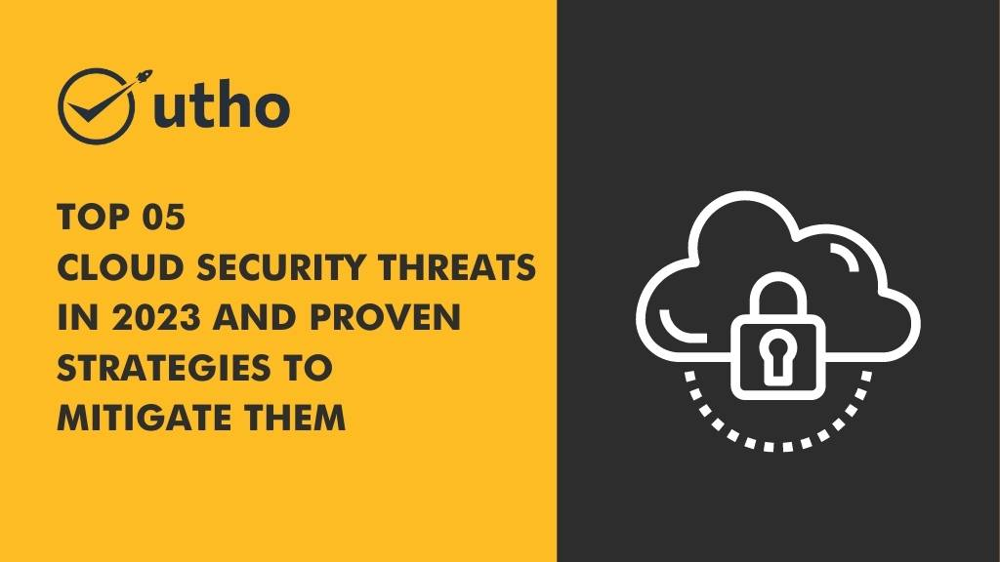

With the rapid advances in cloud Technology, businesses now have access to a wide range of data and applications. Unfortunately, this also means that cyber criminals have more opportunities than ever before to access sensitive information. As technology continues to evolve, it is important for IT managers, small and medium-sized businesses to stay up to date on the latest cloud security threats and how they can be mitigated. In this blog post, I  will provide an overview of the top five cloud security threats in 2023 and proven strategies you can use to tackle them.

<figure>

<figcaption>

Top 05 Cloud Security Threats in 2023 and Proven Strategies to Mitigate Them

</figcaption>

</figure>

## **1 Malware Attacks.** 

**Malware attacks** are another potential cloud security threat that **organizations may face** in **2023**. Malware, short for malicious software, can take various forms, such as viruses, worms, trojans, and ransomware, and it can be used to steal sensitive information, disrupt business operations, and even hold data hostage.

## **Solution**

**To mitigate the risks of malware attacks, organizations can implement the following strategies:**

- Keep all software and systems updated with the latest security patches.

- Use anti-malware software to detect and remove malware from computers and servers.

- Use endpoint security software to block malware and unauthorized software from running on user devices.

- Implement email and web filtering to block malicious links and attachments.

- Train employees on how to identify and avoid phishing and social engineering attacks, which are common vectors for delivering malware.

- Regularly back up important data and maintain offline copies, so that in the event of a ransomware attack, the organization can restore its data without paying the ransom.

It's important to remember that malware attacks can happen through various vectors and can often evade standard protection, to keep your organization secure, you must continuously monitor your systems and be ready to respond to an incident when it happens.

## **2\. ATO Attacks.**

Account takeovers (ATO) are a type of cyber attack where an attacker gains unauthorized access to a user's account by obtaining their login credentials, such as a username and password. Once an attacker has taken over an account, they can use it to steal personal information, make unauthorized purchases, or even cause damage to the user's reputation.

## **Solution**

**Here are some steps that can help prevent account takeovers:**

- Use strong and unique passwords for all accounts.

**Enable two-factor authentication (2FA) or multi-factor authentication (MFA) wherever it is available.**

- 2FA/MFA adds an extra layer of security, by requiring a second form of authentication such as a fingerprint, or a code sent via SMS or email.

- Be wary of suspicious or unsolicited emails or phone calls that ask for personal information or login credentials.

- Keep your computer, browser and mobile device security software updated.

- Keep an eye on your account activity, and look for unusual login attempts, or unauthorized changes to personal information.

- Be careful where you share your personal information online, especially on social media platforms.

**ATO attacks** can cause great damage to your personal or professional reputation and your financial losses. By taking the appropriate preventive measures, you can help protect yourself from ATO attacks and prevent unauthorized access to your accounts.

## **3\. Data Breaches**.

A data breach is a security incident in which sensitive, confidential, or protected information is accessed, disclosed, or stolen by an unauthorized individual or organization. Data breaches can happen due to a variety of reasons, such as weak passwords, poor access controls, unpatched software vulnerabilities, and phishing attacks.

## **Solution**

Here are some steps that can help prevent data breaches:

- Implement robust access controls, including user authentication and authorization to limit who can access sensitive data.

- Use encryption to protect data both in transit and at rest. This can help ensure that even if a breach does occur, the data will be unreadable to the attacker.

- Keep all software and systems updated with the latest security updates. This can help prevent attackers from exploiting known vulnerabilities.

- Train employees on security best practices and how to identify and report suspicious activity.

- Regularly monitor your systems and network for unusual activity or signs of compromise

- Have an incident response plan in place and test it regularly, including regular vulnerability assessments, penetration testing and incident management

It is important to note that even with all the appropriate security measures in place, breaches can still happen. By preparing yourself with a proactive and comprehensive approach you can minimize the impact of a breach on your organization and its customers.

## **4\. Cloud Service Misconfigurations**.

Cloud service misconfigurations are a common security threat in which cloud environments are not properly configured, leaving them vulnerable to attack. This can happen when organizations fail to properly set up security controls, or when changes are made to the cloud environment without proper testing or oversight.

## **Solution**

Here are some steps organizations can take to prevent cloud service misconfigurations:

- Implement cloud security best practices: Use industry standard frameworks such as CIS or NIST to establish security baselines for your cloud environment.

- Use cloud security tools to automatically detect and fix misconfigurations. This can help you quickly identify and remediate issues before they become a security risk.

- Use a least-privilege model: Limit access to cloud resources to only the users and roles that require it.

- Use a change management process: Establish a process for making changes to your cloud environment, which includes testing, approval, and rollback procedures.

- Regularly review your cloud environment for misconfigurations and vulnerabilities.

- Use security groups, **[virtual private clouds](https://utho.com/cloud) (VPCs)**, and network segmentation to create a secure and controlled environment in your cloud.

**Cloud service misconfigurations** are a serious concern, they can lead to data breaches, unauthorized access, or other security incidents. It is important to be proactive in identifying and addressing cloud service misconfigurations, as well as maintaining a secure and compliant cloud environment.

## **5\. Insider Threats.**

Insider threats refer to malicious or unintentional actions by employees or contractors with access to an organization's sensitive data and systems. Insider threats can be caused by various factors such as disgruntled or financially motivated employees, accidental data leaks or lack of security awareness.

## **Solution**

**Here are some steps organizations can take to prevent insider threats:**

- Implement strict access controls: Limit access to sensitive data and systems to only those who need it, and use multi-factor authentication (MFA) whenever possible.

- Monitor user activity: Use monitoring tools to track user activity on your network, looking for unusual or suspicious behavior.

- Implement security awareness training: Regularly educate and train employees on security best practices, the risks of insider threats, and the importance of proper data handling.

- Regularly review access permissions: Ensure that employee access is continuously reviewed and that permissions are removed as soon as they are no longer needed.

- Keep track of who is accessing sensitive data: Understand who is accessing your data and when.

- Use Data Loss Prevention ([DLP](https://digitalguardian.com/blog/what-data-loss-prevention-dlp-definition-data-loss-prevention)) systems to monitor and protect sensitive data from accidental or malicious exfiltration

Insider threats can be difficult to detect and prevent, as the individuals involved already have authorized access to your organization's sensitive data and systems. It is important to be vigilant and proactively mitigate the risk by implementing security controls, monitoring user activity, and providing regular security awareness training to employees.

## **Conclusion:**

In conclusion, cloud security is a critical concern for organizations of all sizes, as more and more companies are moving their operations and data to the cloud. The above-mentioned security threats, such as malware attacks, account takeovers, data breaches, cloud service misconfigurations, and insider threats, are just a few examples of the potential risks that organizations may face when using cloud services.

To mitigate these risks, organizations must implement a comprehensive security strategy that includes robust access controls, encryption, security awareness training, monitoring, and incident response planning. Organizations must also stay informed about the latest security threats and best practices for cloud security.
