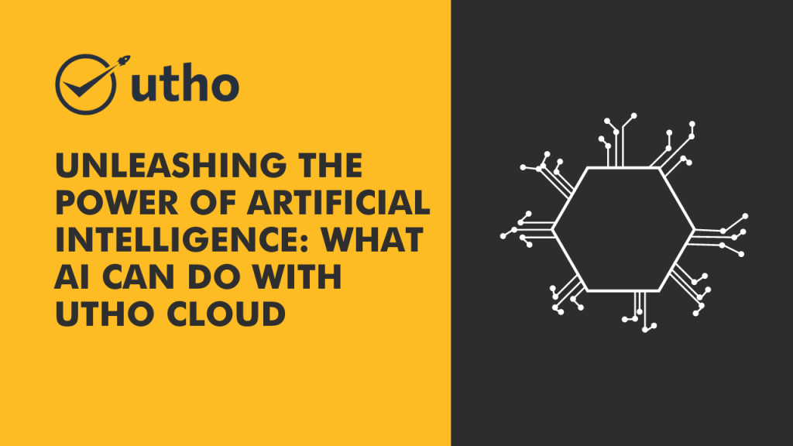

Artificial Intelligence (AI) is revolutionizing the way we live and work. This groundbreaking technology holds immense potential to transform industries and reshape our future. In this article, we will delve into the incredible capabilities of AI and explore the myriad of tasks it can accomplish. Join us as we uncover the possibilities of AI and discover how you can leverage its power with Utho Cloud, a leading AI education provider.

## The Versatility of Artificial Intelligence

Artificial Intelligence encompasses a wide range of applications that can have a profound impact on various sectors. Let's explore some key areas where AI can make a significant difference:

### Automation and Efficiency

AI excels in automating repetitive and mundane tasks, freeing up human resources for more complex and creative endeavors. With machine learning algorithms and intelligent automation, AI can streamline processes, enhance productivity, and optimize resource allocation. From data entry and analysis to routine customer service interactions, AI-powered systems can handle these tasks efficiently, reducing errors and saving time.

### Data Analysis and Insights

The ability of AI to analyze vast amounts of data and derive valuable insights is unparalleled. AI algorithms can process and interpret complex data sets, identify patterns, and make predictions. This capability finds applications in diverse fields, such as finance, marketing, and healthcare. AI-powered analytics tools can help businesses make data-driven decisions, optimize strategies, and uncover hidden opportunities for growth.

### Personalization and Recommendation Systems

AI enables personalized experiences by understanding user preferences and delivering tailored recommendations. Online platforms, such as streaming services and e-commerce websites, leverage AI to analyze user behavior, interests, and previous interactions. This information is then used to provide customized content, product recommendations, and targeted advertisements. By leveraging AI's personalization capabilities, businesses can enhance customer satisfaction and drive engagement.

### Natural Language Processing and Chatbots

AI's advancements in natural language processing have given rise to sophisticated chatbot systems. These AI-powered virtual assistants can understand and respond to human queries, providing instant support and information. Chatbots find applications in customer service, information retrieval, and even virtual companionship. By leveraging AI's language processing capabilities, businesses can enhance customer interactions and improve overall user experiences.

### Image and Speech Recognition

AI has made remarkable progress in image and speech recognition, enabling machines to understand and interpret visual and auditory data. The applications of AI in the field of image manipulation and editing are equally impressive. Tools like **[Picsart background changer](https://picsart.com/background-remover/)** utilize AI's sophisticated image background remover capabilities. Using deep learning algorithms, these tools can identify foreground subjects and separate them from their background, providing users with more flexibility and control over their imagery. This technology is driving change across numerous sectors such as advertising, digital marketing, and social media, making it easier to create compelling visuals with just a few clicks.

## Unlocking AI's Potential with Utho Cloud

To tap into the full potential of AI and navigate this transformative landscape, education and skill development are crucial. Utho Cloud offers a wide range of AI courses and training programs designed to empower individuals and organizations. With experienced instructors, hands-on projects, and comprehensive resources, Utho Cloud equips you with the knowledge and skills needed to harness the power of AI effectively.

[Discover Utho Cloud](https://utho.com/) and explore our AI courses to embark on a transformative learning journey.

## Conclusion

Artificial Intelligence is a game-changer that can revolutionize industries and transform the way we live and work. From automation and data analysis to personalization and natural language processing, AI's capabilities are vast and diverse. By understanding and harnessing the power of AI, businesses can enhance efficiency, drive innovation, and deliver exceptional experiences to their customers. Embrace the potential of AI with Utho Cloud and unlock a future of limitless possibilities.

**Read Also**: [Can Artificial Intelligence Replace Teachers? The Future of Education with AI](https://utho.com/docs/tutorial/can-artificial-intelligence-replace-teachers-the-future-of-education-with-ai/)
