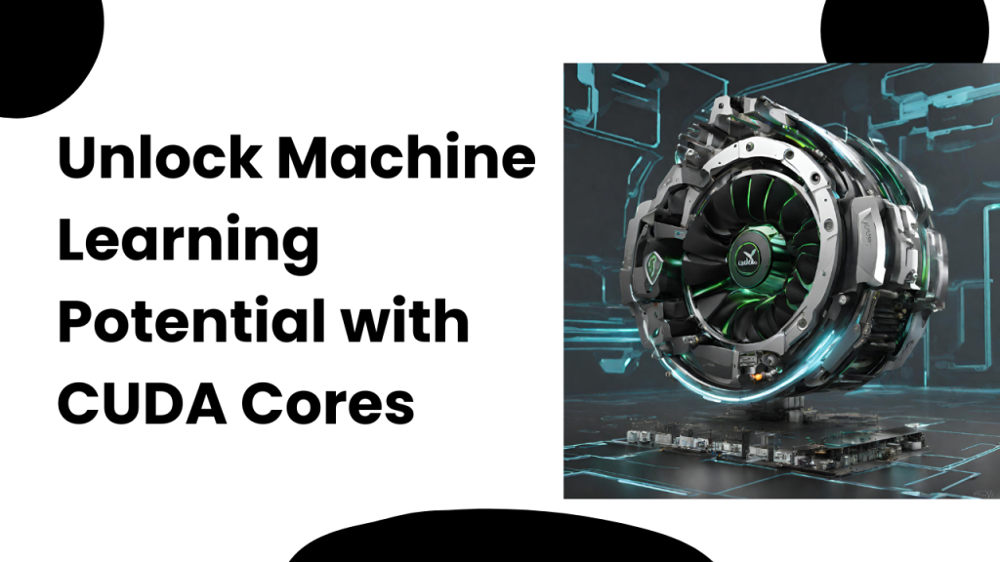

The field of machine learning is constantly changing, and high-performance computing is increasingly necessary. A crucial figure in this field is the Graphics Processing Unit (GPU), a dominant force that has fundamentally transformed the process of training machine learning models. The central element of the GPU is its essential component known as CUDA cores, which each serve a critical function in accelerating intricate computations.

## **CUDA Cores: The Fundamental Elements of GPU Performance**

NVIDIA developed the parallel computing technology known as Compute Unified Device Architecture (CUDA). The fundamental processing units of a GPU are known as CUDA cores, which allow for efficient parallel processing of data. Unlike Central Processing Units (CPUs), which excel at sequential processing, GPUs are specifically optimized to handle multiple tasks concurrently. This makes them highly suitable for the parallelized nature of various machine learning algorithms.

## **How do GPU CUDA benefit from machine learning**

Every individual CUDA core serves as a miniature processor with the ability to carry out its own unique set of instructions. By distributing tasks over numerous CUDA cores, GPUs are able to efficiently tackle complex computations that would otherwise be time-consuming for CPUs. This parallel design is the key factor behind the impressive acceleration that GPUs offer in a variety of computational applications, such as machine learning.

#### **1\. Parallel Processing:**

One of the key benefits of utilizing GPUs in machine learning is their remarkable capability to simultaneously process numerous data points. This is especially useful for challenging tasks that need processing massive volumes of data in parallel, like deep neural network training.

#### **2\. Matrix Operations:**

Machine learning models frequently require complex matrix operations, such as matrix multiplication. To efficiently handle these operations, CUDA cores are specially designed for rapid execution, making them crucial in the training of neural networks.

#### **3\. Model Training Iterations:**

Training a machine learning model involves multiple iterations to adjust its parameters based on the training data. The use of GPU's parallel processing capabilities greatly accelerates these iterations, resulting in faster convergence and reduced training times.

#### **4\. Specialized Libraries:**

GPU companies, such as NVIDIA, offer libraries like CUDA Toolkit and cuDNN to improve the execution of machine learning algorithms on GPUs. These libraries utilize the parallel architecture of CUDA cores to maximize the performance of machine learning tasks.

#### **5\. Deep Learning Frameworks:**

Well-known deep learning frameworks such as TensorFlow and PyTorch now have integrated GPU support, facilitating effortless integration with GPUs. Thus, instead of requiring laborious manual optimization, developers may take advantage of the capabilities of CUDA cores.

## **Spearheading innovation and pushing the frontiers of artificial intelligence**

CUDA cores serve as the unheralded champions that enable GPUs to enhance the speed of machine learning model training. The parallel processing design of CUDA cores, combined with the optimization of libraries and frameworks, has revolutionized GPUs into imperative assets for data scientists and machine learning experts.

Machine learning will surely continue to emphasize GPUs and CUDA cores because these components are essential to innovation and expanding the capabilities of artificial intelligence.

## **How Utho Can Assist You in Choosing the Most Suitable GPUs**

At Utho, we provide advanced cloud GPUs powered by NVIDIA for high-performance computing. Our GPUs are optimized to offer the best price-performance ratio in the market. We pride ourselves on maintaining an uptime of 99.9% and offering 24/7 technical support, backed by SLA guarantees, to ensure the seamless functioning of your applications and workloads without any disruptions. Utho provides services based on NVIDIA GPUs, including the NVIDIA HGX H100, NVIDIA A100, NVIDIA A40, and NVIDIA A16. These GPUs are well-suited for AI tasks, including both deep learning training and inference, facilitating quicker model development and execution.  
  
**Read Also:** [Introduction to AI and Machine Learning in the Cloud: What Are They and How Do They Work?](https://utho.com/docs/tutorial/introduction-to-ai-and-machine-learning-in-the-cloud-what-are-they-and-how-do-they-work/)
