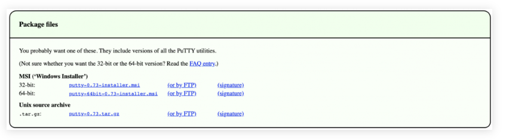
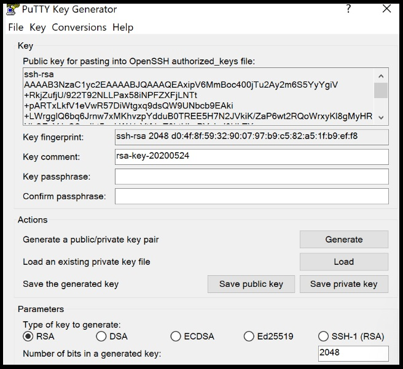

**SSH, which stands for Secure Shell, is a safe way to connect to a server from a distance. To make this connection, you need a special app called an SSH client, such as PuTTY. You'll also need some specific information: the server's IP address, SSH port number, your SSH username, and your SSH password.**

**This guide will show you how to use PuTTY SSH terminal to connect to either your hosting account or a virtual private server. This allows you to control your remote computer by running different commands.**

## **Downloading PuTTY: A Step-by-Step Guide**

PuTTY is widely used on Windows, but it's also compatible with Linux and Mac. Here's how you can download PuTTY on different operating systems.

## **Windows**

To get PuTTY SSH, head to the official website and download the latest version. Make sure to choose the correct bit version for your computer. After downloading, run the installer to begin the setup process.

## **Linux**

While many prefer the preinstalled OpenSSH on Linux, PuTTY on Linux is handy for tasks like debugging and connecting to serial ports and raw sockets.

For Debian, use the following command:  

<table><tbody><tr><td>sudo apt install putty</td></tr></tbody></table>

Afterwards, execute the following command to install the tools:

<table><tbody><tr><td>sudo apt install putty-tools</td></tr></tbody></table>

## **MacOS**

Similar to Linux, [macOS](https://www.lifewire.com/what-is-macos-4691239) already includes a built-in command-line SSH client. However, if you want to download PuTTY, open the terminal window and enter the following commands.

To install PuTTY on MacOS:

<table><tbody><tr><td>brew install putty</td></tr></tbody></table>

## Requirements for Setup

Before setting up an SSH connection using PuTTY, make sure you have the following information ready:

- Server IP Address  
      
    

- SSH Port  
      
    

- SSH Username  
      
    

- SSH Password  
    

## **Establishing an SSH Connection with PuTTY**

Once you have all the SSH connection details, follow these steps:

1\. Open the PuTTY SSH client.  

2\. Enter your server's SSH IP address and SSH port.  

3\. Click the "Open" button to proceed.

1\. After opening PuTTY, you will be promted to enter your SSH username. For VPS users, this is typically "root". You'll use a specific username like "uthouser". Once you've entered your username, press Enter.  

2\. Next, type your SSH password and press Enter again. For [security](https://utho.com/security-solution), the screen won't display the password as you type, but it will register what you enter.

You've successfully connected to your account using the PuTTY SSH client. To see a list of all available SSH commands, simply type "help" into the terminal.

## **Using PuTTYgen: A Step-by-Step Guide**

PuTTYgen is a tool used for generating [SSH key](https://utho.com/ssh-key) pairs. PuTTY saves key authentications in .ppk files. Windows users utilize the PuTTYgen.exe graphical tool, while Linux users rely on the command line.

To start, find PuTTY and open PuTTYgen.

To create a new key pair, click the "Generate" button at the bottom and move your mouse around within the window. Keep moving your mouse until the green progress bar is full.

Once the process is finished, your public key will appear in the window.

It's advisable to set a passphrase and save your private key.

## **Installing the Public Key on the Server**

To allow access to an account, you must add the new public key to the file named ~/.ssh/authorized\_keys.

Start by installing the public key. Then, log into your server and find the authorized\_keys file. Edit the file, paste the new public key, save the changes, and test if the login works.

Unlock seamless server access with PuTTY, a powerful SSH client. Simply have your SSH credentials ready, and you're set to manage your server remotely. Whether you're a beginner or an expert, PuTTY's flexibility and simplicity streamline server operations, empowering you to tackle tasks with confidence. Experience smooth server management and explore PuTTY's full potential today.
