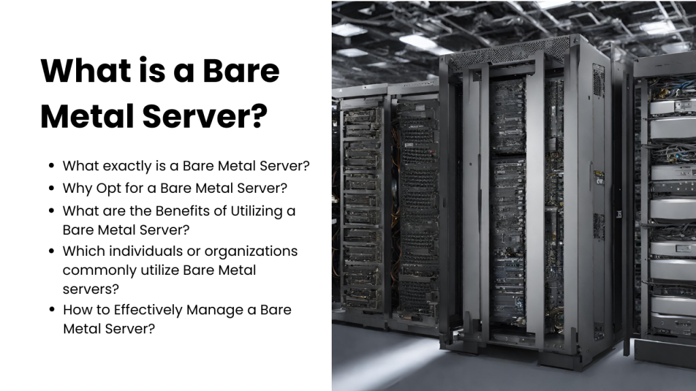

Bare Metal servers play a crucial role in IT infrastructure, providing a solid base for reliable digital connections and operations. However, many users are not fully aware of the top-notch features that come with Bare Metal servers, such as isolation and dedicated resources. Therefore, these servers are in high demand because they can optimize the performance of various applications. ​​​​​​Utho is the premier provider of Bare Metal servers for businesses and individuals seeking high-performance hosting solutions for their resource-intensive websites and applications.

This comprehensive guideline offers valuable insight to aid you in making wise decisions for your business. Consider all benefits, possibilities, and factors before reaching a conclusion.

## **What exactly is a Bare Metal Server?**

A bare-metal server is a [**dedicated hosting service**](https://utho.com/dedicated-cpu) designed for a physical computer to run for a longer period. Only one user or tenant can access it at a time. Therefore, you cannot have multiple users. That is great because the connection and network are predictable, strong, and stable.

Additionally, due to limited capacity, this server does not experience high traffic and maintains a stable performance, unlike other servers. As a single tenant occupies it, there is minimal interference and noise, ensuring smooth operation. Furthermore, it offers direct and efficient access for enterprises.

## **Why Opt for a Bare Metal Server?**

Bare Metal servers are a suitable choice for small and medium-sized industries, offering an affordable solution for businesses. Their cost-effectiveness and flexibility make them an ideal choice as they allow customization of settings according to specific requirements.

They are highly competent hosts known for their impressive ability to quickly and efficiently scale up any allocated resource. Their superior performance makes them the preferred choice in media encoding and rendering environments.

Ensuring data security is a priority for many organizations and businesses. Therefore, when it comes to efficient and secure data operations, Bare Metal remains the optimal choice.

## **What are the Benefits of Utilizing a Bare Metal Server?**

In order to enhance the user experience, these servers allow for unrestricted communication. This is made possible by the lack of hypervisors on the servers, eliminating latency typically associated with virtual machines and their networks. In essence, this type of server seamlessly scales your business while also reducing costs.

Before selecting servers, it is important to understand the specific needs of your business. If your objectives include achieving high scalability, on-demand availability, and pay-as-you-go usage, then this would be the most suitable choice for you.

## **Which individuals or organizations commonly utilize Bare Metal servers?**

Organizations or individuals with high resource-demanding applications, those in need of stringent performance consistency, or those requiring strict security and compliance standards that cannot be fulfilled in a shared environment.

## **How to Effectively Manage a Bare Metal Server?**

Utilizing an external service provider for server management can greatly enhance your company's operations. By freeing up your IT team's time, they can focus on improving your business. This comprehensive service includes managing servers in the following areas:

**Performing OS Updates and Monitoring Processes:** Regular and timely updates of the operating system and prompt installation of software patches are essential for server maintenance. These proactive measures guarantee the safety and security of your data, protecting it from potential malicious attacks.

**Enhancing Security with Firewalls:** Configuring the firewall involves controlling or blocking network traffic based on IP protocols, ports, and addresses. This is done with the goal of eliminating unwanted or suspicious activities within the network.

**Operations Management:** Operational management encompasses a variety of key duties, such as maintaining domain name services, overseeing server backup and recovery, conducting data migration, and managing hardware replacements. These essential functions are crucial in ensuring the efficient operation of servers.

In today's globalized world, speed, availability and scalability are important factors that every company strives to achieve. With Utho Bare Metal server, you can easily make your resources available on a global scale. This solution is undoubtedly the smartest and most efficient choice for companies both in the short and long term.  
  
**Read Also:** [**Customer-Centric Cloud: How Human Support Enhances User Experience**](https://utho.com/docs/tutorial/customer-centric-cloud-how-human-support-enhances-user-experience/)
