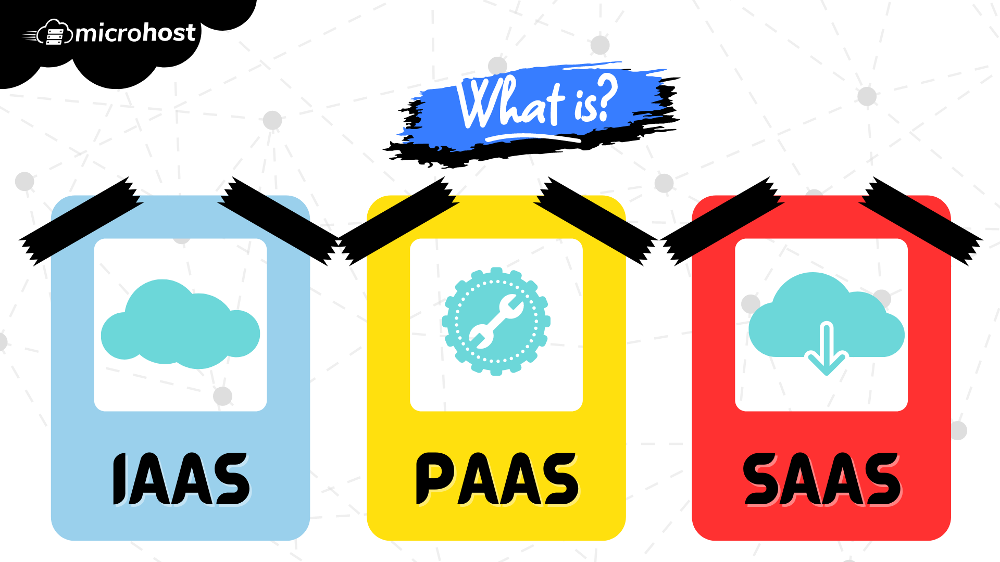

<figure>

<figcaption>

What is IAAS, PAAS and SAAS

</figcaption>

</figure>

In this tutorial, we will learn what is IAAS, PAAS and SAAS. Three of the most important categories of cloud services are IaaS, PaaS, and SaaS. They go by the names "[cloud service models](https://utho.com/docs/tutorial/benefits-of-cloud-computing-for-small-businesses/)" and "cloud computing service models," respectively.

"As a service" refers to how IT assets are used in these services, which is the main difference between standard IT and cloud computing. In standard IT, an organisation uses IT assets like hardware, system software, development tools, and apps by buying, putting, controlling, and keeping them in its own on-premises data centre. In cloud computing, the cloud service provider owns, controls, and keeps the assets. The customer uses the assets through an Internet link and pays for them on a contract or pay-as-you-go basis.

So, the major benefit of IaaS, PaaS, SaaS, or any other "as a service" option is that it saves money. A customer can access and grow the IT skills it needs at a fixed cost, without having to buy and manage everything in its own data center, which would be expensive and time-consuming. But each of these options has other benefits that aren't shared by the others.

## 1\. What is IAAS and its benefits

Hardware as a Service is another name for IaaS. (HaaS). It is a system of computers that is run over the internet. Systems as a Service (IAAS) is a way to offer on-demand services for IT systems. It is one of the three main service types for the cloud. The user buys computers, software, data centre room, or network equipment, and then rents those resources through a fully outsourced, on-demand service model. It can grow and shrink on the fly, and the resources are shared as a service. It usually means that more than one person can use the same piece of gear.

It's up to the customer to choose its tools carefully and according to what it needs. It also lets you handle your bills.

### Benefits:

- Availability: The company can put the tools into the surroundings of a customer at any time.
- Economic: It could be used by a very large number of people.It saves a lot of money and is easy to grow. Companies can pay for the very high costs of putting in place new technologies.
- Scalability: When delivering resources, such as virtual machines, apps, storage, and networks, the service has several choices. Its users can change the size of their business based on their needs.
- Flexibility: The design is provided by the cloud. Better scale and a lot of flexibility. There is support for dynamic tasks.
- Disaster recovery: Instead of putting up additional computers in different places, IaaS can add its disaster recovery option to the cloud provider's already-existing infrastructure, which is spread out geographically.

## 2\. What is PAAS and its benefits

PaaS, Platform as a service, is a cloud computing tool that lets programmers build, test, run, and control apps.

PaaS gives you a tool in the cloud that you can use to build, run, and manage apps. The cloud services provider hosts, manages, and maintains all the hardware and software on the platform. This includes servers (for development, testing, and deployment), operating system (OS) software, storage, networking, databases, middleware, runtimes, frameworks, and development tools, as well as services for security, operating system and software upgrades, backups, and more.

The PaaS is accessed by users through a graphical user interface (GUI), where development or [DevOps teams](https://about.gitlab.com/topics/devops/) can work together on all aspects of their work, such as writing, merging, testing, delivery, release, and feedback.

### Benefits:

- Programmers don't have to worry about what database or programming language was used to make an app.
- Tension free: It gives developers the chance to build apps without having to worry about the operating system or infrastructure underneath.
- Focused: Allows writers to focus on the design of the application while the platform handles the language and database.
- Manageable: It can be changed and moved around.
- Economic: It's not too pricey.
- Hassle free: It does a great job of managing application development steps in the cloud.

## 3\. What is SAAS and its benefits

On-demand software is another name for SaaS. It is a type of software in which the apps are stored by a [cloud service company](http://microhost.com). Users can use a computer browser and an internet connection to get to these apps.

SaaS is ready-to-use application software that is stored in the cloud. It is sometimes called "cloud application services." Users pay a monthly or annual fee to use a full programme in an online browser, PC client, or mobile app. The SaaS provider hosts and manages the application and all of the hardware that is needed to run it, such as servers, storage, networking, tools, application software, and data storage.

The software provider takes care of all updates and fixes, which customers usually don't notice. As part of a service level agreement, the provider usually guarantees a certain level of uptime, speed, and safety. (SLA). Customers can pay extra to add more people and data storage when they want to.

SaaS is used by almost everyone who has a computer or a cell phone today. People use SaaS apps like email, social media, and file storing in the cloud (like Dropbox or Box) every day in their daily lives. Salesforce (customer relationship management software), HubSpot (marketing software), Trello (workflow management), Slack (sharing and messaging), and Canva are all popular business or workplace SaaS options. (graphics). Adobe Creative Suite and other apps that were originally built for the PC are now offered as SaaS. (e.g., Adobe Creative Cloud).

### Benefits:

- Computeable: It is a type of cloud computing service that offers a wide range of skills and services that are stored. These can be used to build and run software apps that run on the web.
- Economic: It has a lower cost of ownership than software that is installed on-site. This is because you don't have to buy or install any tools or licences.
- Easy to use: It is easy to get to by using a browser on a thin computer.
- Free Use: The first setting doesn't cost anything.
- Low or zero maintenance: Low cost to keep up.
- No Installation: Less time is needed for installation, so time is used well.

And this is all you will learn in this tutorial- What is IAAS, PAAS and SAAS
