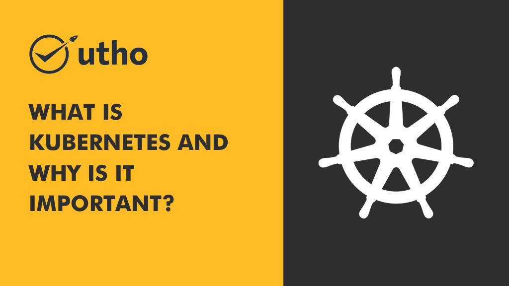

In this blog post, we'll explore what **Kubernetes is** and **why it's become such an important tool for managing cloud applications**. We'll also touch on some of the features that make Kubernetes so powerful and popular. By the end of this post, you should have a good understanding of what Kubernetes is and why it might be a good fit for your own cloud computing needs. 

**Kubernetes also known as k8s** is a system for managing containerized applications across a cluster of servers. It provides a platform for automating deployment, scaling, and operations of application containers across clusters of hosts. Basically, with Kubernetes you can take a bunch of software applications, store them in "containers," and then spread those containers across multiple servers. 

The idea behind containerization is that it makes it easy to move applications around because everything the application needs to run is packaged up nicely in the container. That way, you don't have to worry about dependencies or configuration issues when you move the application from one server to another

Kubernetes was originally designed by Google, who used it to run some of their most popular services like Gmail and YouTube.

## **Kubernetes Is Portable** 

One of the great things about Kubernetes is that it's portable. This means that you can run Kubernetes on any public or private cloud provider. You're not locked into using a specific provider's services. For example, if you're using Amazon Web Services (AWS) today but want to **switch to [Microhost](https://utho.com/) tomorrow**, you can do that without having to rewrite your entire application or infrastructure. 

## **Kubernetes Is Scalable** 

Kubernetes was designed from the ground up to be scalable. This means that you can start small with just a few servers and then easily add more servers as your needs grow. You can also selectively remove servers from the cluster if you need to save money or reduce capacity. This scalability makes **K8s** an ideal solution for businesses that are growing quickly or that have unpredictable workloads. 

## **Kubernetes Is Secure** 

Security is always a top concern when it comes to managing critical business applications. With K8s, you can choose from a variety of authentication methods to control who has access to your cluster. You can also use role-based access control ([RBAC](https://en.wikipedia.org/wiki/Role-based_access_control)) to granularly control what individual users can do within the cluster. Finally, Kubernetes integrates with many existing security solutions like network firewalls and intrusion detection/prevention systems (IDS/IPS). These features make Kubernetes an appealing option for businesses with strict security requirements. 

## Conclusion: 

K8s has emerged as one of the most popular tools for managing cloud-based applications thanks to its portability, scalability, and security features. If you're looking for a flexible solution for running your app in the cloud, Kubernetes should definitely be on your shortlist.
