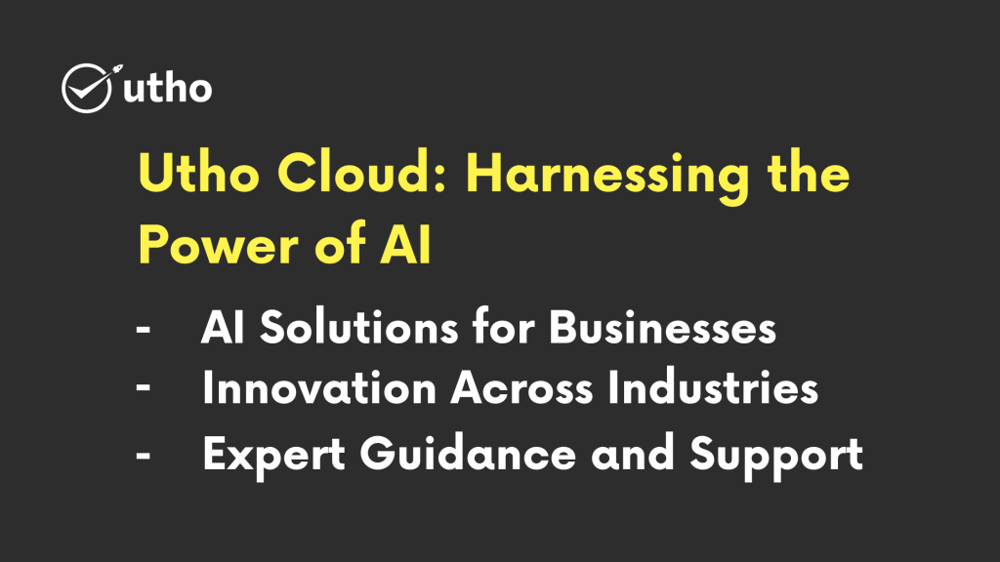

## Introduction

Artificial Intelligence (AI) has revolutionized the modern world, transforming industries and reshaping our lives. In this article, we will explore the timeline of AI's invention, uncovering its origins and key milestones. Join us on a captivating journey as we trace the evolution of AI and its profound impact on society.

## The Birth of AI

The concept of artificial intelligence emerged in the 1950s when visionary researchers began envisioning intelligent machines. However, AI, as we know it today, has evolved over the years through remarkable advancements in computing power and algorithms.

## The Dartmouth Conference: AI Takes Shape (1956)

A significant milestone in AI's history was the Dartmouth Conference of 1956. This groundbreaking event brought together leading researchers who shared a common vision: creating machines capable of replicating human intelligence. It marked the birth of AI as a field of study.

## Early AI Breakthroughs

In the subsequent years, researchers achieved notable breakthroughs in AI, including the development of expert systems and rule-based reasoning. These early AI systems focused on specific domains and tasks, such as chess-playing or mathematical problem-solving.

## The AI Winter: Challenges and Setbacks (1970s-1980s)

The 1970s and 1980s presented challenges and setbacks for the field of AI, leading to what became known as the "AI winter." Sky-high expectations were not fully met, resulting in decreased funding and waning interest in AI research. Progress slowed down during this period.

## Rise of Machine Learning: A Turning Point (1990s)

The 1990s witnessed a resurgence of interest in AI with the advent of machine learning. Machine learning algorithms empowered computers to learn from data and improve their performance over time. This breakthrough opened doors to practical applications of AI across various domains.

## Deep Learning Revolutionizes AI (2000s)

The 2000s saw the emergence of deep learning, a subfield of machine learning that revolutionized AI. Deep learning involves training artificial neural networks with multiple layers to recognize patterns and make complex decisions. It has led to significant advancements in image recognition, natural language processing, and autonomous vehicles.

## AI's Impact Today

Today, AI is seamlessly integrated into our daily lives. It powers voice assistants, recommendation systems, personalized advertisements, and fraud detection mechanisms, among others. The healthcare, finance, transportation, and other industries have experienced transformative changes driven by AI, revolutionizing the way we live and work.

## Utho Cloud: Harnessing the Power of AI

### AI Solutions for Businesses

Utho Cloud is a leading provider of cutting-edge AI solutions that empower businesses to leverage the full potential of AI. Their advanced technologies enable organizations to harness the power of data, automate processes, and gain invaluable insights.

### Innovation Across Industries

Utho Cloud's AI solutions are revolutionizing industries such as healthcare, finance, retail, and manufacturing. By harnessing AI-powered tools, businesses can drive operational efficiency, enhance customer experiences, and make data-driven decisions, gaining a competitive edge.

### Expert Guidance and Support

Utho Cloud offers expert guidance and support to organizations embarking on their AI journey. Their team of AI specialists provides personalized assistance, ensuring a seamless integration process and optimal results.

## Conclusion

The journey of artificial intelligence has been a captivating one, spanning decades of research, breakthroughs, and challenges. From its humble beginnings in the 1950s to the AI revolution of today, AI has come a long way. By embracing the transformative potential of AI, organizations can shape a future powered by intelligent machines.

**Read Also:** [Best Cloud Platform for Your Business](https://utho.com/docs/tutorial/best-cloud-platform-for-your-business/)
