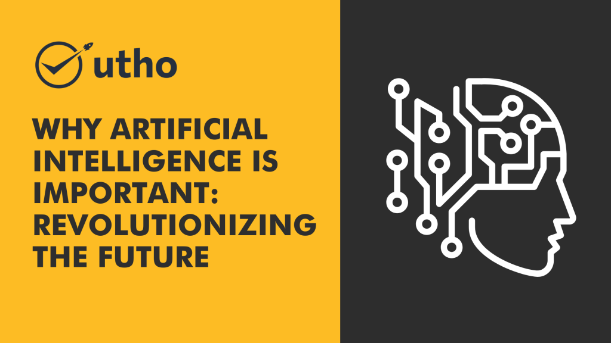
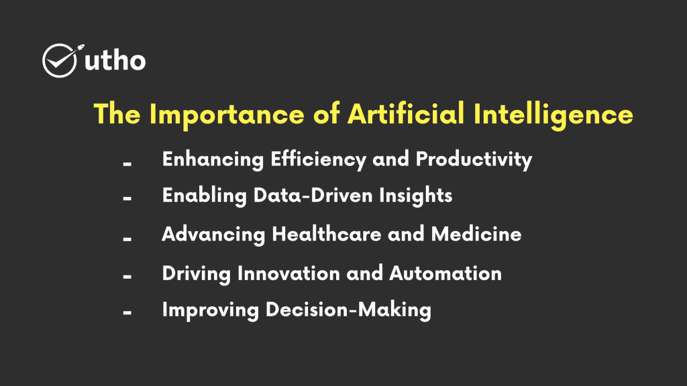

## Introduction

Artificial Intelligence (AI) has become a transformative force in our world, revolutionizing industries and shaping our future. In this article, we will explore why AI is so important in a way that is easy to understand. We'll discuss the benefits and applications of AI and how it impacts our lives.

## Understanding Artificial Intelligence

Artificial Intelligence refers to the development of computer systems that can perform tasks requiring human intelligence. It includes machine learning, natural language processing, computer vision, and robotics. AI systems analyze data, learn from patterns, make decisions, and adapt to changing situations.

## The Importance of Artificial Intelligence

### Enhancing Efficiency and Productivity

AI automates repetitive tasks, saving time and allowing humans to focus on more complex activities. This boosts efficiency and helps organizations accomplish more in less time.

### Enabling Data-Driven Insights

AI algorithms process vast amounts of data, uncovering meaningful patterns and insights. This helps businesses make data-driven decisions, identify trends, and gain a competitive edge.

### Personalizing User Experiences

AI analyzes user behavior, preferences, and feedback to provide personalized experiences. It powers recommendation systems, chatbots, and virtual assistants, enhancing customer satisfaction.

### Advancing Healthcare and Medicine

AI is transforming healthcare by speeding up disease diagnosis, predicting outcomes, and aiding in drug discovery. Medical devices and virtual health assistants powered by AI improve patient care and outcomes.

### Driving Innovation and Automation

AI fuels innovation in autonomous vehicles, robotics, and advanced manufacturing. It streamlines processes, optimizes resource allocation, and drives automation, increasing productivity and cost savings.

### Improving Decision-Making

AI systems analyze complex data sets and provide insights to support decision-making. By considering multiple factors and scenarios, AI helps make informed choices, reducing biases and improving accuracy.

## Utho Cloud: Harnessing the Power of AI

### Empowering Businesses with AI Solutions

Utho Cloud is a leading AI innovator, empowering businesses to leverage the transformative power of AI. Their advanced AI technologies help organizations unlock the value of data, automate processes, and gain valuable insights.

### Revolutionizing Industries

Utho Cloud's AI solutions optimize operations, enhance customer experiences, and drive innovation across sectors like finance, healthcare, manufacturing, and retail. Their AI-powered tools extract actionable insights, improve decision-making, and provide a competitive edge.

### Personalized Support and Expertise

Utho Cloud's team of AI experts offers personalized support, guiding businesses in adopting and implementing AI solutions tailored to their specific needs. They understand the unique challenges organizations face and deliver exceptional results.

## Conclusion

Artificial Intelligence is a critical component of our future. Its ability to enhance efficiency, drive innovation, and enable data-driven decision-making is transforming industries. Embracing AI allows businesses to stay competitive, improve customer experiences, and unlock new opportunities. With Utho Cloud's expertise in AI solutions, organizations can harness AI's power and shape a brighter future.

**Read Also:** [6 Cloud Computing Myths, Busted!](https://utho.com/docs/tutorial/6-cloud-computing-myths-busted/)
