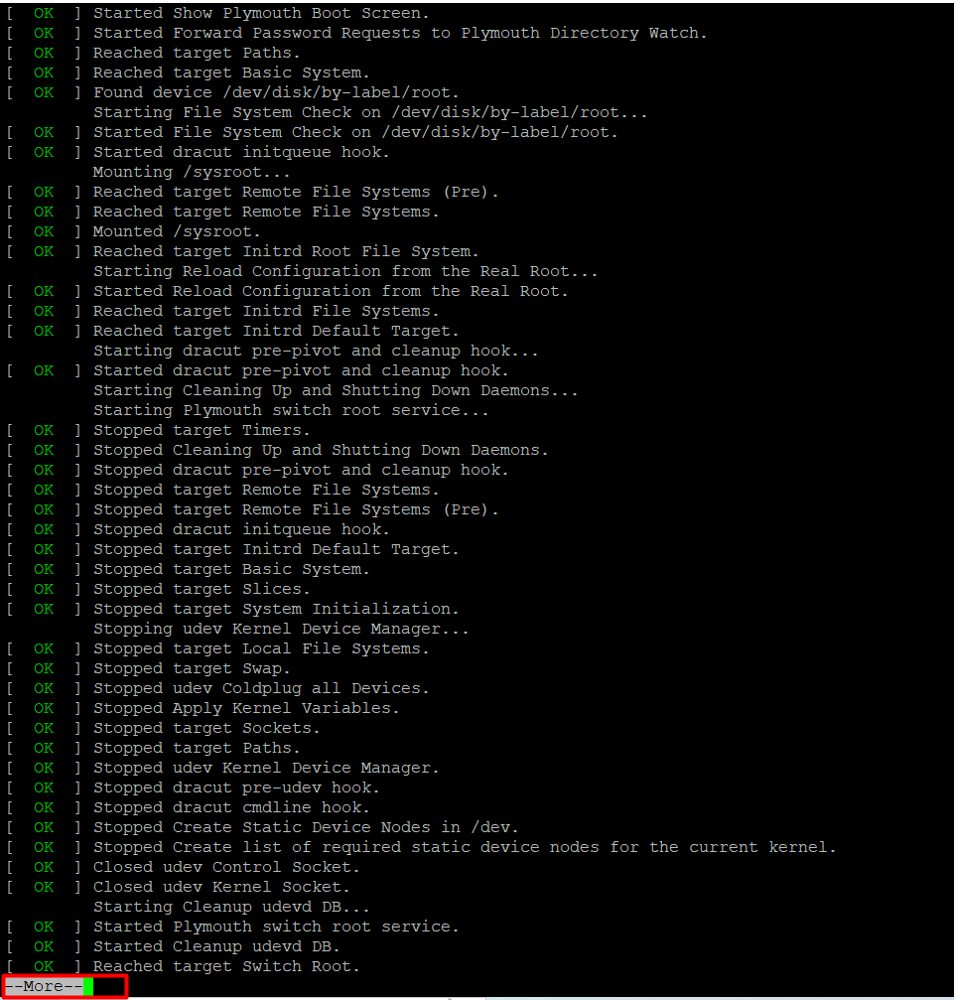
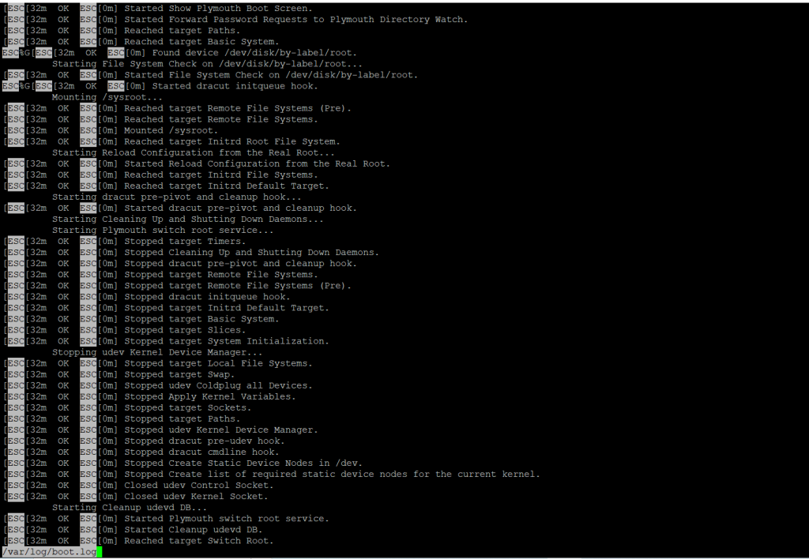

<figure>


<figcaption>

Why less is Faster Than more Command for Effective File Navigation

</figcaption>

</figure>

**Description**

In this article we will learn Why less is Faster Than [more](https://utho.com/docs/tutorial/cheat-sheet-for-15-nmcli-commands-in-linux-rhel-centos/) Command for Effective File Navigation..

"More" is a command line tool in Unix that is used to display the contents of a file in the console. The most fundamental way to use the more command is to execute it in opposition to a file, as demonstrated below: c

Follow the below steps to learn Why [less](https://en.wikipedia.org/wiki/Less_(Unix)) is Faster Than more Command for Effective File Navigation...

## Learn "more" Linux commands.

```
# more /var/log/boot.log 
```


One other approach to employ additional commands in conjunction (pipe) with other ones, such as the cat command, as seen in the sample that follows:

```
# cat /var/log/boot.log | more 
```



Press the Enter key to move through the file one line at a time, or press the Spacebar key to move through the file one page at a time, where one page corresponds to the screen size of your current terminal. Simply pressing the q key will cause the command to terminate.

The -number switch, which is part of the more command, is a helpful option since it allows you to determine how many lines each page should have. As an illustration, show one page of the auth.log file with the following 10 lines:

```
# more -10 /var/log/boot.log 
```


```
# more +14 /var/log/boot.log 
```


## Learn Linux 'less' Command

In a manner analogous to that of more, the less command enables you to inspect the contents of a file and browse through that file. The most significant distinction between more and less is that the less command is significantly quicker. Unlike more, less does not load the entire file at once and makes it possible to navigate through the file by using the page up and page down keys.

In can be used as a solo command that is issued against a file, or it can be used with pipes with a wide variety of other Linux commands in order to narrow the screen output of those commands, allowing you to scroll over the results.

```
# less /var/log/boot.log 
```

or

```
# ls /etc | less 
```

You can go through the file line by line by pressing the Enter key. The spacebar key can be used to navigate the page. Your current terminal screen size represents the page size. To quit the command, use the q key, just as you did for the more command.

The /word-to-seach option of the less command is a handy feature. For example, by entering the /sshd string interactively, you can search and match all sshd messages from a log file.



To display a file starting at a certain line number, use the following syntax:

```
# less +5 /var/log/boot.log 
```

If you need to count the number of lines in less, use the -N option.

```
# less -N /var/log/yum.log 
```


By default, hitting the q key is the only way to leave the less command. Use the -e or -E option to change this behaviour and automatically end the file when it reaches the end:

```
# less -e /var/log/boot.log 
```

```
# less -E /var/log/boot.log 
```

I really hope you understand all the steps carefully. Why less is Faster Than the more Command for Effective File Navigation.

Must read :- https://utho.com/docs/tutorial/cheat-sheet-for-15-nmcli-commands-in-linux-rhel-centos/

**Thank You**
