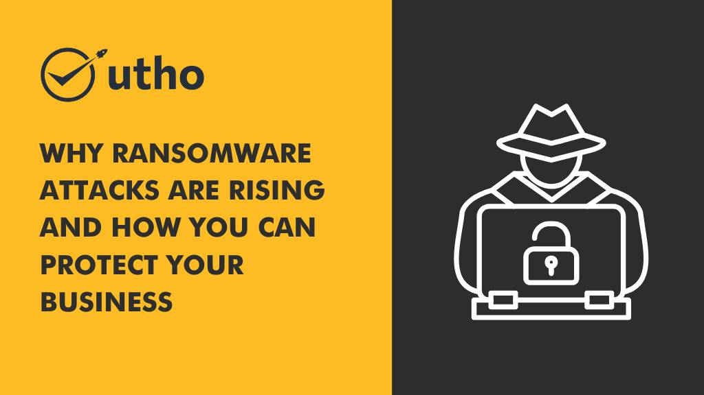

Ransomware attacks are becoming increasingly common as cybercriminals look for new ways to steal data and extort money. Ransomware is a type of malicious software ([malware](https://en.wikipedia.org/wiki/Malware)) that encrypts your data and holds it hostage until you pay a ransom fee. This type of attack has become more prevalent in recent years, due to the fact that it can be so lucrative for hackers. In this article, we’ll discuss why ransomware attacks are on the rise and how you can protect yourself from them. 

## **Why Are Ransomware Attacks On The Rise?** 

Ransomware attacks are on the rise due to several factors, including increased computing power, more sophisticated hacking techniques, and a greater number of targets. The threat is especially concerning because even small businesses are now being targeted by hackers with ransomware. A recent report found that **nearly 60% of ransomware victims were small businesses** with fewer than 250 employees; however, larger companies with more resources still **accounted for 40%.** With the increasing availability of digital currency such as Bitcoin, it’s now easier than ever for criminals to accept payment without being traced. 

## **How Can You Prevent A Ransomware Attack?** 

The best way to protect yourself from a ransomware attack is by taking preventive measures such as regularly updating your software and using reliable anti-virus/anti-malware protection on all your devices. Additionally, you should always back up your data on an external hard drive or cloud storage system so that if you do get attacked, you won’t lose any information or files. It’s also important to be aware of phishing emails or links sent via email or social media – these are often used as a way for attackers to gain access to your computer or network.

Let's take a look at some key steps you can take to ensure your business is secure. 

<figure>

<figure>

<figcaption>

**Avoid ransomware attacks with these tips**

</figcaption>

</figure>

</figure>

## **Password Protection** 

One of the most important ways to protect your business from ransomware attacks is by ensuring that all of your passwords are secure. All staff should be required to use strong passwords, and they should never share their passwords with anyone else. Additionally, you should consider using two-factor authentication (2FA) for added security. This ensures that even if someone were able to gain access to your system, they wouldn't be able to do any damage without entering an additional code or password sent directly from you. 

## **Regular Software Updates** 

Another key step you can take is installing regular software updates on all devices used by your staff. Software updates often contain security patches designed to help protect against malicious threats such as malware and ransomware attacks. If a device isn't being used anymore, make sure it's wiped clean and any data stored on it is securely destroyed before it's disposed of so that no one can access it. 

## **Train Your Staff** 

It's also important that all staff members receive training on cybersecurity best practices, such as not clicking on suspicious links or attachments in emails or downloading applications from unknown sources. Regular training sessions will help ensure that everyone knows the proper procedures for handling sensitive data and staying safe when using the internet. 

## **Having an Incident Response Plan** 

Finally, every business should have an incident response plan in place in case of a cyberattack or [data breach](https://utho.com/docs/tutorial/how-cloud-firewall-can-help-you-to-avoid-costly-data-breaches/). This plan should include detailed steps outlining who needs to be contacted and what steps need to be taken if there is ever a suspected breach or attack on the company’s systems or data. Having this plan in place ahead of time will help reduce the impact and duration of any potential attack so that normal operations can resume quickly and safely. 

There are many steps you can take to ensure your business stays safe from cyberattacks like ransomware attacks. From password protection and regular software updates, to training staff and having an incident response plan ready for any potential breaches, these measures will help keep your business protected against malicious threats online at all times. Taking the necessary precautions now could save you from severe damage down the line, so make sure you're doing everything possible to keep your organization safe!
